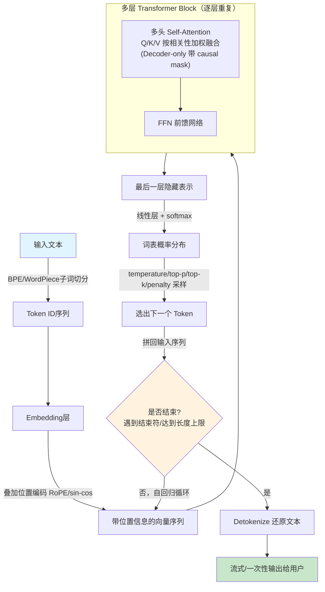

# 阶段1：大模型基础（35-45天）

- 数学直觉：向量/点积/相似度
- Transformer：Self-Attention、多头、Encoder-Decoder vs Decoder-only
- 位置编码、上下文长度
- Tokenization：BPE/WordPiece
- 推理参数：temperature/top-p/top-k/penalty
- 实践：Python调API，多轮对话+流式输出
- 自测：画出请求→Tokenize→模型→解码→文本流程图

## 知识点详解（STAR法则）

### 1. 数学直觉：向量/点积/相似度

**S**：模型里词、句子都表示成高维向量，判断两个东西"像不像"、"有没有关系"，得靠数学量化，不能靠感觉。

**T**：搞清楚点积、余弦相似度这些运算，实际度量的是什么。

**A**：
- 点积 `a·b = Σ aᵢbᵢ`，两向量方向一致时点积大，方向相反时点积小（甚至为负）。可以理解成"投影长度"——一个向量在另一个方向上的分量。
- 余弦相似度 `cos θ = (a·b)/(|a||b|)`，把点积除以模长归一化，只看方向不看长度，取值在[-1,1]，专门衡量"语义方向"是否接近。
- 在Attention里，Q和K做点积就是在算"这两个词有多相关"；Embedding检索里，余弦相似度就是在算"这两段文本语义有多像"。

**R**：理解点积/余弦相似度后，Self-Attention的打分公式、Embedding检索的召回逻辑，本质都讲得通——都是"用向量夹角/投影衡量语义相关性"。

---

### 2. Transformer：Self-Attention、多头、Encoder-Decoder vs Decoder-only

**S**：句子里每个词的含义依赖上下文，且不同任务（翻译、生成）需要不同的信息流动方式。

**T**：理解Self-Attention怎么算相关性并融合上下文；理解为什么要"多头"；理解Encoder-Decoder和Decoder-only两种架构的本质区别，及各自适用场景。

**A**：
- **Transformer**： = 一种完全基于Attention机制、不用RNN的神经网络架构（2017年提出）。Transformer是一种架构框架，Self-Attention和多头是它的核心组件，Encoder-Decoder/Decoder-only是用这些组件搭出来的两种不同"整体形态"。也就是说Self-Attention/多头是零件，Encoder-Decoder/Decoder-only是用零件组装出的两种整机型号，Transformer是这一整套"零件+组装方式"的统称架构名。
- **序列**：一个序列 ≈ 一句话（或一段话）切分成token后的那一串token，比如"我爱猫"tokenize后是["我","爱","猫"]这一串，长度为3。Self-Attention里Q/K/V都来自同一个序列（自己内部互相算）；Cross-Attention里则是两个不同序列（一个提供Q，另一个提供K/V）互相查询。
- **Self-Attention**：每个词生成Q/K/V，`Attention(Q,K,V)=softmax(QK^T/√d_k)V`，让每个词都能"看"到全句其他词并按相关性加权融合（Q=我要找什么，K=我有什么特征供别人匹配，V=我实际携带的内容）。Self-Attention其实就是让句子里面的每个词都能看到句子里面的其他词，并按相关性分配权重再加权融合。
- **Cross-Attention（交叉注意力）**：核心区别——Self-Attention是"自己内部词跟自己内部词"算相关性（Q/K/V都来自同一个序列）；Cross-Attention是"一个序列的词去查询另一个序列的词"（Q来自序列A，K/V来自序列B）。在Encoder-Decoder里具体怎么用：还是"我爱猫"→"I love cats"这个例子，Decoder生成"love"这个词时，它的Q来自Decoder自己（已生成的"I"这个位置），但K和V来自Encoder的输出（"我""爱""猫"编码后的向量），于是Decoder用自己的Q去跟Encoder的K算相关性——发现"爱"这个词的K跟当前要生成的位置最匹配，于是重点参考Encoder里"爱"对应的V。一句话：Cross-Attention让Decoder在生成每个词时，能动态"回头看"输入句子里跟当前最相关的部分，而不是死板地按位置对应。为什么必须有这一步：如果没有Cross-Attention，Decoder只能靠自己已生成的内容瞎猜下一个词，完全脱离原文语义，等于没读输入就硬编，Cross-Attention就是Encoder和Decoder之间唯一的信息桥梁。注意：Decoder-only模型（GPT系列）里没有Cross-Attention，因为它没有单独的Encoder——输入和输出在一个序列里，全靠Self-Attention一套机制处理。
- **多头（Multi-Head）**：把Q/K/V切成多组（比如8个头），每组独立算一次Attention再拼接。原因——单一Attention只能学到一种"关注模式"（比如只关注语法关系，学不到同时存在的语义相似、指代关系），多头让模型同时从多个子空间（语法、语义、指代等）捕捉不同类型的关联，最后拼接投影融合。多头其实就是"多角度分析关联模式"的综合表示
- **Encoder-Decoder vs Decoder-only**：
  - Encoder-Decoder（如T5、原始Transformer）：Encoder双向看整个输入（无mask，每个词能看到前后所有词），Decoder单向生成（带mask，只能看已生成部分），中间用cross-attention让Decoder关注Encoder输出。适合输入输出结构差异大的任务，如翻译、摘要。Self-Attention（Encoder内部用一次，Decoder内部也用一次，各自处理自己序列内的关联）+ Cross-Attention（Decoder查询Encoder输出，桥接两个序列）。
  - Decoder-only（如GPT系列、LLaMA）：只有一套单向（causal mask）的自注意力，输入输出拼在同一序列里统一处理。结构简单、扩展性好，是目前主流大模型的选择，靠海量数据+大参数量把理解和生成能力都压到一个统一结构里。只用Self-Attention，输入输出拼一个序列，没有独立Encoder，自然不需要Cross-Attention去跨序列查询。
- **主流大模型分类**（Self-Attention/Cross-Attention不互斥，是"用不用"的问题，Encoder-Decoder架构就是既用Self-Attention又用Cross-Attention）：
  - 纯Decoder-only（只用Self-Attention，没有Cross-Attention）：GPT系列（GPT-3/4）、LLaMA系列、Qwen、GLM（新版）、DeepSeek、Mistral——目前几乎所有主流对话大模型都是这条路线。
  - Encoder-Decoder（同时用Self-Attention和Cross-Attention）：T5、原始Transformer（翻译模型）、BART、Whisper（语音转文字，Encoder处理音频，Decoder生成文字，中间靠Cross-Attention桥接）、老一代GLM（清华最早那版，Encoder-Decoder架构）。
  - 纯Encoder（只用Self-Attention，没有Decoder也没有Cross-Attention）：BERT（只做理解任务，不生成文本）。

**R**：能解释清楚"为什么现在大模型基本都是Decoder-only"——训练目标统一（自回归预测下一词）、架构简单易scale、上下文利用更灵活，这是高频面试点。

**为什么现在大模型基本都是Decoder-only（展开）**：

1. **训练目标统一、简单**：Decoder-only只有一个任务——给定前面所有token，预测下一个token（自回归）。不管是"理解"还是"生成"，都用同一套目标训练，数据不需要区分"输入部分"和"输出部分"，随便一段网页文本、代码、对话都能直接拿来训练——数据利用率极高，工程简单。Encoder-Decoder得区分input/output两部分，数据构造更麻烦。

2. **架构简单，更容易scale**：Decoder-only只有一套Transformer block，参数、计算路径统一。想把模型做大（几百亿到万亿参数），复用同一套block堆层数、堆宽度就行，工程实现和调优经验能直接复用。Encoder-Decoder有两套不同结构（Encoder双向、Decoder单向+Cross-Attention），scale时要分别调，复杂度翻倍。

3. **上下文利用更灵活**：Decoder-only输入输出在同一序列里，模型能把"输入"和"已生成的输出"同等对待，前面生成的内容可以随时被后面参考（比如多轮对话、in-context learning，几个例子往上下文一塞就能work）。Encoder-Decoder的Encoder在编码完输入后基本"定型"了，Decoder只能通过固定的Cross-Attention接口去读，灵活性差一些。

4. **实践验证：In-context learning能力**：GPT-3论文证明了纯靠堆参数量的Decoder-only模型，能在不改权重的情况下，靠prompt里给几个例子就学会新任务（few-shot learning）。这个能力后来被验证是Decoder-only+超大规模预训练的涌现能力，Encoder-Decoder在这方面没有表现出同等优势。

**一句话总结**：Decoder-only用一套简单统一的结构，靠"预测下一词"这一个目标吃下所有NLP任务，数据利用效率高、工程scale简单，规模上去后涌现出强大的通用能力——这条路线被验证work之后，行业就基本收敛到这一种架构了。

---

### 3. 位置编码、上下文长度

**S**：Self-Attention本身是"排列不变"的——打乱输入顺序，算出来的结果集合不变，但语言是有顺序的（"我打你"≠"你打我"），必须显式注入位置信息。Self-Attention是一次性、并行地让所有词互相看，天生没有"顺序"这个概念——这正是它并行快的原因，但也带来了"不知道顺序"的副作用。

**T**：理解位置编码怎么把顺序信息加进去，以及"上下文长度"受什么限制、为什么会成为大模型的瓶颈。

**A**：
- **绝对位置编码**：如原始Transformer用sin/cos函数按位置生成固定向量加到词向量上；BERT用可学习的位置Embedding。
- **相对位置编码/RoPE（旋转位置编码）**：现代大模型（LLaMA、GLM等）主流用RoPE，通过旋转矩阵把位置信息编码进Q/K的乘积里，使得Attention分数天然带有"相对距离"信息，且能一定程度上外推到训练时没见过的长度。
  - **绝对位置编码的痛点**：sin/cos编码是加在输入词向量上的（词向量+位置向量=最终输入），一旦进入Attention计算（Q·K点积），位置信息和语义信息就搅在一起，模型很难干净提取出"两个词差了几个位置"这种相对关系——而语言里真正重要的往往是相对距离，不是"全局第157个"这种绝对信息。
  - **RoPE核心思路：不加，而是"转"**——不把位置信息加到词向量上，而是把每个词的Q向量和K向量，按照它的位置角度做一次旋转变换。类比2维平面：把Q向量看成平面上一个点，位置是pos，就把这个点旋转`pos×θ`这个角度（θ是固定频率参数）；K向量同样按自己位置旋转；再做Q·K点积。
  - **关键数学性质**：两个都被"旋转过"的向量做点积，结果只跟两者旋转角度的差值有关，跟各自绝对角度无关。即`Q_rotated · K_rotated = f(Q, K, m-n)`，只依赖位置差(m-n)，不依赖m、n各自绝对值。"我"在位置5、"猫"在位置8，跟"我"在位置105、"猫"在位置108，只要相对距离都是3，Attention算出来的分数模式一致——模型学到的是"距离3"这种可复用的相对关系，不是死记"位置5配位置8"的绝对组合。
  - **为什么能外推到没见过的长度**：绝对位置编码训练时最多见过位置0-511，推理时来了位置1000，模型对这个从没见过的绝对编号完全没概念。RoPE关注相对距离，只要相对距离3在训练时见过（不管是位置5-8还是500-503），模型都认识这个"距离3"对应的旋转角度差，即使推理时绝对位置超出训练范围，只要相对距离模式相似，依然有一定泛化能力。
- **上下文长度限制**：Attention计算复杂度是O(n²)（n是序列长度），长度越长，显存和计算量平方增长，这是原生Transformer上下文长度的硬瓶颈。业界用稀疏注意力、滑动窗口、线性Attention、RoPE外推等方法缓解。
- **位置编码外推（Extrapolation）**：模型没训练过的、超出训练时上下文长度范围的位置，如何让Attention机制依然能算出合理的位置关系，不至于直接失效。与"上下文长度限制"是两个不同维度的问题——上下文长度限制是O(n²)带来的算力/显存硬件瓶颈（能不能塞下），外推是位置编码机制在超长位置上算得对不对的模型能力问题（算得准不准）；两者共同决定大模型实际可用的上下文长度。RoPE因为编码相对距离而非绝对位置，天生比绝对位置编码更容易外推，但距离过大依然会失效，需要位置插值、NTK-aware scaling/YaRN、长上下文继续训练等技巧进一步扩展。

**R**：能答出"为什么模型上下文长度扩展很难"（O(n²)复杂度+位置编码外推问题），以及"RoPE比绝对位置编码好在哪"（相对位置、支持外推）。

---

### 4. Tokenization（分词/切词）：BPE/WordPiece

**S**：模型不能直接处理原始文本字符串，必须先切成"token"（数字ID）才能进模型；切分方式直接影响词表大小、生僻词处理、多语言支持效果。

**T**：理解子词（subword）切分的动机，以及BPE、WordPiece的核心算法思路和区别。

**层级关系**：
```
Tokenization（切分文本成token的整个过程，最上层概念）
  └─ 子词切分（subword tokenization，其中一种切分策略/思路）
       ├─ BPE（具体算法：按频率合并）
       ├─ WordPiece（具体算法：按似然分数合并）
       └─ Unigram LM（具体算法：SentencePiece内部支持的另一种）
```
Tokenization是"做什么"（把文本切成token），子词切分是"用哪种思路切"（词表大小、覆盖新词能力、序列长度三者折中出的方案），BPE/WordPiece/Unigram LM是"这个思路下具体怎么算"的实现算法。

**A**：
- **token与序列的关系**：token是切分后的最小单位（一个字、一个词、一个子词片段），每个token对应一个数字ID；序列是一串按顺序排列的token（多个token组合起来）。比如"我爱猫"tokenize后变成三个token：["我","爱","猫"]（对应数字ID比如[101, 234, 567]），这一串token放在一起才构成一个序列，序列的长度就是它包含的token个数。token是序列的元素，序列是token的容器，两者不能互换。
- **subword切分方案本身为什么被设计出来**：按整词切分，词表会爆炸且无法处理没见过的新词（OOV问题）；按字符切分，序列会变得极长。子词切分是折中——常见词整体保留，生僻词拆成有意义的子片段（如"unhappiness" → "un"+"happi"+"ness"）。
  - **方案1（不好）：按整词切分**（如英文按空格分词，一个词=一个token）——问题：①词表爆炸：英语单词几十万个加各种变形（happy/happier/happiest），词表想覆盖全得几十万到上百万条目，每个token占一份Embedding参数，模型直接被撑爆；②OOV问题（Out-Of-Vocabulary，词表外新词）：词表再大也不可能覆盖所有词，遇到没收进词表的新词（网络新词、专有名词、拼写错误）完全不认识，只能标记成"未知符号"，丢失全部语义，是致命缺陷。
  - **方案2（不好）：按字符切分**（每个字母/汉字单独一个token）——问题：序列会变得极长。一句话原来20个词按字符拆可能变成100+个token，序列长度暴增，Attention计算是O(n²)，序列变长几倍计算量爆炸式增长，且字符本身几乎不携带语义，模型要花更多层才能重新"拼"出词的语义，学习难度更大。
  - **方案3（推荐）：子词（subword）切分**——常见完整词直接保留成一个token（如"the"、"cat"不拆），不常见词拆成有意义的小片段（如"unhappiness"拆成"un"+"happi"+"ness"）。好处：①词表可控，几万个词根/前缀/后缀片段就能通过组合覆盖绝大多数词；②解决OOV，遇到新词也能拆成已知子片段表示，不会完全不认识；③序列长度可控，常见词还是一个token，不会像字符切分那样把每句话拆得特别长。"动机"即在词表大小、覆盖新词能力、序列长度三者之间找折中平衡点，BPE/WordPiece就是这个平衡点的具体解法。
- **BPE（Byte Pair Encoding，基于子词切分）**：从字符级开始，统计训练语料里相邻字符对（或子词对）出现频率，每次把频率最高的一对合并成新token，重复N次直到达到目标词表大小。GPT系列、LLaMA系列、Qwen、DeepSeek、Mistral常用。
  - **举例走一遍算法**：假设语料只有`low(5次) lower(2次) newest(6次) widest(3次)`。第0步先切成字符级，词末加结束符`_`标记词边界：`l o w _`、`l o w e r _`、`n e w e s t _`、`w i d e s t _`，词表=所有出现过的单字符（l,o,w,_,e,r,n,s,t,i,d）。
  - 第1步统计所有"相邻字符对"频率：如`e`和`s`相邻在newest(6次)、widest(3次)里共出现9次，`s`和`t`相邻同样9次。
  - 第2步把频率最高的对合并成新token，比如合并`e+s`→`es`，语料变成`n e w es t _`、`w i d es t _`，词表新增token`es`。
  - 第3步重复统计+合并，比如接下来合并`es+t`→`est`，语料变成`n e w est _`、`w i d est _`，词表再新增`est`。持续重复这个过程：统计当前所有相邻token对频率→合并频率最高的一对→加入词表，直到词表大小达到设定目标（如GPT-2用50257）为止。
  - **为什么GPT系列用这个方法**：完全数据驱动，不需要人工规定怎么拆，语料里天然高频共现的字符组合（如英语"ing"、"tion"这种常见后缀）会在算法运行中自动合并成一个token，低频罕见组合保持拆散，最终得到一份"专门为这批数据优化过"的词表和切分规则。
- **WordPiece(基于子词切分)**：和BPE思路类似（也是逐步合并），但合并时打分标准不是频率，而是"合并后能否提升语言模型似然"（更倾向统计意义上更优的合并）。BERT用这个。
- 两者都是数据驱动、贪心构建词表，区别主要在合并打分策略。

**R**：能解释"为什么大模型词表是几万到十几万个token而不是按字/词"，以及"同一句话不同模型token数不同"的原因（词表和切分算法不同）。

**一句话总结**：几万到十几万token是"词表大小×序列长度×训练效率"这三者拉扯出来的经验最优平衡点，太小（按字）序列爆长，太大（按词）参数爆炸+OOV问题，BPE算法就是通过预设这个目标词表大小、贪心合并高频子词，把这个平衡点具体实现出来的。

---

### 5. 推理参数：temperature/top-p/top-k/penalty

**S**：模型每一步输出的是词表上的概率分布，从这个分布里"怎么选下一个词"直接决定生成结果的确定性、多样性、重复程度，是调用API时最直接能控制生成效果的参数。

**T**：理解每个采样参数具体在干什么，以及该怎么组合调整来达到想要的生成效果。

**A**：
- **temperature**：在softmax前把logits除以T。T越小（→0）分布越尖锐，几乎只选概率最高的词（更确定、更保守）；T越大分布越平，随机性越强（更有创造性但也更容易跑偏）。
- **top-k**：只在概率最高的k个候选词里采样，砍掉长尾低概率词，避免选到完全不合理的词。
- **top-p（nucleus sampling）**：按概率从高到低累加，直到累积概率达到p，只在这个动态大小的候选集里采样——比top-k更自适应（分布尖锐时候选少，分布平缓时候选多）。
- **penalty（repetition/frequency penalty）**：对已经生成过的token在后续预测时降低其logit，抑制重复啰嗦。

**R**：能答出"为什么设置temperature=0还可能不完全确定性"（还有top-p/top-k等其他随机源，以及数值精度问题），以及"生成结果重复怎么调参数"（提高penalty或适度调高temperature/top-p）。

**为什么temperature=0还可能不完全确定性（一句话总结）**：temperature=0在数学定义上是"完全确定选最大概率词"，但真实GPU推理环境下的浮点数并行计算误差、动态batching、以及部分模型（如MoE）的路由机制，会在候选词概率非常接近时引入微小扰动，导致"理论确定性"在工程实践中变成"高概率但非100%确定性"。

---

### 6. 实践：Python调API，多轮对话+流式输出

**S**：理解原理后要真正跑通一次调用，才能建立"消息结构→请求→流式返回"的完整实际认知，面试也常问工程实现细节。

**T**：能用Python写一个支持多轮对话上下文管理、流式（streaming）输出的最小可运行脚本。

**A**：
- **多轮对话**：本质是把历史messages（role: system/user/assistant）都拼进每次请求里，模型本身无状态，"记忆"是客户端自己维护的一个列表，每轮append新消息再整体发送。
- **流式输出**：请求时开启stream=True，服务端用SSE（Server-Sent Events）逐token/逐chunk返回，客户端边收边拼边显示，而不是等全部生成完再一次性返回——降低首字延迟，提升体验。
- 实践建议：用官方SDK写一个循环，维护messages列表，每次用户输入后append，调用流式接口，边打印边收集完整回复，再append回messages形成下一轮上下文。

**R**：能实际跑通一个多轮流式对话脚本，理解"上下文"是客户端行为不是模型自带状态，这是后面理解Agent记忆机制的基础。

---

### 7. 自测：请求→Tokenize→模型→解码→文本 全流程图

**S**：前面6个点是孤立知识点，需要串成一条完整链路才能真正内化，也是面试里常考的"讲讲大模型怎么工作"的标准答案骨架。

**T**：能独立画出/口述一次推理请求从输入文本到输出文本的完整流程。

**A**：完整链路：
1. **输入文本** → Tokenizer按BPE/WordPiece切分成token ID序列
2. **Embedding层** 把token ID映射成向量，叠加位置编码
3. **多层Transformer block**（Self-Attention多头 + FFN，Decoder-only的话带causal mask）逐层处理，得到每个位置的隐藏表示
4. **输出层**：最后一层隐藏状态过一个线性层+softmax，得到词表上的概率分布
5. **采样/解码**：按temperature/top-p/top-k从分布里选出下一个token
6. **自回归循环**：把新token拼回输入序列，重复步骤以上步骤（2-5），直到生成结束符或达到长度上限
7. **Detokenize**：把生成的token ID序列还原成文本，SSE流式场景下每生成一个就立即输出

**R**：能把阶段1所有知识点串成一张图/一段话讲清楚，说明阶段1基础打牢，可以进入阶段2的Prompt工程学习。

**流程图（mermaid）**：



**图上对应阶段1知识点**：
- 输入文本→Token ID：对应知识点4（Tokenization：BPE/WordPiece）
- Embedding+位置编码：对应知识点3（位置编码、上下文长度）
- 多头Self-Attention：对应知识点2（Transformer：Self-Attention、多头）
- 词表概率分布→采样：对应知识点5（推理参数：temperature/top-p/top-k/penalty）
- 自回归循环+流式输出：对应知识点6（实践：多轮对话+流式输出）
- 全局的向量运算基础：对应知识点1（数学直觉：向量/点积/相似度）
