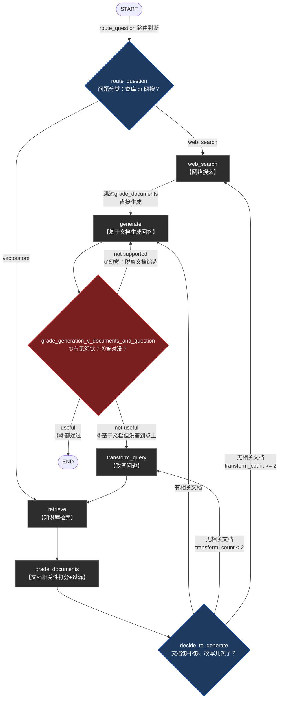
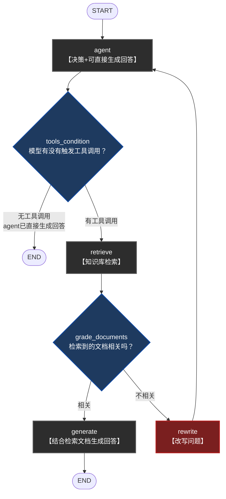

# graph1 & graph2 讲解笔记

两条独立Pipeline，同一套Self-RAG思路的两个演进阶段。三层讲法：图长啥样 → 节点干啥 → 为啥这么设计。

---

## Q0：RAG 是什么？Self-RAG 又是什么？

### RAG 是什么

RAG = Retrieval-Augmented Generation（检索增强生成）。核心思路：LLM 回答问题前先去外部知识库（向量库/文档库）检索相关内容，把检索到的内容当上下文塞进 prompt，再让 LLM 基于这些内容生成答案。解决两个问题：LLM 训练数据是静态的（不知道私有数据/实时数据），且容易瞎编（幻觉）——给它真实依据能显著缓解。

标准 RAG 流程：问题 → 检索 → 生成。一条直线，中间没有校验环节，检索到的文档不管相不相关都会拿去生成，生成完也不检查答案质量。

### Self-RAG 是什么

Self-RAG（Self-Reflective RAG）在这条直线上加自我反思/自纠错节点，具体到项目 `graph2/graph_2.py` 里体现的是：

1. **问题路由**：先判断这问题该查知识库还是走 web 搜索（`route_question`）
2. **检索文档打分**：检索回来的每篇文档单独让 LLM 判相关不相关，不相关的直接丢（`grade_documents`）
3. **生成结果双重校验**：
   - 幻觉检测——生成内容是不是真基于检索到的文档说的，还是瞎编（`hallucination_grader_chain`）
   - 答案匹配度——就算没瞎编，是不是真答到用户问题点上了（`answer_grader_chain`）
4. **纠错动作**：文档不相关→重写查询再检索；答案没答到点→重写查询；生成有幻觉→重新生成；重写次数超阈值→升级 web 搜索兜底

本质区别一句话：标准 RAG 是"检索完就生成，生成完就完事"；Self-RAG 是"每一步都问自己一句'这步做对了吗'，做错了就回头重来"，用多轮 LLM 判断换生成质量的稳定性，代价是延迟和 token 成本更高。

---

# Part 1：graph2（Self-RAG，完整版）

代码位置：`graph2/graph_2.py` + `graph2/graph_state2.py`

## 一、图长啥样（先建脑图）

```
START
  │
  ├─(route_question 路由判断)─→ web_search ──┐
  │                                            ├─→ generate
  └─(路由到知识库)──→ retrieve                 │      │
                        │                      │   (grade_generation 双重校验)
                        ↓                      │      │
                  grade_documents               │   ┌──┴──┬────────┐
                        │                       │  useful  not     not
                  (decide_to_generate)          │   │    useful  supported
                   ┌────┼────┐                  │   │      │        │
                有文档  无文档  无文档且已改写2次  │  END  transform  回到
                   │      │      │              │       _query    generate
                   ↓      ↓      ↓              │         │       自身
               generate transform  web_search────┘         ↓
                        _query                          retrieve
                          │                            (再走一遍)
                          └──────────→ retrieve
```

### Mermaid完整流程图



**节点功能一句话对照表**（图看不懂时对照这张表）：

| 节点/判断 | 一句话功能 |
|---|---|
| `route_question` | 问题分类：走知识库还是网搜 |
| `retrieve` | 知识库检索 |
| `grade_documents` | 逐文档打分，过滤不相关的 |
| `decide_to_generate` | 判断文档够不够、改写次数是否超限 |
| `web_search` | 实时网络搜索 |
| `generate` | 基于文档生成回答 |
| `grade_generation_v_documents_and_question` | 双重质检：①有无幻觉 ②是否答对问题 |
| `transform_query` | 改写问题，换个说法重新检索 |

### State字段（`graph_state2.py`）

四个字段，对应上面每个判断点要用的数据：

- `question` — 全程带着
- `documents` — retrieve/grade_documents 填，generate/幻觉检测要用
- `generation` — generate 填，双重校验要用
- `transform_count` — 专门为收敛循环设的计数器

---

## 二、每个节点干啥

**入口：`route_question`**（`graph_2.py:81`）
问题先过一遍LLM分类，判断该走知识库(`vectorstore`)还是实时网搜(`web_search`)。分岔从这里开始，不是所有问题都无脑查库。

**分支A：`web_search`**（`graph_2.py:124`）
查完直接→`generate`，**跳过**文档相关性打分这一步。（web搜索结果暂时"无条件信任"，是可以挑的一个点。）

**分支B：`retrieve` → `grade_documents`**
先查库，再对查到的每个文档块逐个打分相关/不相关，过滤掉不相关的，剩下的塞进`documents`状态字段。

**`decide_to_generate`**（`graph_2.py:55`）三路判断：

- 有文档 → `generate`
- 没文档 且 `transform_count < 2` → `transform_query`（改写问题重新查）
- 没文档 且 `transform_count >= 2` → 升级 `web_search`（知识库已经试两次没戏，换武器）

**`generate`**
用过滤后的文档生成回答。生成完不是直接给用户，还要过一道"质检"。

**`grade_generation_v_documents_and_question`**（`graph_2.py:21`）两级校验，顺序固定：

1. 先查幻觉：`generation`是不是脱离`documents`编出来的 → 不基于文档 → `"not supported"` → **打回`generate`自己重新生成**
2. 基于文档 → 再查切题：是否真答了`question` → 没答到点上 → `"not useful"` → 走`transform_query`换个问题角度重新检索
3. 两关都过 → `"useful"` → `END`

---

## 三、为啥这么设计（设计动机，面试重点）

**1. 为啥要路由**
检索有成本（Milvus查询延迟+资源），知识库覆盖不到的问题（比如问行业最新趋势）查库也白查，先分类再动手，是资源分配判断。

**2. 为啥幻觉检测必须在答案相关性前面，不能颠倒或合并**
一段完全编造的内容完全可能"看起来很贴题"，如果先判相关性会被这种假答案骗过。必须先确认"有没有依据"（忠实度），再谈"这个有依据的答案是否切题"（相关性），两个维度独立，顺序不能换。

**3. 为啥"not supported"和"not useful"走向不同**
失败原因不同，修复动作也该不同：

- 生成阶段出问题（幻觉）→ 换个生成尝试，文档没换（`generate`自身重试）
- 检索角度可能有问题（答案没切题）→ 换个问题表达重新检索（`transform_query`）

这是"按失败原因分类修复"，比笼统"失败就重试"精细。

**4. 为啥`transform_count`这个计数字段必须存在**
`decide_to_generate`那条循环有它兜底（改写2次仍无果就转web搜索），**但`"not supported"→generate`这条边没有任何计数**，理论上模型持续产生幻觉会无限重生成下去。这是**现存未修复问题**，面试被问"会不会死循环"就诚实答这个，附带修复思路（加个`generation_retry_count`字段，超阈值降级返回"无法确定"提示）。

---

# Part 2：graph1（简单Agentic RAG，早期版本）

代码位置：`graph/graph1.py` + `graph/graph_state1.py`

## 一、图长啥样

```
START → agent ──(tools_condition)──→ 无工具调用 → END
                        │
                    有工具调用
                        ↓
                    retrieve ──(grade_documents)──→ 相关 → generate → END
                        │
                      不相关
                        ↓
                    rewrite → 回到 agent（循环）
```

### Mermaid完整流程图



**关键点标注**：`agent`节点方框写"决策+可直接生成回答"——这不是漏画了一步，是`agent_node`（`graph/agent_node.py:22-25`）里`model.invoke(...)`这一次调用本身就是Function Calling范式下的"二选一"：模型要么吐工具调用请求，要么直接吐文本回答当最终答案。`tools_condition`看到没有工具调用请求就直接判`END`，是因为回答已经在`agent`这一步生成完了，不是跳过了生成环节。

**`REWRITE`节点标红（风险节点）**：`rewrite→agent`这条边没有任何重试次数上限，对应第三节"设计缺陷"分析。

**节点功能一句话对照表**：

| 节点/判断 | 一句话功能 |
|---|---|
| `agent` | 模型决策：直接答还是调工具；不调工具时这一步就是最终生成 |
| `tools_condition` | LangGraph预置判断：模型有没有触发工具调用 |
| `retrieve` | 知识库检索 |
| `grade_documents` | 对检索到的文档整体打一次相关性分 |
| `generate` | 结合检索文档生成回答（区别于`agent`节点的直接生成） |
| `rewrite` | 改写问题，回`agent`重新走一遍决策 |

State（`graph_state1.py`）只有一个字段`messages`（`add_messages`标注，langgraph约定"追加"而非"覆盖"），比graph2简单得多——因为graph1没有`transform_count`这种要专门收敛循环的计数需求（这正是它"没有兜底"的根源，见下方第三节）。

## 二、节点干啥

**`agent`**——普通LLM+工具绑定节点，模型自己决定要不要调用`retriever_tool`。

**`tools_condition`**（`graph1.py:80-87`）

```python
workflow.add_conditional_edges(
    'agent',
    tools_condition,
    {
        'tools': 'retrieve',
        END: END
    }
)
```

LangGraph**预置**的条件函数，不是本项目手写的——只需把节点名映射表传给它，不用像`route_question`那样自己写判断逻辑。作用是判断上一轮`agent`节点的输出里有没有工具调用请求：有→走`retrieve`，没有→直接`END`。这跟graph2的`route_question`（本项目手写的路由判断）不是一回事——`tools_condition`判断的是"模型决定要不要用工具"这个**机制层面**的问题（模型内部的Function Calling有没有触发），不涉及"该走知识库还是网搜"这种**语义层面**的分类，graph1压根没有网搜这条路。

**`retrieve`**——`ToolNode([retriever_tool])`，LangGraph预置的工具执行节点，直接跑检索。

**`grade_documents`**（`graph1.py:26-68`）——文档相关性打分，跟graph2的`grade_documents`节点思路一样（结构化输出yes/no），但**graph1这里是对`retrieve`返回的整块文档内容一次性打分**，不是graph2那种逐文档过滤。相关→`generate`，不相关→`rewrite`。

**`rewrite`**——改写问题，然后**回`agent`**（不是回`retrieve`）。

**`generate`**——生成回答，直接→`END`。没有graph2那套幻觉检测+答案相关性评估的双重质检。

## 三、为啥这么设计（对比graph2看差异）

**1. 为啥graph1用`tools_condition`而graph2手写`route_question`**
graph1让LLM自己判断"要不要调工具"，是LangChain/LangGraph最基础的Agent范式（省心，但判断粒度粗，只有"用/不用"两态）；graph2手写路由是因为要多一层语义判断"该用哪种检索资源"（知识库 vs 网搜），`tools_condition`做不到这个语义分类，必须自己写链。

**2. 为啥`rewrite`是回`agent`而graph2的`transform_query`是回`retrieve`**
graph1的循环单位是"整个Agent决策"（改写问题后要让模型重新决定策略，因为graph1的`agent`节点本身承担了"要不要检索"的判断），graph2的循环单位是"检索"本身（因为图2已经在`route_question`阶段做完策略判断，改写问题不需要重新过一遍路由，直接回检索即可）。这是两种图对"循环该绕回哪一层"的不同设计，取决于判断逻辑放在哪个节点。

**3. 为啥graph1没有生成质量校验、没有收敛计数——是缺陷不是设计选择**
`rewrite→agent`这条循环边**没有任何次数上限**，如果用户问题反复改写后依然检索不到相关内容，会无限循环。这跟graph2里`generate`重试没有计数是同一类问题（都是"局部正确的收敛模式没有推广"），只是graph1是"从头到尾都没做"，graph2是"做了一半"。

**面试给分点**：被问"两条pipeline区别"，答案架构是——graph1验证"Agent+工具+简单校验"这个基础范式能不能跑通，graph2在这基础上补上路由判断、生成质量双重校验、显式收敛控制，是同一套Self-RAG思路"从0到1再到完整"的两个阶段产物，不是两个不相关的实现。

---

# Part 3：技术方案迭代动机推测（CRM线上case视角）

以下推理**不依赖git提交记录**，纯从graph1→graph2的结构差异反推：什么样的CRM线上故障/投诉会逼出这几个具体改动。面试被问"为什么要做这次迭代"，可以按这个思路组织答案。

## 一、四类可能的线上case

**1. 死循环/超时 case（最像，优先级最高）**

graph1的`rewrite→agent`没有任何重试上限。CRM场景里用户问一个知识库压根没覆盖的问题（比如"某客户合同编号XXX的最新状态"这类库里没有的内容），agent反复认为"该检索"但检索不到相关文档，`rewrite`→`agent`→再检索→再不相关……**无限循环**。线上表现是请求hang死/超时，而且每轮循环都是一次完整的LLM调用+检索调用，**成本随循环次数线性爆炸**。

graph2直接对症下药：`transform_count`计数器，改写2次仍无果就**强制**跳出循环升级到`web_search`，从"可能无限"变成"最多3次尝试"。这是最直接、最像是"故障复盘后加的硬约束"的改动。

**2. 答非所问/幻觉被投诉 case**

graph1的`grade_documents`只做检索**前置**校验（文档相关不相关），`generate`生成完直接`END`，**生成结果本身没有任何二次校验**。这意味着"检索到了相关文档"≠"基于这些文档生成的回答是对的"——模型完全可能拿着相关文档还是编造内容，或者答非所问。CRM客户问"这个报价单为什么被驳回"，模型检索到相关文档但答案跑偏或半真半假，直接就把错误答案吐给客户了，这种case业务侧最容易感知到并投诉。

graph2补上`grade_generation_v_documents_and_question`，**生成后**做两级质检：先查幻觉（`not supported`→打回`generate`重试），再查是否切题（`not useful`→`transform_query`换角度重新检索）。这个改动的信号很明确：**已经在生产环境见过"答案是编的"或"答案没答到点上"的真实反馈**，才会专门补这道后置质检。

**3. 知识库覆盖不全，纯向量检索死磕 case**

graph1完全没有`web_search`兜底路径，只能死磕`vectorstore`。CRM知识库这类业务天然有长尾问题（比如问某个外部系统的最新公告、行业动态），知识库更新滞后，纯向量检索查不到时graph1只能"死循环改写"或者最终给一个"不知道"。

graph2引入`route_question`前置分流（部分问题一开始就分去`web_search`，不进知识库）+ 循环内超限升级`web_search`兜底，说明**遇到过知识库确实没覆盖、又没有任何兜底手段直接暴露给用户的case**，才被迫接入外部搜索作保底。

**4. 隐藏的工程诉求：从"LLM自主决策"转向"确定性状态机"**

graph1核心分支`tools_condition`是LangGraph预置函数，本质是让LLM自己决定"要不要调工具"——**可控性差**，线上排查"这次为什么没触发检索"很难定位（黑盒在模型内部的Function Calling决策里）。

graph2把这层判断显式化：`route_question`/`decide_to_generate`都是本项目手写的规则函数，不依赖LLM随机决定要不要调工具，每条分支走向都能在日志里对应到明确的判断依据。这更像是**从"信任LLM自主决策"转向"工程化的确定性状态机"**——企业级CRM场景对可控性、可追溯性要求高，出故障要能讲清楚"为什么走了这条分支"，而不是"模型当时决定不调工具"这种无法复盘的解释。

## 二、结论（一句话）

最可能的触发链路：**先出现过检索不到相关文档时的死循环/超时故障**（`rewrite`无上限），**叠加答案幻觉被业务侧投诉**（生成后无校验），两个真实case合并推动了这次迭代——从"tool-calling agent + 无限重试 + 生成后零校验"演进到"显式状态机 + 重试次数上限 + 生成后双重质检 + web搜索兜底"。graph2里`transform_count`的存在、以及`grade_generation_v_documents_and_question`两级质检的顺序设计（幻觉检测必须先于相关性检测），都是这两类故障最直接的工程回应。

**注意**：graph2自身也不是完美收敛的——`"not supported"→generate`这条边（Part 1第137行提到的现存问题）依然没有计数上限，如果面试官追问"那graph2彻底解决问题了吗"，诚实答：只解决了检索侧的死循环，生成侧的死循环隐患还在，是下一轮可能迭代的方向。
