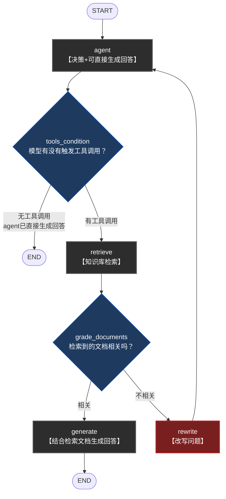
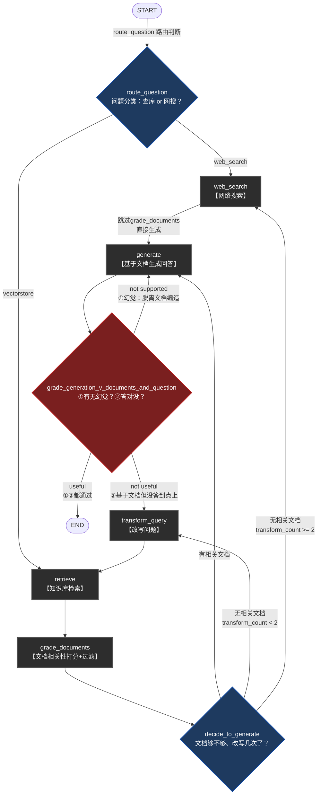

# 两条Agentic工作流：graph1 与 graph2

简历原文对应两句：
> 1. 基于LangGraph构建两条Agentic工作流：简单工具调用型RAG（多轮对话）与Self-RAG（带路由与自纠错的复杂问答链路）。
> 4. 基于LangGraph实现Self-RAG自纠错流程：问题路由（web搜索/知识库检索）、检索文档相关性打分、生成结果幻觉检测与答案匹配度双重评估，未通过校验自动触发查询重写或升级为web搜索兜底。

对应代码：`graph/graph1.py`（+`graph_state1.py`/`agent_node.py`/`generate_node.py`/`rewrite_node.py`）、`graph2/graph_2.py`（+`graph_state2.py`/`query_route_chain.py`/`grade_documents_node.py`/`grader_chain.py`/`grade_hallucinations_chain.py`/`grade_answer_chain.py`/`transform_query_node.py`/`web_search_node.py`/`generate_node2.py`）

---

## 目录

1. [两者是递进关系，不是并列关系](#1-两者是递进关系不是并列关系)
2. [graph1：简单工具调用型RAG](#2-graph1简单工具调用型rag)
3. [graph2：Self-RAG自纠错流程](#3-graph2self-rag自纠错流程)
4. [两者核心区别对比](#4-两者核心区别对比)
5. [必要的LangGraph背景知识](#5-必要的langgraph背景知识)
6. [两阶段过滤：Milvus向量过滤 vs LLM语义过滤](#6-两阶段过滤milvus向量过滤-vs-llm语义过滤)
7. [召回率与准确率实测数据](#7-召回率与准确率实测数据)
8. [技术方案迭代动机推测](#8-技术方案迭代动机推测)

---

## 1. 两者是递进关系，不是并列关系

**面试官问："你这项目里怎么有两个RAG实现？一个简单一个复杂，是分开用在不同场景的吗？"**

不是分场景用的，是同一个东西迭代了一版。刚立项时要求尽快搞出一个能跑、能演示的版本，时间紧，先做了graph1——Agent自己判断要不要检索，检索完打一次相关性分，行就生成，不行就改写问题再来一轮。这版目的很单纯，就是先验证"知识库+Agent"这套东西能不能跑起来，跑起来之后开了内部账号，给部分产品和研发同学试用。

试用之后暴露问题了：检索不到东西的时候会死循环、答案有时候是编的出现幻觉、知识库覆盖不到的问题没有兜底、整个流程靠模型自己决定要不要调工具，出问题很难排查。这几个问题攒起来，逼着重新设计了graph2，把路由判断、生成后的双重质检、改写次数的收敛控制、web搜索兜底这些补上了。

**graph2是主力方案，graph1是简单原型。**

### RAG 与 Self-RAG 的关系

标准RAG的思路：让模型回答问题前，先去外部知识库查一下相关内容，把查到的内容塞进prompt当上下文，再让模型基于这些内容生成答案。这么做主要解决两个问题：模型训练数据固定不知道私有数据；模型容易瞎编，给它真实依据能明显缓解。标准RAG流程是一条直线：问题进来→检索→生成，完事，中间没有任何校验，检索到的东西不管相不相关都会拿去用，生成完了也不检查答案靠不靠谱。

Self-RAG是在这条直线上加了几个自我反思、自我纠错的环节。落到graph2里，具体是这几件事：
1. 先做**问题路由**，判断这个问题该查知识库还是走web搜索
2. 检索完之后**逐篇给文档打相关性分**，不相关的直接扔掉
3. 生成完了不是直接给用户，还要过**两道校验**：先看这段回答是不是真的基于检索到的文档说的（有没有幻觉），再看是不是真答到用户问题点上了（切不切题）
4. 根据校验结果做不同的纠错动作：文档不相关就改写问题重新查，答案没答到点上就改写问题，生成有幻觉就重新生成，改写次数超了就升级到web搜索兜底

一句话总结区别：**标准RAG是"查完就生成，生成完就完事"；Self-RAG是"每一步都自己反问一句'这步做对了吗'，做错了就退回去重来"**，代价是多轮LLM调用，延迟和token成本都会上去，换来的是生成质量更稳定。

---

## 2. graph1：简单工具调用型RAG

代码位置：`graph/graph1.py` + `graph/graph_state1.py`

### 图长啥样

```
START → agent ──(tools_condition)──→ 无工具调用 → END
                        │
                    有工具调用
                        ↓
                    retrieve ──(grade_documents)──→ 相关 → generate → END
                        │
                      不相关
                        ↓
                    rewrite → 回到 agent（循环）
```



**节点功能一句话对照表**：

| 节点/判断 | 一句话功能 |
|---|---|
| `agent` | 模型决策：直接答还是调工具；不调工具时这一步就是最终生成 |
| `tools_condition` | LangGraph预置判断：模型有没有触发工具调用 |
| `retrieve` | 知识库检索 |
| `grade_documents` | 对检索到的文档整体打一次相关性分 |
| `generate` | 结合检索文档生成回答（区别于`agent`节点的直接生成） |
| `rewrite` | 改写问题，回`agent`重新走一遍决策 |

**关于`agent`节点画成"决策+可直接生成回答"**：不是漏画生成环节，`model.invoke(...)`（`graph/agent_node.py:22-25`）本身就是Function Calling范式下的二选一——模型要么吐一个工具调用请求，要么直接吐文本回答当最终答案。`tools_condition`看到没有工具调用请求，就直接判`END`，是因为回答已经在`agent`这一步生成完了，不是跳过了生成这一环。

State（`graph_state1.py`）只有一个字段`messages`（用`add_messages`标注，langgraph的约定是"追加"不是"覆盖"），比graph2简单很多——因为graph1根本没有`transform_count`这种要专门控制循环收敛的需求，这正是它"没有兜底"的根源。

### 节点干啥（可以直接照着讲）

**`agent`**：普通的LLM+工具绑定节点，模型自己决定要不要调用`retriever_tool`。

**`tools_condition`**（`graph1.py:80-87`）是LangGraph自带的，不是自己写的：
```python
workflow.add_conditional_edges(
    'agent',
    tools_condition,
    {'tools': 'retrieve', END: END}
)
```
判断上一轮`agent`的输出里有没有工具调用请求：有就走`retrieve`，没有就直接`END`。判断的是"模型决定要不要用工具"这种**机制层面**的问题，跟graph2的`route_question`不是一回事——`route_question`判断的是"该走知识库还是网搜"这种**语义层面**的分类，graph1压根没有网搜这条路，也不需要这种语义判断。

**`retrieve`**：LangGraph预置的`ToolNode([retriever_tool])`，直接跑检索。

**`grade_documents`**（`graph1.py:26-68`）做文档相关性打分，思路跟graph2的同名节点一样，都是结构化输出yes/no，但这里**是对`retrieve`返回的整块文档内容一次性打分**，不像graph2那样逐条文档过滤。相关就去`generate`，不相关就去`rewrite`。

**`rewrite`**：改写问题，然后**回`agent`**，注意不是回`retrieve`。

**`generate`**：生成回答，直接结束，没有graph2那套幻觉检测加答案相关性评估的双重质检。

### 为啥这么设计（拿graph2来对比讲）

**"graph1用的是`tools_condition`，graph2为什么要自己手写`route_question`？"**

因为这两个解决的不是同一层问题。`tools_condition`是让LLM自己判断"要不要调工具"，这是LangChain/LangGraph最基础的Agent范式，省心，但判断粒度很粗，只有"用/不用"两态。graph2要多判断一层"该用哪种检索资源"，是知识库还是网搜，`tools_condition`做不到这种语义分类，所以只能自己写一条链。

**"`rewrite`回的是`agent`，`transform_query`回的是`retrieve`，为什么不一样？"**

因为两边循环的单位不一样。graph1里`agent`节点本身就承担了"要不要检索"这个判断，所以改写问题之后，需要让模型重新走一遍完整决策，所以回`agent`；graph2这边策略判断已经在`route_question`阶段做完了，改写问题不需要再重新走一遍路由，直接回`retrieve`就行。判断逻辑放在哪个节点，循环就该绕回哪一层。

**"graph1没有生成质量校验、没有收敛计数，是故意这么设计的吗？"**

不是故意的，这是缺陷，直接承认。`rewrite→agent`这条循环边**没有任何次数上限**，如果用户问题反复改写后还是检索不到相关内容，理论上会一直循环下去。这跟graph2里`generate`重试没有计数其实是同一类问题——都是"局部对的收敛模式没有推广到全局"，只是graph1是从头到尾都没做这件事，graph2是做了一半。

---

## 3. graph2：Self-RAG自纠错流程

代码位置：`graph2/graph_2.py` 主流程 + `graph2/query_route_chain.py`、`graph2/grade_documents_node.py`、`graph2/grade_hallucinations_chain.py`、`graph2/grade_answer_chain.py`、`graph2/transform_query_node.py`、`graph2/web_search_node.py`

### 整体流程（30秒话术）

简单的RAG（检索完直接生成）有个问题：检索到的文档如果和问题不相关，或者LLM生成时脱离文档内容瞎编（幻觉），最终答案质量没法保证。所以做了一条Self-RAG流程，在关键节点加自我校验和纠错能力：先路由问题该走知识库检索还是网络搜索；检索完之后对每篇文档做相关性打分，过滤掉不相关的；生成答案后做两层评估——先看生成内容是否有幻觉（是否基于检索到的文档），再看是否真的回答了用户问题；任何一层没通过就自动触发对应的纠错动作：文档不相关就重写查询再检索，重写次数超过阈值就升级用网络搜索兜底；生成有幻觉就重新生成；生成没答到点上就重写查询。

代码链路：`route_question()`路由 → `retrieve`/`web_search` → `grade_documents()`打分过滤 → `decide_to_generate()`决策 → `generate` → `grade_generation_v_documents_and_question()`双重评估 → 按结果走`transform_query`/`web_search`/`END`。

### Mermaid完整流程图



**节点功能一句话对照表**：

| 节点/判断 | 一句话功能 |
|---|---|
| `route_question` | 问题分类：走知识库还是网搜 |
| `retrieve` | 知识库检索 |
| `grade_documents` | 逐文档打分，过滤不相关的 |
| `decide_to_generate` | 判断文档够不够、改写次数是否超限 |
| `web_search` | 实时网络搜索 |
| `generate` | 基于文档生成回答 |
| `grade_generation_v_documents_and_question` | 双重质检：①有无幻觉 ②是否答对问题 |
| `transform_query` | 改写问题，换个说法重新检索 |

### State字段（`graph_state2.py`）

四个字段，对应每个判断点要用的数据：`question`（全程带着）、`documents`（retrieve/grade_documents填，generate/幻觉检测要用）、`generation`（generate填，双重校验要用）、`transform_count`（专门为收敛循环设的计数器）。

### 一、问题路由

用一个单独的LLM判断链（`question_router_chain`），给LLM一个结构化输出的分类任务：告诉它知识库里包含哪些主题的内容（目前prompt里配置的是"半导体材料、芯片制造、光刻技术相关文档"，在CRM场景里应该对应改成"销售SOP、产品功能、系统操作故障排查"这些主题），让LLM判断用户问题应该路由到`vectorstore`（走知识库检索）还是`web_search`（走网络搜索）。用的是`with_structured_output`绑定一个Pydantic模型（`RouteQuery`），保证返回的是固定的枚举值而不是自由文本，方便代码里直接用条件边分支。

**为什么要加路由这一步？** 检索本身是有成本的，Milvus查一次要花时间和资源，而且有些问题知识库压根没覆盖，比如问行业最新趋势这种，查库也是白查。先让模型判断一下这个问题该用哪种武器，再动手，这其实是个资源分配的判断，省掉不必要的检索开销。

**路由判断错了会怎样？** 目前这一层路由是单次判断，没有再次校验或回退机制——如果LLM误判把该走知识库的问题路由去了web搜索，流程会直接按web搜索的路径走到生成，不会再绕回来重新路由。这是当前设计的一个局限，如果要补强，可以在生成后的双重评估阶段加一层判断，发现走web_search分支生成的答案质量不达标时也考虑再路由回知识库检索，但目前代码没有做这层双向兜底。

### 二、文档相关性打分（简历核心亮点，问得最细）

这题分两层答：先说外面怎么调的，再说LLM内部到底凭什么判断yes还是no。

**外层怎么调的**：是一篇一篇单独打分，不是把检索回来的文档整体打包丢给模型判一次。具体在`grade_documents()`节点里（`graph2/grade_documents_node.py:21-24`），对`state["documents"]`里的每一篇文档都单独循环调用一次`retrieval_grader_chain`：

```python
for d in documents:
    score = retrieval_grader_chain.invoke(
        {"question": question, "document": d.page_content}
    )
    grade = score.binary_score
```

判yes的留下，判no的直接丢掉，最后`filtered_docs`里只剩相关的文档，才会往后传给生成节点用。

**内层，LLM具体怎么判断yes还是no的**，拆成三点讲（对应`graph2/grader_chain.py`）：

第一点，靠system prompt把判断标准先给模型定死，不是让它自己随便判。prompt原文：

```
你是一个评估检索文档与用户问题相关性的评分器。
如果文档包含与用户问题相关的关键词或语义含义，则评为相关。
不需要非常严格的测试，目的是过滤掉错误的检索结果。
给出'yes'或'no'的二元评分来表示文档是否与问题相关。
```

两个特意设计的点：一是判断依据写的是"关键词或语义含义"两个维度一起看，不是纯关键词匹配（那样直接用BM25就行，不用请LLM），也不是纯语义相似度（向量检索那一步其实已经算过一次语义距离了），这一步是让LLM再综合复核一遍；二是特意写了"不需要非常严格"这句话，故意把这道关卡设得松一点——它的定位是把检索阶段明显跑偏的结果兜底剔除掉，不是要在这里做精细的排序打分，排序这件事在检索阶段RRF融合排名的时候就已经做完了。

第二点，靠输入的组织方式，让模型做的是"对比判断"，不是凭空评价一篇文档好不好。human prompt模板是`"Retrieved document: \n\n {document} \n\n User question: {question}"`（`graph2/grader_chain.py:27`），把文档和问题并排喂给模型，让它回答"给你这篇文档、给你这个问题，这篇文档能不能支撑回答这个问题"，这是一个有明确参照物的判断，比抽象地问"这篇文档质量怎么样"要精确得多。

第三点，靠结构化输出把模型的嘴管住，让它只能吐yes或no，不能扯一段解释：

```python
class GradeDocuments(BaseModel):
    binary_score: str = Field(description="文档是否与问题相关，取值为'yes'或'no'")
```

用`llm.with_structured_output(GradeDocuments)`把这个模型绑定给LLM，底层走的是模型自带的Function Calling能力，强制返回值必须符合这个schema。如果不加这层约束，直接问模型"这篇文档相关吗"，它很可能回一段"这篇文档提到了……所以算是部分相关"这种自由文本，代码根本没法直接拿去做if判断；加了结构化输出之后，`score.binary_score`稳定就是字符串"yes"或"no"，可以直接拿去做条件分支，不用再写正则去解析模型说的人话。

一句话收尾：判断标准靠prompt里那两句话锚定，判断方式是把文档和问题放一起做对比，输出格式靠结构化输出强制收敛成程序能直接吃的yes/no，三层加在一起才让这个"打分"真正落地成可执行的代码逻辑，不是一句空话。

**如果检索回来的所有文档都被打成不相关，接下来怎么处理？** 对应`decide_to_generate()`这个决策函数。如果打分过滤完`filtered_documents`是空的，先看`transform_count`（已经重写过几次查询了）——如果还没到2次，就走`transform_query`，把问题换个说法重写一遍，再回去重新检索一次；如果已经重写两次了还是一篇相关文档都没有，就不跟知识库死磕了，直接升级走`web_search`兜底，避免用户一直等。

**打分会不会增加延迟？** 会，直接承认，不回避。这一步是按文档数量来调LLM的，比如检索出来k=4篇文档，就要多调4次LLM去逐篇判相关性，跟简单RAG（检索完直接生成，中间零判断）比起来，延迟和token成本确实明显多了一块。但这是Self-RAG的典型取舍——用"多几轮LLM校验"换"生成质量更稳"，这条链路是给销售、客服这种后台查询场景用的，能接受几秒级的响应延迟，不是要求毫秒级响应的实时对话场景，这个延迟成本划得来。

### 三、生成结果的双重评估：幻觉检测 + 答案匹配度（简历核心亮点）

**"幻觉检测"和"答案匹配度评估"这两层具体分别检查什么？为什么要分两层不合并成一层？**

这两层检查的对象不一样：幻觉检测（`hallucination_grader_chain`）检查的是"生成内容有没有胡编，是不是基于检索到的文档说的话"——即使答案说得头头是道，如果内容和文档对不上，就是不可信的幻觉；答案匹配度评估（`answer_grader_chain`）检查的是"就算生成内容都基于文档、没有胡编，它有没有真的回答用户问题"——有可能模型基于文档如实说了一堆相关但没切中问题重点的话，内容真实但没解决用户的疑问。**这两个是正交的两个维度（真实性 vs 有用性）**，必须分两层单独判断，如果合并成一层判断很容易把"答得对但没答到点"和"胡编瞎答"两种完全不同性质的问题混在一起，纠错动作也应该不一样。

**为什么必须是这个先后顺序，不能颠倒或者合并成一步？** 一段完全编造出来的内容，完全可能看起来很贴题，如果先判相关性，很容易被这种看着像真的、其实是编的答案骗过去。所以必须先确认"这个答案到底有没有依据"（忠实度），再去谈"这个有依据的答案是不是真的切题"（相关性）。这是两个完全独立的维度，顺序不能换，一换就会让编造出来的假答案蒙混过关。

**幻觉检测判定为"有幻觉"之后走哪个分支？** 对应`grade_generation_v_documents_and_question()`里的`"not supported"`分支，代码里`add_conditional_edges`配置的是`"not supported": "generate"`，直接退回`generate`节点本身重新生成一次——不重新检索、不重写问题，只是让LLM基于同样的文档再生成一遍答案，寄希望于重新生成能减少幻觉。

**答案匹配度没通过之后走哪个分支？跟文档不相关走的分支是同一个吗？** 走的是`"not useful": "transform_query"`，和"文档不相关"走的重写查询是**同一个**`transform_query`节点，但触发场景不同——一个是检索阶段就没找到相关文档，一个是生成完了发现答案没答到点上，说明可能是问题表述本身不够精确，两种情况都用"重写查询再检索"来纠正。**因为失败的原因不一样，修复动作也该不一样**——生成阶段出问题（幻觉），不去换文档，而是让`generate`自己再试一次，因为问题出在生成这一步，文档本身没问题；但如果是答案没切题，可能是检索角度本身有问题，所以走`transform_query`换个问题的说法重新检索。这是"按失败原因分类修复"，不是笼统地"失败了就重试一遍"。

**幻觉检测这一步如果反复判定失败会怎样？有没有重试上限？** 这是当前实现的一个明确风险点：`"not supported": "generate"`这条边**没有设置重试次数上限**，如果LLM持续判定生成内容有幻觉，理论上会一直在`generate`节点原地重试、不会跳出，存在死循环风险。这是简历没写但代码里确实存在的已知问题，如果被问到，应该坦诚这是待优化点——理想方案是也给幻觉检测加一个类似`transform_count`的计数器，超过阈值后跳出（比如直接返回当前生成结果加免责提示，或升级web搜索）。

### 四、查询重写与升级web搜索兜底

**查询重写具体是怎么做的？** 用一个单独的LLM链（`transform_query`节点里现场构建的`question_rewriter`），prompt让LLM扮演"问题重写器"角色，分析原始问题背后的真实语义意图，生成一个更适合向量库检索的优化版本——把用户可能口语化、模糊、或者用词和知识库文档不完全对齐的提问，转写成更贴近文档表达习惯、检索友好的查询句子，提升下一轮检索的召回率。

**`transform_count`达到多少次会升级web搜索，为什么定这个数字？** 代码里定的是2次（`decide_to_generate()`里`if transform_count >= 2`）。这是经验性设定——给查询重写两次机会去尝试匹配知识库内容，如果两次重写后依然检索不到相关文档，大概率说明这个问题本身不在知识库覆盖范围内，继续重写边际收益很低，不如直接升级到网络搜索兜底，避免用户等太久。没有针对这个次数做过量化调优实验。

**升级到web搜索之后，还会再走一遍文档相关性打分吗？** 不会。`workflow.add_edge("web_search", "generate")`，web搜索完是直接走到生成节点，跳过了`grade_documents`这一步。这是因为网络搜索的结果本身没有像知识库文档一样的固定category/结构化字段，也没有针对网络搜索结果专门写相关性判断逻辑，属于简化处理——网络搜索作为兜底路径，直接信任搜索工具返回的结果去生成。这里承认一下：web搜索结果目前是"无条件信任"的，没有再做一次过滤，这是可以挑的一个点。

### 五、整体设计权衡：延迟 vs 死循环风险

**这套流程比简单RAG多绕这么多层，会不会导致响应时间明显变长？怎么权衡准确率和延迟？** Self-RAG每加一层校验（路由判断、逐篇文档相关性打分、幻觉检测、答案匹配度评估）都是一次额外的LLM调用，累积下来响应时间和token消耗比简单RAG明显更高。目前的权衡思路是：这条链路面向销售/客服这种对答案准确性要求较高、可以接受几秒级响应延迟的场景，选择用更多轮校验换更稳的答案质量，属于"准确率优先于速度"的场景化取舍。

**会不会死循环？** 存在风险，不硬说不会死循环。`decide_to_generate`那条循环有兜底，改写两次还没结果就转web搜索了，靠`transform_count`这个计数器控制。但是"not supported"打回`generate`这条边，目前**没有**加任何计数，理论上如果模型一直产生幻觉，就会一直重新生成下去，没有退出条件。这是知道但还没修的问题，修复思路很简单，就是加一个`generation_retry_count`字段，超过阈值就降级返回"无法确定"这样的提示，而不是让它一直空转。**这种诚实指出问题、还能给出具体修复思路的回答，比硬说"不会有问题"更让人信。**

---

## 4. 两者核心区别对比

| 维度 | graph1 | graph2 |
|---|---|---|
| 打分粒度 | 整批一次判断（4个chunk拼一起打一个分） | 逐chunk单独判断（4次独立LLM调用，各自yes/no） |
| 打分结果承载方式 | 混在`messages`列表里（`ToolMessage.content`是拼接字符串） | State里独立的`documents: List[Document]`字段，结构化保留 |
| 精细程度 | 粗——只要整批里有一部分不相关就可能拖累整体判断 | 细——能精确剔除混进来的不相关chunk，只保留真正相关的 |
| 不相关时的出口 | 只有1个：`rewrite`（重写问题回`agent`重新走） | 3个分支：`transform_query`（重写重试，有限次）/`web_search`（兜底）/`generate`（还有剩余相关chunk则生成） |
| 循环保护 | 无上限，`rewrite→agent`可能无限循环 | 有`transform_count`计数器，≥2次转`web_search`兜底；但`generate`幻觉重试仍无上限 |
| LLM调用次数（打分这一步） | 1次（整批） | k次（k=4，逐chunk各1次） |
| 延迟代价 | 低（1次调用） | 高（4次串行调用，且是同步for循环，无并发优化） |
| 生成后校验 | 无 | 幻觉检测+答案匹配度双重评估 |
| 问题路由 | 无（只有工具调不调用的二元判断） | 有（`route_question`语义分类，知识库/网搜） |
| 设计定位 | 更简单的验证性实现，用于跑通基础"检索→判断→生成/重写"闭环 | Self-RAG范式的精细实现，用更多LLM调用换更高的过滤精度和更完善的兜底策略 |

一句话总结：**graph1用1次LLM调用换低延迟、粗粒度、无兜底；graph2用k次LLM调用换高精度、细粒度、有限重试+兜底，本质是准确率与延迟之间不同的工程取舍**，这也是Self-RAG论文相比普通RAG-Agent范式多付出的成本所在。

---

## 5. 必要的LangGraph背景知识

看懂上面的代码对比，需要先分清两个概念：**独立node** 和 **条件边函数**。

| | 独立node | 条件边函数 |
|---|---|---|
| 注册方式 | `add_node(name, func)` | `add_conditional_edges(from_node, func, [mapping])` |
| 返回值类型 | `dict`（更新state的字段） | `str`（下一个节点名） |
| 对state的影响 | 修改/追加 | 只读，不修改 |
| 图上的表现 | 一个方框（干活的地方） | 方框之间的分叉箭头（选路的地方） |
| 职责 | 执行具体业务逻辑（调LLM、查数据库、调工具） | 只做路由判断，回答"接下来去哪" |

**本项目对照**：graph2把"打分"和"路由决策"拆成两步：`grade_documents`（真node，改`state.documents`）→ `decide_to_generate`（条件边函数，只读`state.documents`做路由）。graph1把两步合并成一步：`grade_documents`（条件边函数，自己打分自己决定路由，不是node，从没被`add_node`注册过）。**判断依据**：看函数有没有被传给`add_node()`，以及它的返回类型——返回`dict`就是node，返回`str`（节点名）就是条件边函数。两个项目里都叫`grade_documents`的函数，角色完全不同，容易搞混。

### 项目里已用到的关键内置概念

**`ToolNode`**：`from langgraph.prebuilt import ToolNode`，`workflow.add_node('retrieve', ToolNode([retriever_tool]))`。不是函数，是可调用对象（callable class），构造参数是"这个执行器手上有权调用的工具列表"。内部逻辑：读`state["messages"][-1].tool_calls`，按`name`字段匹配到对应工具，执行它，把结果包装成`ToolMessage`，返回`{"messages": [tool_message]}`。本质也是"会修改state的独立node"，只是具体行为是LangGraph帮你写好的。

**`add_messages`**：state字段的reducer，配合`Annotated`标注某个字段，node返回该字段时执行"追加"而非"覆盖"整个列表。`class AgentState(TypedDict): messages: Annotated[list[BaseMessage], add_messages]`。如果不加这个标注，`agent_node`每次`return {"messages": [response]}`会**直接覆盖**整个字段，之前累积的历史全部丢失。这是声明式注册的规则，不是在node函数体里手动调用的。

**`MemorySaver`**：checkpointer，配合`thread_id`让同一对话线程的多次调用共享state。graph1借此实现多轮对话记忆；graph2没有配置checkpointer，每次调用都是全新单轮，没有跨轮记忆。

### 三种消息类型体系

`HumanMessage`/`AIMessage`/`ToolMessage`三种类型代表三个不同的"发言者角色"，互斥（一条消息只能是其中一种类型）。

关键易混点：**`tool_calls`是`AIMessage`的字段，不是独立消息类型**。现代LLM的function calling能力让`AIMessage`可以携带两种内容之一：纯文本回答，或者"我要调用哪个工具"的结构化请求（`tool_calls`字段）。这两种情况下发言者都是AI，只是内容性质不同。`tool_calls`不是工具执行后留下的痕迹，是LLM自己主动生成的请求，`ToolNode`收到这个请求后才会真正去执行工具、产出独立的`ToolMessage`。

完整链路（graph1场景）：

```
HumanMessage           用户提问（角色：用户）
     ↓
AIMessage(tool_calls=[...])   LLM决定要查资料（角色：AI，内容性质="调用指令"）
     ↓
ToolNode 执行该指令，真正调用 retriever_tool.invoke()
     ↓
ToolMessage             工具返回的检索结果（角色：工具，回应上面的tool_calls）
     ↓
AIMessage(content="根据检索结果...")   LLM给出最终文字回答（角色：AI，内容性质="回答"）
```

`state["messages"][-1]`在链路不同阶段取到的是不同类型的消息——在`grade_documents`这一步，取到的正是`ToolNode`刚产出的`ToolMessage`。

`agent_node`的已知局限：`model.invoke([messages[-1]])`只传了最后一条，不是完整历史`messages`。graph1的`agent_node`每次调用LLM决策"要不要调用工具"时，LLM看不到更早的对话历史，只看当前最新这一条——这跟`rag_agent.py`里`RunnableWithMessageHistory`（支持多轮记忆）是不同机制，graph1这里虽然靠`MemorySaver`把历史存进了state，但`agent_node`调用LLM时并没有把完整历史喂给它。

---

## 6. 两阶段过滤：Milvus向量过滤 vs LLM语义过滤

延续文档相关性打分话题，专门梳理"过滤"这个动作在RAG链路里到底发生了几次、分别是谁做的、依据是什么。

### 核心结论：过滤发生两次，性质完全不同，不能混为一谈

```
第1次过滤：Milvus检索阶段（向量相似度过滤，数学距离近似）
     ↓
第2次过滤：LLM打分阶段（语义相关性过滤，graph1无 / graph2有）
```

容易产生的误解：以为"检索到4个chunk → 过滤掉不相关的2个 → 剩下2个合并起来再整体判断"是同一个流程里的连续步骤。实际上这是把两个不同阶段的过滤揉在了一起理解。

### 第1次过滤：Milvus检索阶段做了什么

```python
retriever = mv.vector_store_saved.as_retriever(
    search_type='similarity',
    search_kwargs={
        "k": 4,                                    # 只要最相似的4个
        "score_threshold": 0.1,                    # 相似度低于0.1的直接不返回
        "ranker_type": "rrf",
        "ranker_params": {"k": 100},
        'filter': {"category": "content"}          # 只在category=content的记录里找
    }
)
```

三层过滤，全在Milvus/检索器内部完成，跟LLM完全无关：`filter: {"category": "content"}`（硬性条件过滤，排除孤立的标题节点）、`score_threshold: 0.1`（相似度阈值过滤，低于0.1的直接排除）、`k: 4`（数量截断，RRF融合排序后只取最靠前的4个）。`retriever.invoke(question)`返回的4个chunk，是Milvus内部完成"向量相似度计算+阈值过滤+排序截断"之后，数学意义上最像相关的4个。这一步全程不涉及LLM调用。

### 第2次过滤：为什么Milvus过滤完了，还要LLM再判断一次

**关键陷阱**：向量相似度高，不等于语义真正相关。向量检索衡量的是词汇/语义**表面**的接近程度，是数学近似——表面接近不代表内容真的能回答用户问题，例如用户问"CRM系统怎么设置提醒"，向量检索可能捞回"CRM系统的价格设置"这段（"设置"一词重合度高，向量距离近），但内容答不上真实问题。`score_threshold=0.1`这个阈值本身设得比较宽松，是RAG召回阶段的常见策略：宁可多召回、不漏召回，精筛留给后面。**LLM打分要做Milvus向量距离做不到的事**：让真正理解语言语义的模型，重新审视这4个"数学上相似"的chunk，判断内容是否真的在语义上能回应用户的问题。

graph1无第2次精筛能力，只有整批判断——4个chunk原样拼接的文本，LLM输出1个yes/no，没有能力区分"这4个里面哪几个相关、哪几个不相关"，no的话4个chunk被整体丢弃，即使里面真的有部分相关的内容也一并牺牲。graph2逐个拆开精筛——才是"过滤掉不相关的，剩下相关的"这个动作的真正出处，graph2独有，graph1完全没有。但要注意：graph2筛完剩下的`filtered_docs`，**不会**再对剩下的做"合并起来整体判断一次相关性"，筛选本身就是终点，直接交给`decide_to_generate`决定下一步走向。两条pipeline都不存在"先过滤、再对幸存者做二次整体判断"这个两段式流程。

**类比理解**：Milvus检索=图书馆按关键词/书名检索，按相关度排序先捞出4本"看起来沾边"的书；LLM打分=翻开这4本书细读，判断"这本书是否真的讲到了我想问的东西"。图书馆检索系统不可能读懂问题的深层语义，只能靠关键词/向量距离这类数学近似去猜"可能相关"；真正判断"是否相关"这种需要理解的活，要靠LLM。

**一句话总结**："过滤"这个词在RAG链路里至少对应两个不同阶段的动作：Milvus检索阶段过滤的是"向量距离太远、明显不沾边"的候选（成千上万个chunk里选出k=4个，依据是数学距离）；LLM打分阶段（仅graph2有）过滤的是"这k个里面谁真的语义相关"（依据是语言理解）。两者过滤依据不同、发生时机不同、面对的候选集合规模也完全不同，不能混为同一次过滤来理解。

---

## 7. 召回率与准确率实测数据

面试官问"你说的召回率提升多少，这个数字怎么来的"——这一节是完整答案。按吴师兄《RAG评估从0到1》一文的六步方法论实操：测试集构建→检索层评估→生成层评估→问题定位→A/B对比→面试话术。

### 一句话结论

**检索层和过滤层：Recall@k两条pipeline完全打平（都是100%，40/40），差异体现在Precision@k——graph2逐chunk过滤比graph1整批判断高25.4个百分点（74.79% vs 49.38%）。但生成层：三个质量维度（正确性/忠实度/答案相关性）graph2都没有显著优于graph1，答案相关性反而低1.4个百分点。**

**核心发现**：过滤层更精细≠生成层答案更好。逐题排查定位到具体机制——graph2逐chunk判断在"答案信息分散在多个chunk"的题目上，可能会把包含次要但必要信息的chunk误判为不相关丢弃，导致生成阶段拿到的上下文反而不如graph1"整批全留"更完整。这不是简单验证"差异存在"，而是定位到了差异发生的具体条件和边界。

### 测试设置

| 项 | 值 |
|---|---|
| 测试文档 | 12篇自建CRM文档，覆盖销售SOP/产品功能/异议处理/故障排查4大类，每篇≥3000字 |
| 切块结果 | 12篇文档共解析出39个`category=content`的chunk，写入独立Milvus collection，与生产collection完全隔离 |
| 评测问题 | 40题，覆盖四种问题类型：factual简单事实题24、negation否定性查询9、multi_hop多跳推理题4、colloquial口语化查询3；每题标注`ground_truth_source`（支持多篇文档）、`ground_truth_snippet`（原文片段）、`reference_answer`（人工撰写参考答案） |
| 质量审查 | 对40题做了100%交叉验证（超过常规20%抽样比例），发现并修正1处标注错误（2.5%错误率），跟行业实践"交叉验证后降到2%以下"的经验值接近 |
| 检索配置 | 与`tools/retriever_tools.py`完全一致：k=4，RRF融合，score_threshold=0.1，filter=category:content |
| 评测方式 | 检索层：两条pipeline共享同一次Milvus检索结果，避免检索随机性造成不公平对比。生成层：分别用graph1/graph2过滤后的chunk复用两条pipeline完全相同的生成prompt，确保唯一变量是过滤策略本身 |

### 检索层 + 过滤层数据

| 指标 | graph1（整批判断） | graph2（逐chunk过滤） | 差值 |
|---|---|---|---|
| 检索层Recall@k（完全命中） | 100% (40/40) | 同 | 0 |
| MRR | 0.9458 | — | 排序质量很高 |
| NDCG@4 | 1.4619 | — | 部分题目ground truth在top4重复出现 |
| 检索层冗余率（同一文档被重复检索占比） | 30.63% | — | 平均每题约1.2个chunk是重复来源 |
| **Precision@k（保留chunk中命中率，均值）** | **49.38%** | **74.79%** | **+25.42个百分点** |

按问题类型拆解Precision：

| 问题类型 | 题数 | graph1 Precision | graph2 Precision | 差值 |
|---|---|---|---|---|
| factual | 24 | 44.8% | 74.3% | +29.5pp |
| multi_hop | 4 | 68.8% | 77.1% | +8.3pp |
| negation | 9 | 58.3% | 87.0% | +28.7pp |
| colloquial | 3 | 33.3% | 38.9% | +5.6pp |

graph2的精筛优势在factual和negation类型题上最明显（+28~29个百分点），在multi_hop和colloquial题上收窄到+5~8个百分点。原因：multi_hop题答案本身分散在多个chunk，graph2逐chunk判断容易把"部分相关"的chunk也保留（精筛红利有限）；colloquial题因为提问措辞跟文档原文差异大，检索召回的相关信号本身更弱，两条pipeline判断都更容易出错，precision普遍偏低。

### 生成层数据（正确性/忠实度/答案相关性，LLM-as-a-Judge）

方法：复刻`graph/generate_node.py`和`graph2/generate_node2.py`的生成prompt（两者完全一致），分别用graph1/graph2过滤后的chunk生成答案，再用手写LLM-as-a-Judge（不引入RAGAS，风格与项目现有代码保持一致）在三个独立维度打分。

| 指标 | graph1 | graph2 | 差值 |
|---|---|---|---|
| Correctness（正确性） | 98.58% | 98.28% | -0.30pp |
| Faithfulness（忠实度） | 97.97% | 97.97% | 0 |
| Relevance（答案相关性） | 96.35% | 94.93% | **-1.42pp** |

**三个指标graph2都没有优于graph1，答案相关性反而更低。**

**具体机制（题10案例）**：问题"商机从初步接触推进到需求确认阶段，需要满足什么条件？"标准答案要求两个信息点：①至少一次有效沟通记录（电话超3分钟或面谈）②系统会自动统计通话时长做强制校验。graph1保留全部4个chunk（含无关内容），但这4个chunk碰巧完整覆盖①②两点，relevance=1.0；graph2精筛后只保留1个chunk（precision=1.0，看起来很"干净"），但这个chunk只有①，遗漏了②，relevance掉到0.6。**机制总结**：graph2逐chunk判断是二元决策（相关/不相关），当标准答案的信息分散在多个chunk时，某个只包含"次要但必要信息"的chunk容易被判定为"不够相关"而丢弃，导致生成阶段实际拿到的信息反而比graph1"整批全留"更不完整。

按吴师兄文章的分层诊断框架套：检索层没问题（Recall@k持平100%，不是瓶颈）；过滤层确实有差异（Precision提升25.4个百分点，四种问题类型方向一致，真实可复现）；生成层没有随之提升，且Relevance更低（问题不在Prompt或模型能力，两条pipeline生成prompt完全相同，而在过滤策略本身的粒度权衡——逐chunk精筛在"信息集中于单个chunk"的场景下效果好，但在"信息分散、需要多chunk拼接才完整"的场景下有"精筛过度、误删必要信息"的副作用）。这是文章原有诊断框架（"检索好生成差→问题在Prompt/模型"）没有覆盖到的第四种情况：**检索好、过滤精度也更高，但生成没提升，问题在过滤策略的粒度设计本身**。

### 面试怎么答（四段话术）

**第一段——测试集构建**："构建了40条覆盖12篇CRM文档的测试集，覆盖四种问题类型（简单事实/多跳推理/否定性查询/口语化查询），做了全量交叉验证，发现并修正1处标注错误，错误率2.5%，接近行业实践'交叉验证后降到2%以下'的经验值。"

**第二段——分层评估**："检索、过滤、生成三层分开评估。检索层Recall@k两条pipeline持平100%，检索本身不是瓶颈。过滤层graph2逐chunk判断比graph1整批判断，Precision提升25个百分点，四种问题类型方向一致，是真实效果。但我们进一步测了生成层的正确性、忠实度、答案相关性，发现过滤层的精度优势没有传导到生成层，三个指标都没有显著提升，答案相关性反而低了1.4个百分点。"

**第三段——工具与方法**："生成层用手写LLM-as-a-Judge实现，没有引入RAGAS等现成框架，跟项目现有代码风格保持一致；生成阶段复用两条pipeline完全相同的prompt，确保对比的唯一变量是过滤策略本身。"

**第四段——发现与反思（最有分量的一段）**："这次评测最有价值的不是'graph2更好'这种简单结论，而是定位到了具体机制：graph2的逐chunk精筛在信息集中于单个chunk的题目上效果很好，但当标准答案需要综合多个chunk信息时，逐chunk的二元判断可能会误删掉包含次要但必要信息的chunk，导致生成阶段拿到的上下文反而不如graph1'整批全留'完整。这说明过滤策略的粒度设计要结合问题的信息分布特征，不是'越精细越好'。"

### 局限性说明（主动坦白，被追问时用）

- 测试集40题、语料39个chunk仍是小规模自建数据，问题全部人工编写，可能存在出题偏向（更容易出"能在文档里精确定位"的问题，对graph2这类精筛策略可能存在一定有利倾向）
- 生成层LLM-as-a-Judge本身是LLM判断，存在"长上下文偶尔判断出错"的固有局限，本次未做人工抽检校准自动评估结果的准确性
- 检索层Recall@k在40题上100%持平，某种程度上是因为测试语料规模小（39个chunk），候选池竞争不激烈；语料规模更大时Recall层面的差异可能显现，这是尚未验证的推测

---

## 8. 技术方案迭代动机推测（CRM线上case视角）

**先说明**：下面这些推理**不是靠翻git提交记录得出来的**，是纯粹从graph1到graph2的结构差异反推的——什么样的线上故障或者用户投诉，会逼着做出这几个具体的改动。如果面试官问"你们为什么要做这次迭代"，按这个思路组织答案。

### 四类可能的线上case

**第一类，也是最像、优先级最高的：死循环/超时**

graph1的`rewrite→agent`没有任何重试上限。想象CRM场景里用户问一个知识库压根没覆盖的问题，比如"某个客户合同编号XXX的最新状态"这种库里根本没有的内容，agent会反复认为"该检索"，但每次检索都查不到相关文档，`rewrite`→`agent`→再检索→再不相关……就这么无限循环下去。反映到线上就是请求一直hang着、超时，而且每转一圈都是一次完整的LLM调用加检索调用，成本跟着循环次数线性往上涨。

graph2直接对症下药，加了`transform_count`这个计数器，改写两次还是没结果，就强制跳出循环升级到`web_search`，从"可能无限循环"变成"最多试三次"。这个改动最直接、最像是"出过故障之后加的硬约束"。

**第二类：答非所问、或者答案是编的，被投诉了**

graph1的`grade_documents`只在检索**之前**做校验，就是判断文档相关不相关，`generate`生成完了就直接结束，**生成结果本身完全没有二次校验**。这意味着"检索到了相关文档"不等于"基于这些文档生成的回答是对的"——模型完全可能拿着相关的文档，还是编内容，或者答偏了。想象CRM客户问"这个报价单为什么被驳回"，模型检索到了相关文档，但答案跑偏了或者一半真一半假，就直接把这个错误答案吐给客户了，这种case业务侧最容易感知到、也最容易投诉。

graph2补上了`grade_generation_v_documents_and_question`，生成之后做两级质检，先查幻觉（不支持就打回`generate`重试），再查是否切题（没切题就走`transform_query`换角度重新检索）。这个改动信号很明确——大概率是已经在生产环境里见过"答案是编的"或者"答案没答到点上"的真实反馈了，才会专门补这道生成后的质检。

**第三类：知识库覆盖不全，纯向量检索死磕**

graph1完全没有`web_search`这条兜底路径，只能死磕`vectorstore`。CRM知识库这类业务天然会有长尾问题，比如问某个外部系统的最新公告、行业动态，知识库更新是滞后的，纯向量检索查不到的时候，graph1就只能"死循环改写"，或者最后给用户一个"不知道"。

graph2引入了`route_question`前置分流，一部分问题一开始就直接分去`web_search`，不进知识库，再加上循环内超限之后升级`web_search`兜底。这个改动大概率是遇到过知识库确实没覆盖、又完全没有兜底手段、直接把这个问题暴露给用户的case，才被迫接入外部搜索兜底的。

**第四类：藏得比较深的工程诉求——从"让LLM自己决策"转向"确定性状态机"**

graph1的核心分支`tools_condition`是LangGraph自带的，本质是让LLM自己决定"要不要调工具"，这个可控性比较差，线上要排查"这次为什么没触发检索"是很难定位的，因为黑盒藏在模型内部的Function Calling决策里，看不见。

graph2把这层判断显式化了，`route_question`、`decide_to_generate`都是自己写的规则函数，不依赖LLM随机决定要不要调工具，每条分支走向都能在日志里对上明确的判断依据。这更像是从"信任LLM自己决策"转向"工程化的确定性状态机"——企业级CRM场景对可控性、可追溯性要求很高，出了故障要能讲清楚"为什么走了这条分支"，而不是一句"模型当时决定不调工具"这种没法复盘的解释。

### 结论（一句话讲清楚）

最可能的触发链路：先出现过检索不到相关文档时的死循环/超时故障（`rewrite`没有上限），叠加答案幻觉被业务侧投诉（生成后完全没校验），这两个真实的case合起来推动了这次迭代——从"tool-calling agent + 无限重试 + 生成后零校验"，演进到"显式状态机 + 重试次数上限 + 生成后双重质检 + web搜索兜底"。graph2里`transform_count`的存在、以及幻觉检测必须先于相关性检测这个顺序设计，都是这两类故障最直接的工程回应。

**补一句诚实的话**：graph2自己也不是完美收敛的，前面提到的"not supported"打回`generate`这条边，依然没有计数上限。如果面试官追问"那graph2彻底解决问题了吗"，老实说：只解决了检索侧的死循环，生成侧的死循环隐患还在，这是下一轮可能要迭代的方向。
