# 操作系统常见面试题总结

> 整理自 javaguide.cn 面试题总结(上/下)，用自己的话组织，配图见 `img/` 目录。

## 一、操作系统基础

- **操作系统**：管理硬件+软件资源的核心程序，屏蔽硬件复杂性，让应用不用直接操作内存/磁盘等设备
- **内核**：OS的核心，负责内存管理/设备管理/文件系统/应用管理，是应用和硬件之间的桥梁。注意内核是软件层面，CPU才是硬件运算部件
- **六大功能**：进程线程管理、存储管理、文件管理、设备管理、网络管理、安全管理
- **常见OS**：Windows(桌面主流)、Unix(多用户多任务先驱)、Linux(开源类Unix，严格讲只指内核)、Mac OS

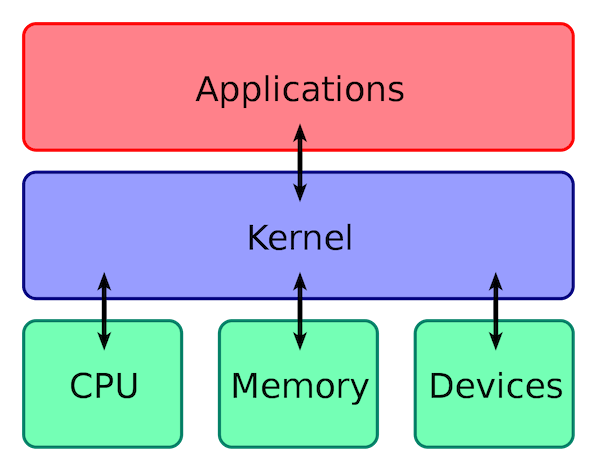

---

## 二、用户态与内核态

CPU执行代码的两种特权级别：
- **用户态**：权限低，不能执行特权指令/直接访问内核地址空间，要用系统调用请求服务
- **内核态**：权限高，可执行页表管理、中断处理等特权操作

设计目的：**安全和稳定**——防止应用的bug或恶意代码破坏系统隔离性。

**切换到内核态的三种方式**：
1. 系统调用（同步，主动发起）
2. 硬件中断（异步，外部触发）
3. 同步异常（如除零、缺页，由当前指令触发）

> 区分要点：中断/异常/系统调用是CPU为什么进内核；**信号**是内核通知进程/线程的软件机制，不是同一个维度的概念。

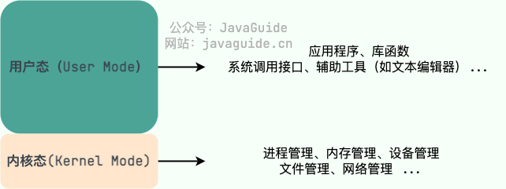

---

## 三、系统调用

内核提供给用户程序的受控服务接口，用于访问磁盘/页表/网卡等受保护资源。

**五大类**：设备管理、文件管理、进程管理、内存管理、网络通信

**与库函数的区别**：库函数调用始终跑在用户态，只有内部真正触发系统调用指令（比如glibc的read包装函数）才会进内核。

**Linux x86-64 read() 调用流程**：参数放寄存器执行syscall指令 → CPU切内核态并分发 → 内核检查权限状态 → 执行实际读取或让线程等待 → 通过寄存器把结果传回用户态。

> 系统调用不一定导致线程上下文切换——只有需要等I/O或锁资源时，线程才会阻塞被调度走。

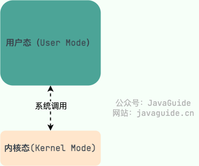
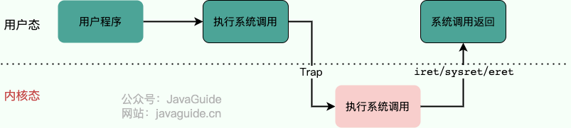

---

## 四、进程与线程

**类比**：进程是独立工厂(有专属资源+隔离空间)，线程是工厂里的工人(共享工厂资源，各干各的活)。

从JVM角度：多线程共享进程的堆和方法区，但每个线程有独立的程序计数器、虚拟机栈、本地方法栈。

| 维度 | 进程 | 线程 |
|---|---|---|
| 本质 | 资源分配隔离单位 | CPU调度执行单位 |
| 地址空间 | 独立 | 共享进程地址空间 |
| 通信 | 需要IPC | 可直接共享内存(需处理同步) |
| 切换成本 | 高(地址空间切换+TLB失效) | 低 |
| 故障隔离 | 好 | 一个线程崩可能拖垮整个进程 |

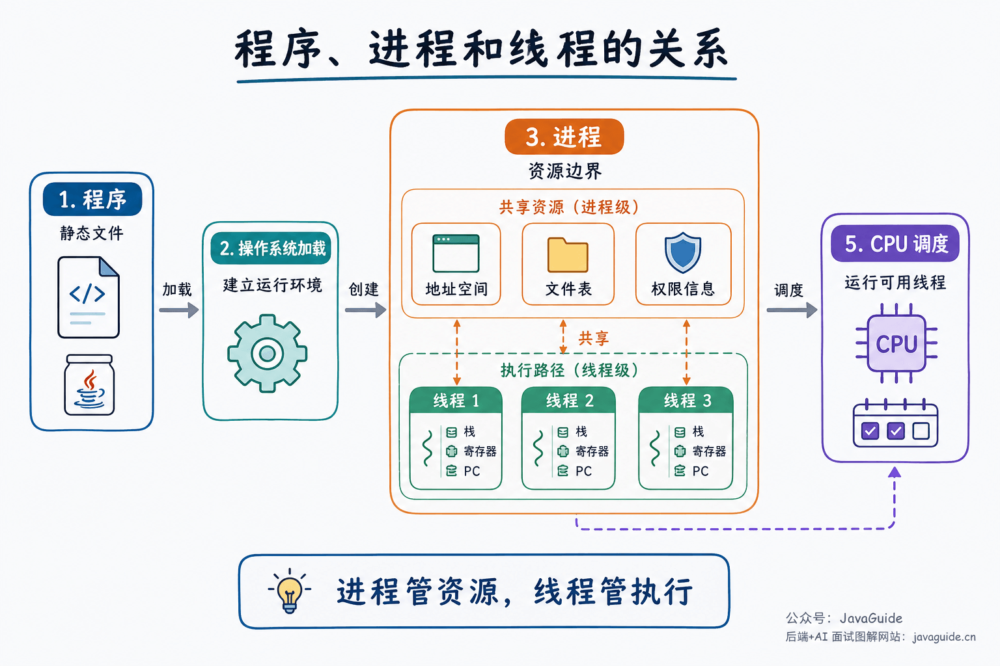

### 为什么需要线程

核心价值：**单个应用内实现低开销高效率的并发**，避免多进程IPC的高成本。单核场景阻塞线程让出CPU给别的线程，多核场景线程可并行。

**线程数不是越多越好**：过多线程带来栈内存占用、调度开销、锁竞争、缓存失效等问题。
- I/O密集型任务：多线程能隐藏等待时间，收益明显
- CPU密集型任务：受核数、串行部分、缓存影响，线程太多反而运行队列变长、上下文切换和锁竞争增加，吞吐下降

### 线程同步方式

| 机制 | 说明 | Java对应 |
|---|---|---|
| 互斥锁(Mutex) | 唯一持有者访问 | synchronized / Lock |
| 读写锁 | 多读单写 | ReadWriteLock |
| 信号量(Semaphore) | 控制最大并发访问数 | Semaphore |
| 屏障(Barrier) | 等所有线程到同一点再继续 | CyclicBarrier |
| 条件变量 | 等条件满足被唤醒，配合互斥锁 | wait/notify、Condition |

### PCB 与 TCB

- **PCB**(进程控制块)：管理进程的核心数据结构，含PID/父PID、状态调度信息、CPU上下文(PC/寄存器)、内存管理信息、资源信息。上下文切换时把现场存到PCB，再从下一个PCB恢复
- **TCB**(线程控制块)：保存线程ID、寄存器现场、栈信息

> Linux的特殊实现：进程和线程都被看成 `task`，用 `task_struct` 描述调度实体。区分进程/线程的关键在于**资源是否共享**，不是命名本身。

### 进程状态

**创建态 → 就绪态 → 运行态 → (阻塞态) → 结束态**

- 就绪态获得CPU → 运行态
- 运行态时间片耗尽 → 就绪态
- 运行中发起阻塞操作 → 阻塞态
- 阻塞事件完成 → 通常先回就绪态等调度

> "挂起状态"(进程不在内存中)和阻塞态(等事件但仍可能在内存)是不同维度概念，不要混淆。

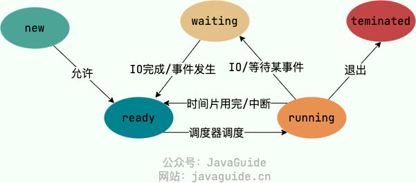

### 进程间通信(IPC)

进程有独立地址空间，无法直接互访内存。选型建议：

| 场景 | 方式 |
|---|---|
| 父子进程少量数据 | 匿名管道 |
| 无亲缘关系进程 | 命名管道 / Unix Domain Socket |
| 结构化消息 | 消息队列 |
| 大块数据交换 | 共享内存(配合信号量/互斥锁同步) |
| 异步事件通知 | 信号 |
| 跨机器通信 | TCP/UDP Socket / RPC |

### fork / exec / wait

- `fork()`：创建子进程，父子从同一位置继续执行但返回值不同
- `exec()`：在当前进程内装入并替换成另一个程序，不新建进程
- `wait()`/`waitpid()`：等待子进程状态变化，回收其退出后的内核状态信息

典型链路：Shell fork出子进程 → 子进程exec成目标程序 → 父进程wait回收状态。父进程不及时回收会产生**僵尸进程**。

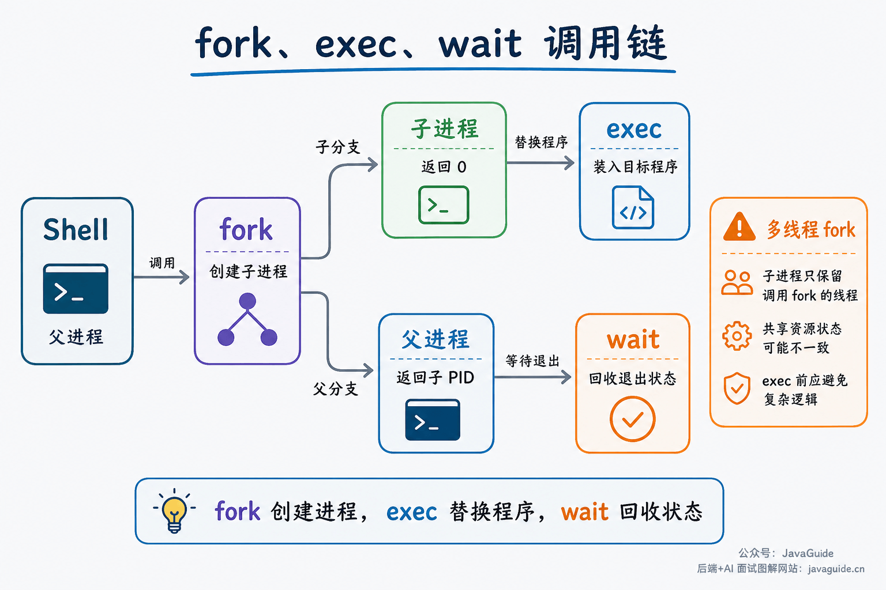

### 上下文切换

CPU从一个执行实体切到另一个，保存/恢复寄存器、PC、栈指针等现场。

- 进程切换更重：可能涉及页表切换、TLB失效、缓存局部性下降
- 同进程内线程切换更轻：只切执行现场，不切整套地址空间

> 区分上下文切换与态切换：只要内核处理完仍返回原线程，就**没有**发生线程上下文切换——系统调用/缺页/硬件中断可能只是态切换。

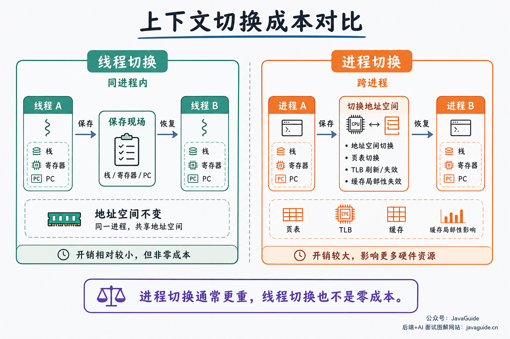

### 进程调度算法

**非抢占式**：
- FCFS(先到先服务)：按到达顺序，简单但有"护航效应"
- SJF(短作业优先)：优先短任务，降低平均等待时间，但难准确预测任务长度

**抢占式**：
- RR(时间片轮转)：轮流执行固定时间片，片太短放大切换开销，太长趋近FCFS
- 优先级调度：表达紧急程度，需处理低优先级饥饿问题
- MLFQ(多级反馈队列)：多个优先级队列，CPU密集型任务逐步降级，I/O交互型任务保留高优先级

> 现代Linux实际用 **CFS**(按权重和vruntime分配CPU)，6.6起fair调度类引入 **EEVDF** 算法。教材算法只是简化模型。

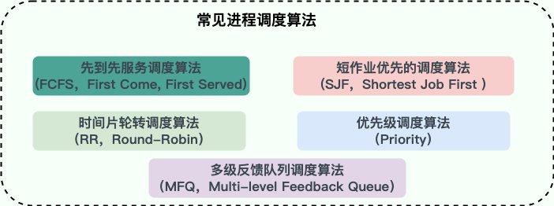

### 调度器 vs 分派程序

- **调度器**：负责调度决策，触发时机——任务阻塞/主动让出/时间片耗尽/优先级变化/更合适任务被唤醒
- **分派程序**：落实调度决定——保存当前进程上下文到PCB → 从下一进程PCB加载上下文 → 移交控制权

> 现代Linux内核实现不会严格拆成两个独立组件，理解职责划分即可。

### load average vs CPU使用率

两者维度不同：
- **load average**：一段时间内可运行任务+不可中断睡眠任务的数量(对应Linux的R状态和D状态)
- **CPU使用率**：CPU时间分布在用户态/内核态/I/O wait/中断/空闲

> 判断load高低要结合逻辑CPU数量；load高不一定是CPU争抢，可能是等磁盘/网络I/O，此时CPU可能反而空闲。排查顺序：`uptime`看趋势 → `top`/`vmstat`/`pidstat`/`mpstat`定位瓶颈。

---

## 五、死锁

一组进程/线程互相等待对方释放资源，形成闭环等待，全部卡死。

> 死锁与普通阻塞的区别：等待链绕成了**环**，没有外力介入不会自然解开。

经典案例：线程1持锁A等锁B，线程2持锁B等锁A —— 交叉持锁死锁。

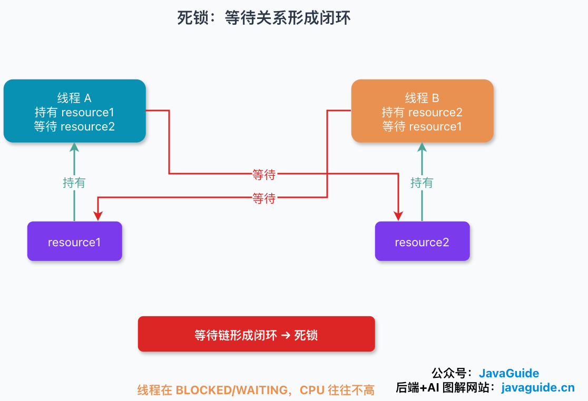

### 死锁四个必要条件

1. **互斥**：资源非共享，一次仅一个进程能用
2. **占有并等待**：进程持有一个资源同时等待别的资源
3. **非抢占**：资源只能被持有者主动释放，不能强制剥夺
4. **循环等待**：多个进程形成环形等待链

> 必要非充分：只满足一两个条件不一定死锁；反过来只要能稳定破坏其中任意一个，就能从结构上预防死锁。

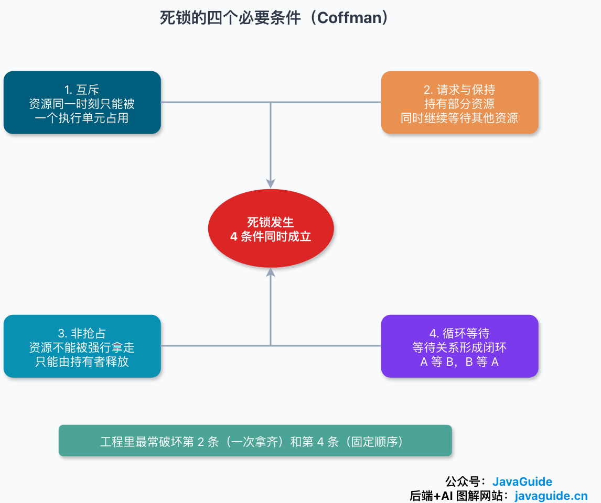

### 死锁解决方法

| 思路 | 说明 |
|---|---|
| 预防 | 提前破坏四条件之一，工程常用**固定加锁顺序**、缩小锁范围 |
| 避免 | 分配资源前判断是否安全，代表是**银行家算法**(多用于教材，实际业务少用) |
| 检测 | 允许等待发生，检查资源分配图是否成环(Java可用 `jstack`、`ThreadMXBean`) |
| 解除/恢复 | 打破环路——终止进程/回滚事务/应用层重试(数据库场景更适合检测+恢复，天然支持事务回滚) |

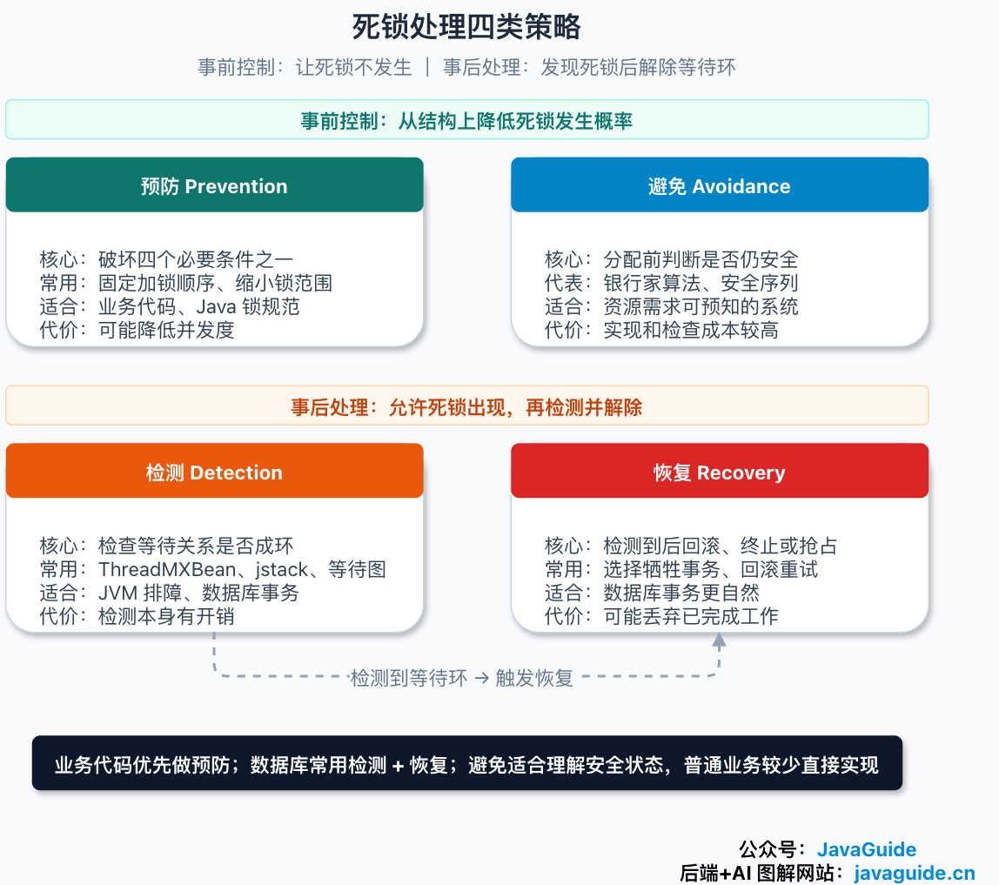

---

## 六、内存管理

### 五项核心职责

1. 分配回收内存(brk/mmap)
2. MMU+页表+TLB 完成地址转换
3. 页表权限位实现进程隔离与保护
4. 内存紧张时页面回收换页
5. 映射机制支持库共享和写时复制

### VSZ / RSS / PSS

- **VSZ**：进程映射的虚拟地址空间总量，包含未实际驻留部分，≠物理内存占用
- **RSS**：当前真正驻留物理内存的页面总量，但共享库/Page Cache的共享页也会被计入(可能重复计算)
- **PSS**：按比例分摊共享页(如1页被4个进程共享，每个进程只算1/4)

> 估算单进程占用看RSS，估算多进程合计占用要用PSS，避免共享页重复计算。

### 内存碎片

- **内部碎片**：分配给进程但未被实际使用的部分(如按2的幂分配，需求65字节实际分配128字节，浪费63字节)
- **外部碎片**：未分配但过于零散不连续、无法满足新请求的空间(分段机制典型问题)

### 连续内存管理：伙伴系统(Buddy System)

Linux用伙伴系统优化连续分配：内存按2的幂次划分，"必须相邻才是伙伴"，分配按需切分，释放时合并相邻块减少外部碎片，但仍有内部碎片问题。

小对象频繁分配用 **SLAB/SLUB** 分配器缓存常用内核对象复用内存。

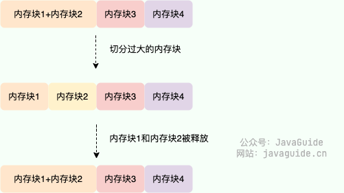
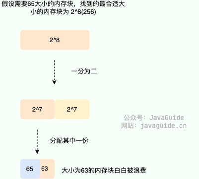

### 虚拟内存的六大价值

1. 隔离不同进程的地址空间
2. 提升物理内存利用率(只加载当前需要的页)
3. 简化内存管理(连续虚拟地址对应离散物理页)
4. 支持多进程共享物理内存(动态库、共享内存IPC)
5. 权限控制提高安全性
6. 换页机制扩展可用内存空间(但牺牲性能)

> 没有虚拟内存：程序直接操作物理地址 → 安全性差、多程序易互相覆盖崩溃、大量未用数据占用宝贵物理内存

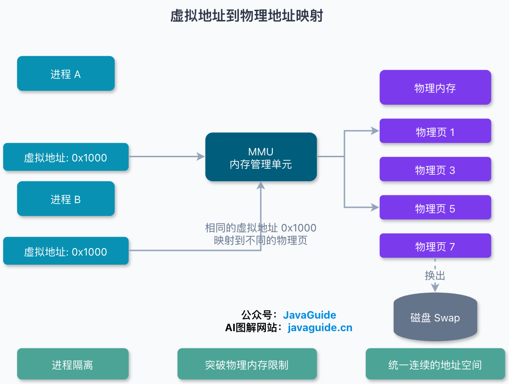

### 地址转换：MMU + 页表 + TLB

物理地址是内存条真实地址，程序里接触的都是**虚拟地址**，转换由CPU的MMU完成(地址翻译)。现代系统靠页表转换，TLB缓存近期结果减少查表开销。

> 不同进程数值相同的虚拟地址可以指向完全不同的物理页——这就是进程隔离及为何需要IPC的根本原因。

MMU地址翻译三种机制：**分段、分页、段页式**

#### 分段机制

按逻辑结构划分地址空间(代码段/数据段/堆/栈)，段表记录段基址、段界限、访问权限。

虚拟地址 = 段号 + 段内偏移量。翻译：解析段号 → 查段表取段信息 → 检查偏移越界/权限 → 段基址+偏移=物理地址。

**导致外部碎片**：段长不固定且需连续物理内存，反复创建释放后留下零散空洞——空洞总量够但单个空洞不够大，无法分配给需要更大连续空间的新进程。缓解靠**内存紧凑**(搬移腾出连续空间)，成本较高。

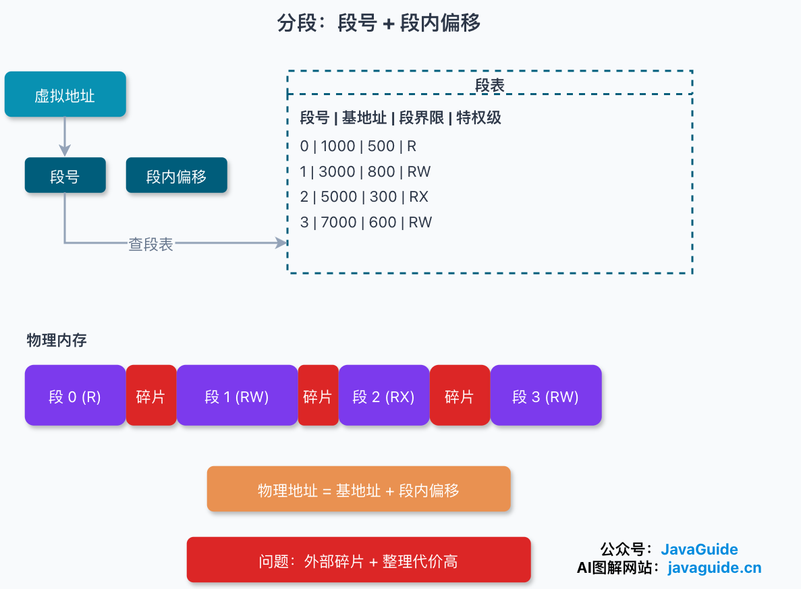
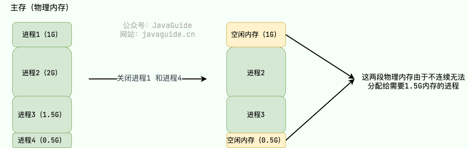

#### 分页机制

虚拟地址空间和物理内存都切成固定大小块(Linux通常**4KB**一页)，虚拟页可映射到任意物理页帧，**基本消除外部碎片**，只在最后一页产生少量内部碎片。支持**按需调页**——只有真正访问到某页才加载进内存。

虚拟地址 = 页号 + 页内偏移量。翻译：MMU解析页号 → 查页表取物理页帧号 → 页帧起始地址+偏移=物理地址。

> 页表项不存在/页面未驻留/权限不匹配 → 触发 **Page Fault**：可修复则建立映射/调页后重试，不可修复则发 `SIGSEGV` 终止进程。

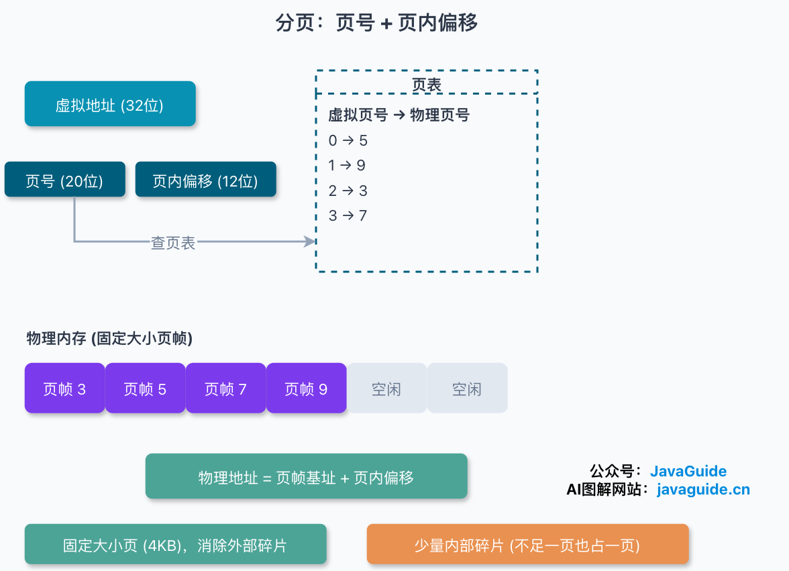
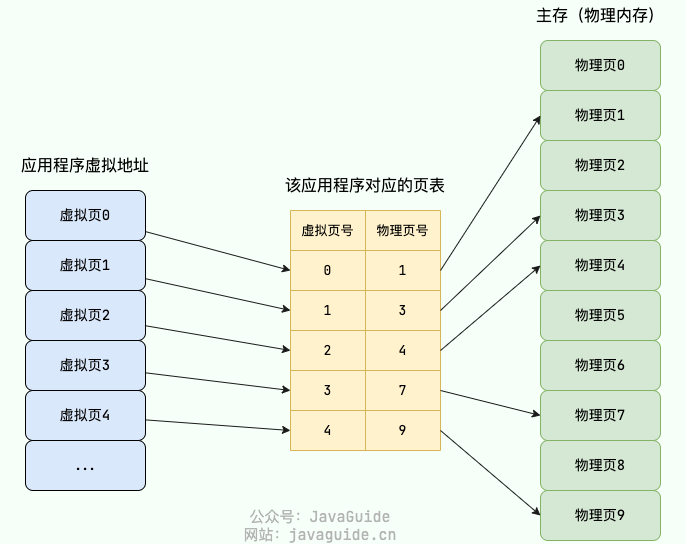
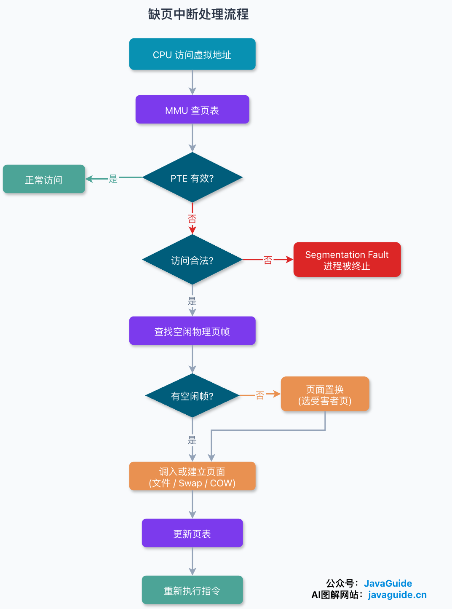

#### 多级页表

32位系统单级页表若一页4KB，需要 2^20 个页表项，每项4字节，整表约**4MB**——但大多数进程只用一小部分地址空间，浪费严重。

多级页表分层索引：顶层覆盖整个地址空间，下级页表按需创建。举例：只需2个二级页表，总占用约 4KB+4KB×2=**12KB**，远小于单级的4MB。

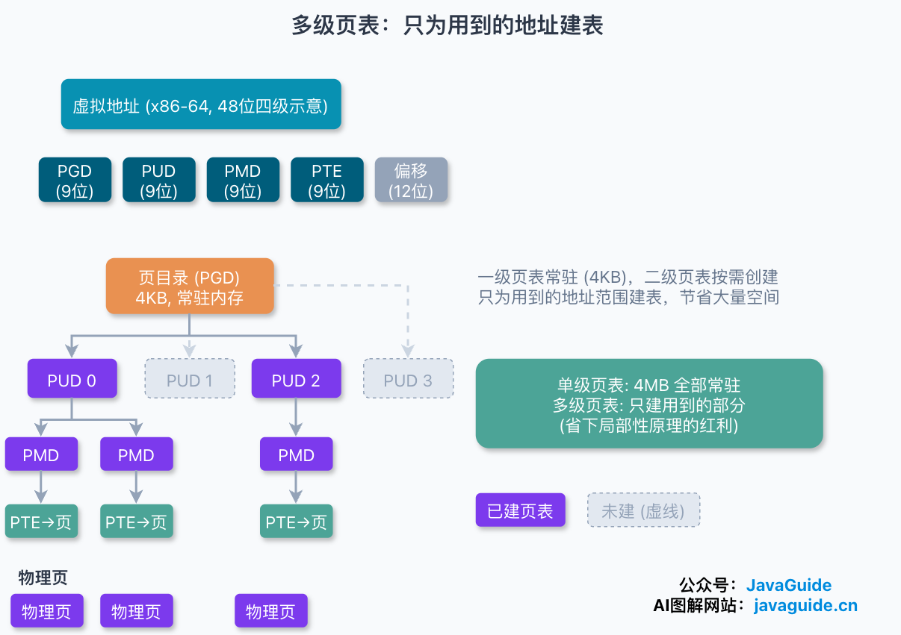

#### TLB

硬件缓存，加速虚拟→物理地址转换。CPU用虚拟页号匹配TLB项：命中(TLB hit)直接拿物理页帧号；未命中(TLB miss)查主存页表再填入TLB；满了按淘汰策略替换。命中率高的原因：**局部性原理**——短时间内频繁访问的页集中在少数几个。

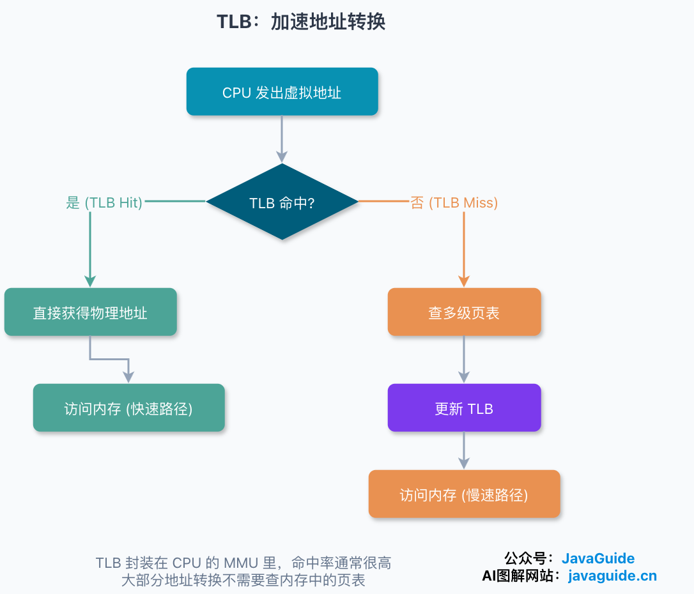

### 换页机制与抖动(Thrashing)

物理内存不足时把暂不用的页换出到磁盘，需要时换回——本质"时间换空间"。频繁换页系统明显变慢，严重时**抖动**：CPU大部分时间耗在换页而非计算。

**工作集**：进程一段时间内真正频繁访问的页集合，物理内存能容纳主要工作集，缺页就可控。

### Page Fault 分类

同步异常，由访存指令直接触发(不是硬件中断)。

- **可修复**：匿名页首次访问分配 / 文件页尚未驻留 / 写COW页需先复制 → 内核处理后重新执行指令
- **不可修复**：地址不属于合法VMA / 写只读映射 / 执行不可执行页 → 触发 `SIGSEGV`

可修复缺页再分：**主缺页**(Major，需实际I/O从磁盘读，开销大) / **次缺页**(Minor，不用读存储设备，开销小)

### 五种页面置换算法

| 算法 | 原理 | 特点 |
|---|---|---|
| OPT(最佳) | 淘汰未来最长时间不访问的页 | 理论最优，无法实现，仅作评估基准 |
| FIFO | 淘汰最早进入内存的页 | 简单但可能误伤热点页，有**Belady异常**(分配页数增多缺页率反升) |
| LRU | 淘汰最久未访问的页 | 接近OPT但维护成本高 |
| LFU | 淘汰访问次数最少的页 | 早期频繁后期弃用的页会滞留，需配合计数衰减 |
| Clock(时钟) | LRU低成本近似 | 环形队列+访问位实现二次机会判断 |

> 实际系统(Linux)用活跃/非活跃LRU、workingset等工程化机制，不是直接套教科书算法。

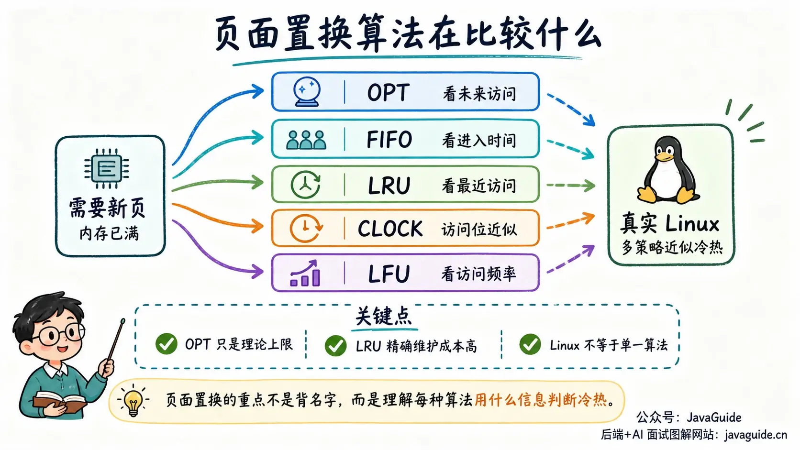
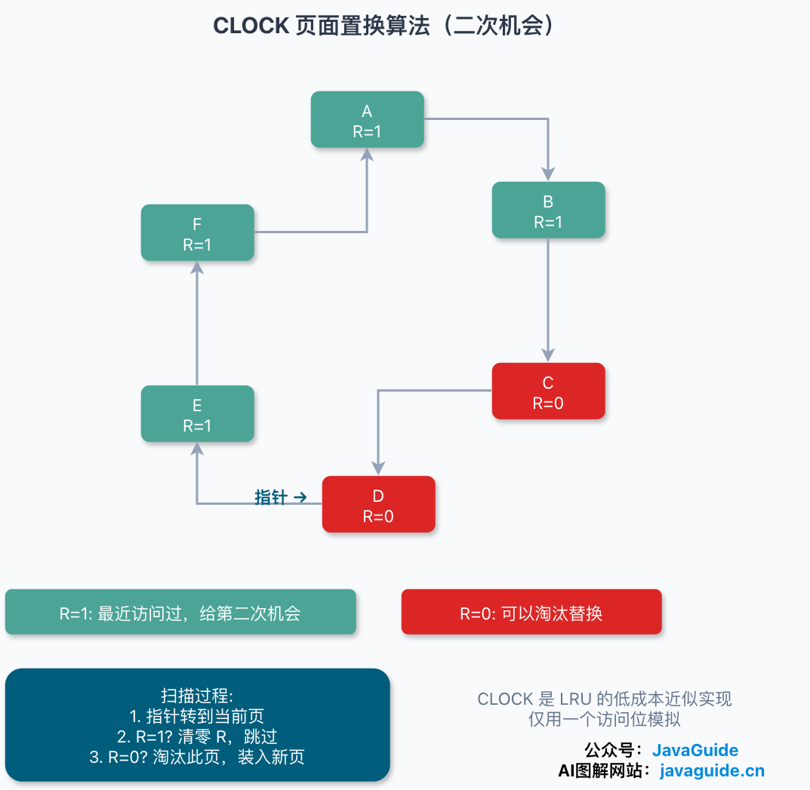

### Swap、Overcommit、OOM

- **Swap**：磁盘后备空间，专放匿名页(无文件来源)。Swap活跃时业务延迟通常变差，不是免费扩容手段
- **Overcommit**：Linux允许申请的虚拟内存超过实际RAM+Swap总量，`malloc`/`mmap`成功只代表虚拟地址申请成功，物理页往往首次访问时才真正分配
- **OOM Killer**：内核无法通过回收/写回/Swap获得足够内存时，选进程杀掉释放内存。容器环境还要考虑cgroup的 `memory.max`，可能先触发容器范围内OOM

### mmap、COW 与共享内存

- **mmap**：在进程虚拟地址空间创建映射(文件映射/匿名映射)，映射建立不代表立即读入数据，真正访问才可能触发缺页。多进程映射同一文件可共享Page Cache的物理页
- **COW(写时复制)**：常见于fork——父子进程共享同批物理页且页表标记只读，谁先写入就触发缺页由内核复制一份给写入方，避免fork立即复制全部内存的开销

---

## 七、I/O 多路复用

**核心问题**：一个线程如何同时等待多个fd的就绪事件(不是提升单次读写速度)。

网络读取两阶段：数据从网卡到内核缓冲区(等待阶段) → 数据从内核缓冲区拷贝到用户缓冲区。阻塞I/O瓶颈在第一阶段。

I/O多路复用让线程阻塞在 `select`/`poll`/`epoll` 这类系统调用上，任意fd就绪就返回处理，适合**大量连接空闲、少量活跃**的场景。

> 本质仍是同步I/O，内核只通知就绪状态，真正读写和数据拷贝还是应用自己做。

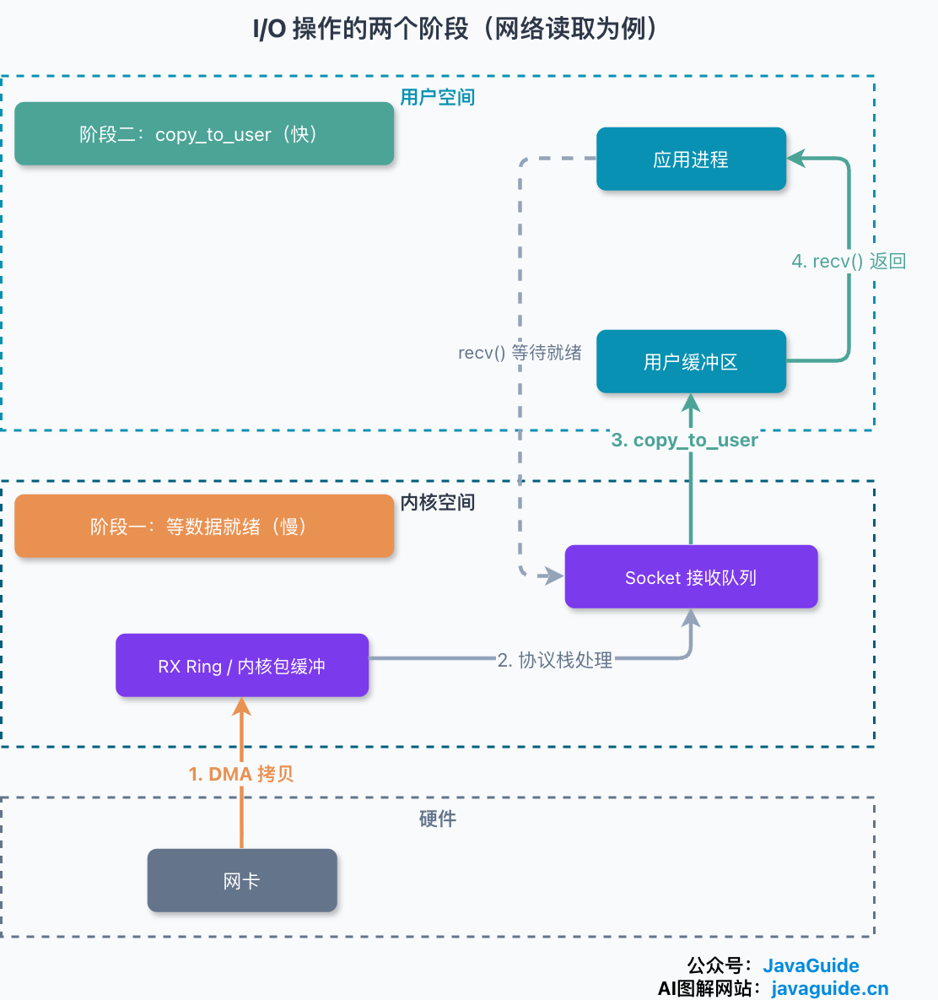

### select / poll / epoll 区别

| | select | poll | epoll |
|---|---|---|---|
| 数据结构 | 固定大小fd_set位图 | pollfd数组 | interest list + ready list |
| fd数量限制 | 受FD_SETSIZE限制(通常0~1023) | 无限制 | 无限制 |
| 每次调用 | 重设监听集合+遍历位图 | 传完整数组+遍历revents | 只返回就绪事件 |
| 扫描成本 | 高 | 仍需全量扫描 | 避免重复传参和全量扫描 |

epoll支持：
- **LT(水平触发)**：缓冲区有数据就反复通知
- **ET(边缘触发)**：只在状态变化时通知一次，需配合非阻塞fd循环读到`EAGAIN`

> epoll不是任何场景都更优——连接数少或全部连接都活跃时，其维护成本可能反而更高。

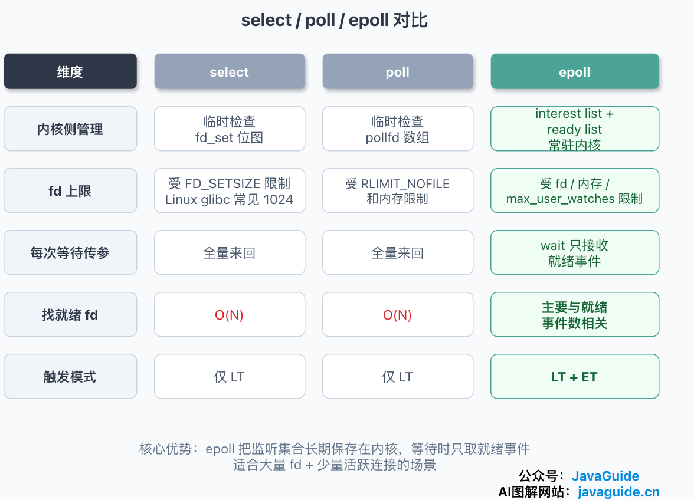

---

## 八、零拷贝

**核心思路**：不是完全没有拷贝，是尽量避免CPU在内核缓冲区和用户缓冲区之间搬运数据，减少CPU拷贝和态切换。

传统 `read`+`write` 发送文件经历**4次拷贝**：
1. 磁盘→内核 (DMA)
2. 内核→用户 (CPU)
3. 用户→Socket缓冲区 (CPU)
4. Socket→网卡 (DMA)

其中②③两次CPU拷贝是主要浪费。

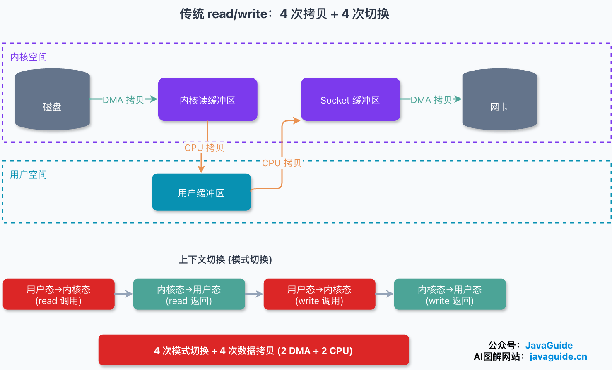

### mmap / sendfile / splice 怎么选

| 方式 | 原理 | 适用场景 |
|---|---|---|
| mmap+write | 映射Page Cache省去"内核→用户"CPU拷贝，但write到Socket仍有一次CPU拷贝 | 需要处理/修改数据 |
| sendfile | 数据不进用户态，系统调用更少，配合SG-DMA网卡可把CPU payload拷贝降到0 | 纯文件到Socket原样转发(静态文件服务器) |
| splice | 借助pipe在内核内移动页引用 | 更通用的fd间转发 |

> 零拷贝在TLS加密、压缩、内容过滤等需要真正处理payload的场景会失效。

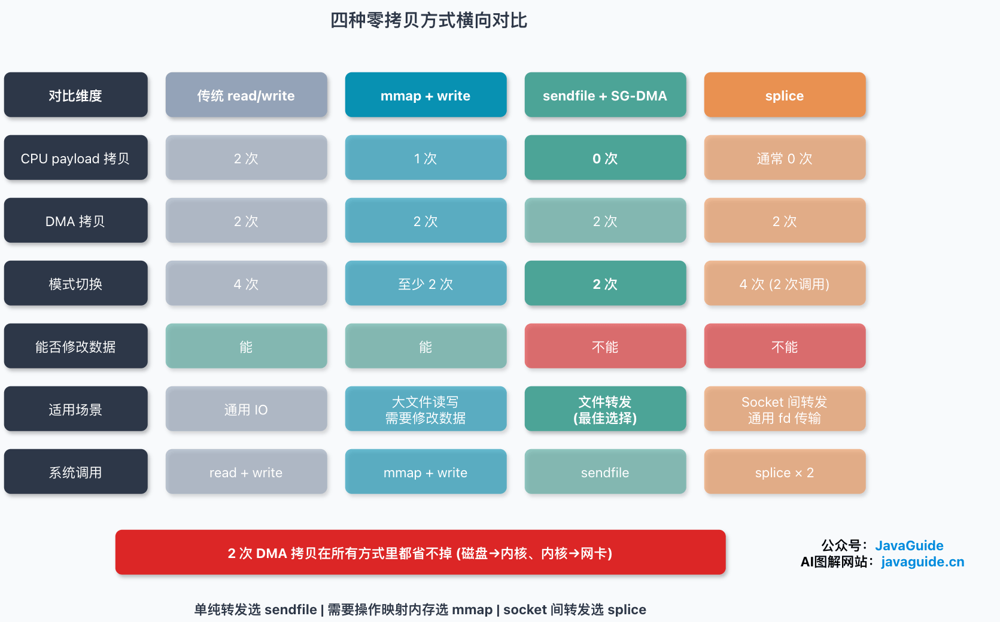

---

## 九、文件系统

### 六项职责

命名(路径查找)、组织(目录树管理)、定位(字节映射到数据块)、空间管理(分配释放磁盘块)、权限保护(元数据+访问检查)、缓存和恢复(Page Cache提速+日志减少崩溃损坏)。

> 不是所有文件系统对应本地磁盘：tmpfs以内存为后端，procfs暴露内核状态，NFS接远端文件系统。Linux通过 **VFS** 统一接口。

### inode / dentry 关系

- 文件名通常**不存**在inode中
- **目录项**：保存文件名→inode号的映射
- **inode**：记录文件类型、权限、所有者、大小、时间戳、链接计数、数据块映射
- **dentry**：VFS内存中的目录项缓存，加速路径查找，也可能缓存"不存在"结果(negative dentry)

> 一个文件可以有多个名字——多个目录项指向同一inode。同文件系统内 `mv` 往往只改目录项，不移动文件内容。

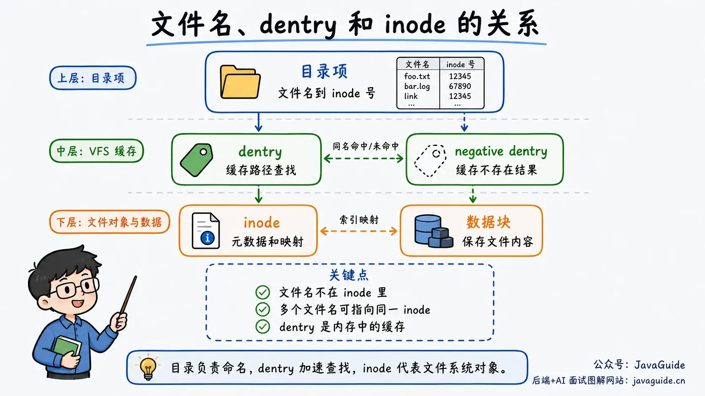

### open() 系统调用流程

不会把整个文件读入内存，主要做路径解析+打开对象创建：
根/当前目录逐级查找目录项和dentry缓存 → 找到inode检查权限/标志/文件类型 → 创建内核打开文件对象(记录偏移量和状态) → 进程fd表分配最小可用非负整数作为fd

> fd是进程文件描述符表的索引，不是inode本身。`dup`/`fork`后多个fd可能共享同一打开文件对象及偏移量；两个进程分别open同一文件通常各自独立的打开文件对象。

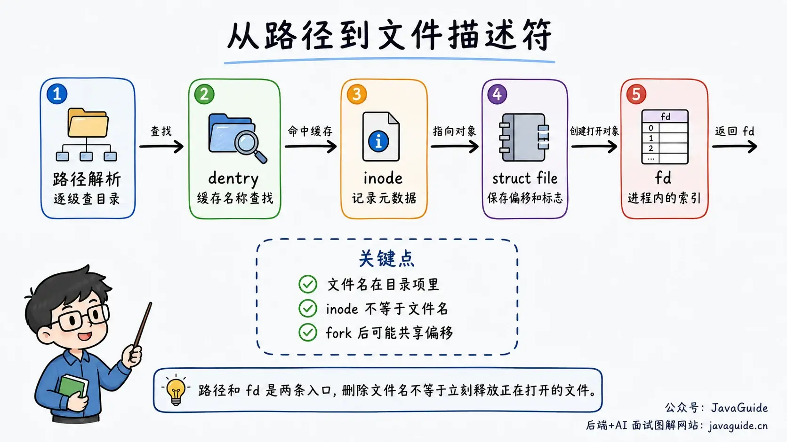

### 文件数据块分配方式

| 方式 | 优点 | 缺点 |
|---|---|---|
| 连续分配 | 顺序/随机访问都快 | 文件增长困难，易产生外部碎片 |
| 链式分配 | 不要求连续空间 | 随机访问差 |
| 索引分配 | 随机访问方便 | 需要额外索引空间 |

> ext2/ext3用直接块指针+1~3级间接块；ext4用 **extent tree**，一个extent记录连续物理块的逻辑起点、物理起点、长度，大文件更省元数据。

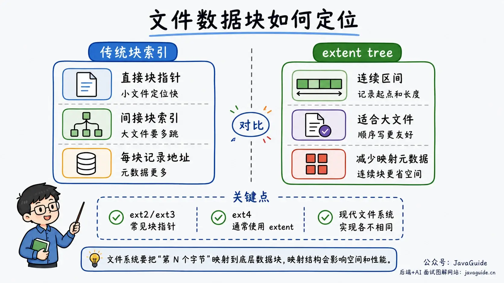

### 硬链接 vs 软链接

| | 硬链接 | 软链接 |
|---|---|---|
| 本质 | 指向同一inode，新增目录项+链接计数 | 独立文件，有自己inode，存路径字符串 |
| 跨文件系统 | 不能 | 能 |
| 对目录 | Linux不允许 | 能链接目录 |
| 源文件删除 | 只要还有硬链接，数据仍存在 | 变成悬空链接 |

> 跨文件系统限制的根本原因：inode号只在当前文件系统内有意义；软链接是按路径字符串重新查找，不依赖inode号。

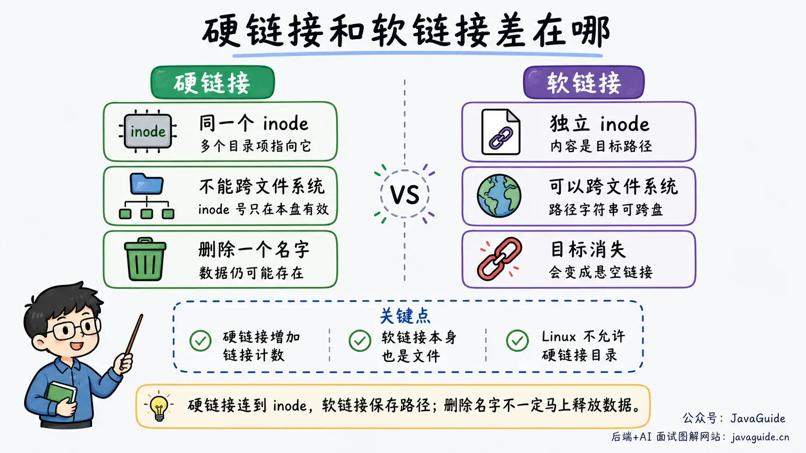

### write 成功 ≠ 落盘

普通buffered I/O下 `write()` 成功通常只表示数据进了Page Cache标记为脏页，不代表已持久化。

需要更强持久性保证：
- `fsync()`：同步数据+关联元数据
- `fdatasync()`：同步数据+必要元数据(如文件大小)
- `O_SYNC`/`O_DSYNC`：打开标志

> `write()` 可能只写部分字节，需处理partial write；创建文件/rename/unlink后如需目录项持久化，通常还要对父目录fd调 `fsync()`。

### 日志文件系统(Journaling)

文件系统一次操作常涉及多处元数据变更(分配inode、数据块、更新目录项和位图)，中途断电可能不一致。

日志文件系统先把元数据变更写入日志区域，再更新正式位置；恢复时重放已完整提交的事务、丢弃未完整提交的事务。

ext4 三种数据模式：
- **writeback**：只保证元数据日志顺序
- **ordered**(默认)：数据块先于元数据写入主文件系统
- **journal**：数据和元数据都先写日志，写放大更明显

> 日志机制只保证文件系统结构一致性，不等于保证业务数据不丢失，事务级持久性仍依赖应用正确使用fsync。

### 磁盘调度算法

| 算法 | 原理 | 特点 |
|---|---|---|
| FCFS | 按到达顺序 | 简单但未考虑磁头移动路径 |
| SSTF | 优先离当前磁头最近的请求 | 寻道时间小但易让远端请求饥饿 |
| SCAN(电梯算法) | 沿一个方向扫描到边界再反向 | 解决饥饿但可能有无效扫描 |
| C-SCAN | 只单向扫描，到边界直接回起点 | — |
| LOOK | SCAN改进：方向上无请求立即反向 | 减少无用移动 |
| C-LOOK | C-SCAN改进：磁头只返回到有请求的位置 | — |

> 示例：磁头在50号磁道，请求序列82/170/43/140/24，SSTF会先选最近的43。

> SSD/NVMe无机械寻道，不适用此模型，但内核块层仍靠 **blk-mq** 等机制处理吞吐和公平性。

---

## 附：延伸阅读方向（未在此展开）

- Java线程同步的具体代码示例（synchronized/Lock/Semaphore等）
- 死锁完整代码复现示例
- Linux CFS/EEVDF调度器实现细节
- 具体分布式文件系统(HDFS等)对比

> 复习建议：结合 `top`/`vmstat`/`pidstat`/`strace` 等工具实操验证概念，比死记硬背更容易讲清楚原理。
