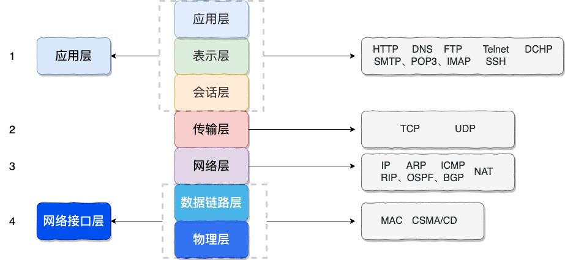
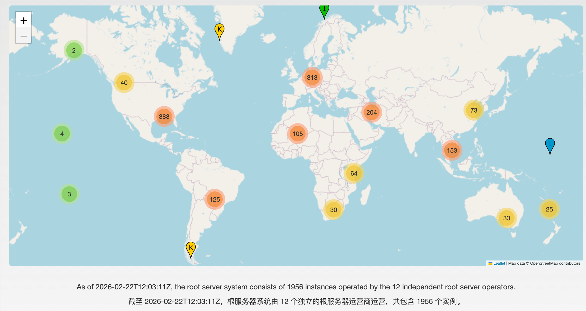
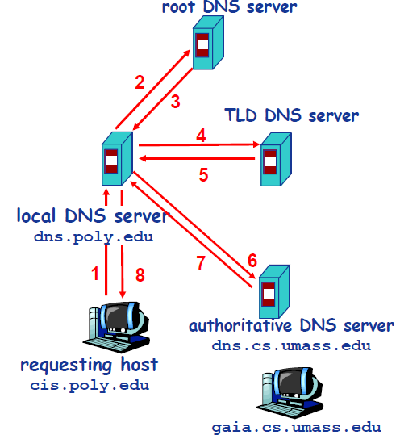
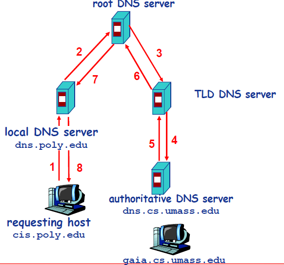
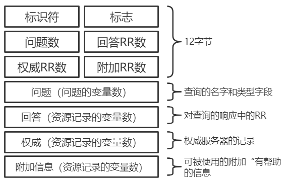
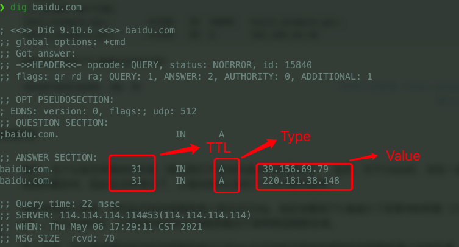
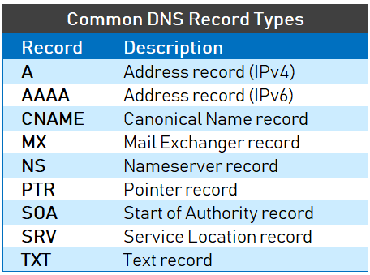

# DNS 域名系统

## DNS 是什么

浏览器访问一个网址之前，需要先把人类习惯记忆的域名（比如 `www.example.com`）转换成机器实际用来通信的 IP 地址，这个转换过程就是 DNS（Domain Name System）负责的事。DNS 是一个应用层协议，通常基于 UDP，默认端口 53；但当响应内容超过报文大小限制，或者需要进行区域传送（Zone Transfer）时，会切换成 TCP。

有一个前置细节值得注意：如果要访问的域名恰好已经存在于本机维护的 hosts 文件列表中，浏览器可以直接从本地读取对应的 IP，完全跳过一次 DNS 查询——这也是"hosts 文件劫持"这类安全问题的原理所在。

DNS 的设计目标不只是简单的"查表"，还涉及缓存策略、递归查询与迭代查询的配合、多级服务器的分工协作，下面依次展开。




## 域名的层次结构与服务器角色分工

DNS 系统按照层级分工，不同层级的服务器承担不同职责：

- **根服务器（Root Server）**：位于层级最顶端，本身不直接保存具体域名的记录，而是负责告诉查询方"下一步该去问哪个顶级域服务器"，起到一个转介作用。
- **顶级域服务器（TLD，Top-Level Domain）**：负责管理 `.com`、`.org`、`.net`、`.edu` 以及各个国家/地区后缀（如 `.cn`）对应的域名区域，同样以转介的方式指向更下一级的权威服务器。
- **权威服务器（Authoritative Server）**：真正保存某个具体域名区域的实际记录数据，是能给出"权威回答"的那一级。
- **递归解析器（Recursive Resolver）**：站在客户端这一侧的角色，接收终端设备发来的查询请求，先检查自己有没有缓存结果，没有的话再依次向根服务器、TLD 服务器、权威服务器逐级查询，最终把结果汇总返回给客户端。

这里有个常被误解的知识点需要纠正：很多人以为全球只有 13 台根服务器物理机器，**但事实并非如此**。根服务器系统在逻辑上确实只分配了 13 个标识（从 a.root-servers.net 到 m.root-servers.net），由 12 个不同的组织分别运营，但每个逻辑标识背后通过 Anycast 技术在全球部署了大量的物理实例——所以实际的物理服务器数量远远不止 13 台，13 只是逻辑编号的数量。



## DNS 解析的完整过程

以查询 `gaia.cs.umass.edu` 为例（假设查询发起自 `cis.poly.edu` 所在网络），一次典型的解析过程大致是这样展开的：

1. 用户所在主机向本地 DNS 服务器（例如 `dns.poly.edu`）发起查询请求。
2. 本地 DNS 服务器如果没有对应的缓存记录，就转向根服务器发起查询。
3. 根服务器返回负责 `.edu` 这个顶级域的 TLD 服务器地址（转介，而非直接给出最终答案）。
4. 本地 DNS 服务器接着向 `.edu` 的 TLD 服务器发起查询。
5. TLD 服务器返回 `umass.edu` 这个区域对应的权威服务器地址。
6. 本地 DNS 服务器再向权威服务器（例如 `dns.cs.umass.edu`）发起查询。
7. 权威服务器返回目标主机 `gaia.cs.umass.edu` 真正对应的 IP 地址。
8. 本地 DNS 服务器把最终查到的 IP 地址返回给最初发起请求的用户主机。

这个过程里存在两种不同的查询方式：**从用户主机到本地 DNS 服务器这一步，属于"递归查询"**——用户只发一次请求，剩下所有的中间查询工作全部由本地 DNS 服务器代劳，最终直接拿到确定的结果；**而本地 DNS 服务器向根服务器、TLD 服务器、权威服务器逐级发起的查询，属于"迭代查询"**——每一级服务器只负责回答"下一步该去问谁"，不会代劳去问更下一级，本地 DNS 服务器需要自己拿着转介结果继续问下一个服务器。



作为对比，也存在一种全程都走递归查询的模式，即每一级服务器都代劳向下一级发起查询，而不是把转介结果原样返回——这种方式对上层服务器的负载压力更大，实践中较少采用，但理解上可以和上面的"混合模式"做对照。



值得强调的是缓存机制在这整个过程里的作用：DNS 记录都带有 TTL（Time To Live），本地解析器会在 TTL 有效期内缓存查到的转介信息和最终记录，如果同一个域名（或同一区域）在 TTL 未过期前被再次查询，就可以跳过完整的根服务器起步流程，直接用缓存结果或从已知的下级服务器继续查询，大幅减少重复查询的开销。

## DNS 报文格式

DNS 的查询报文和应答报文使用相同的结构，主要包含以下字段：

- **标识符（16 比特）**：用来把某个应答和它对应的查询请求匹配起来。
- **标志位**：包含"这是查询还是应答"、"是否为权威回答"、"是否希望使用递归"、"服务器是否支持递归"等多个二进制位。
- **计数字段**：分别记录问题数量、回答资源记录（RR）数量、权威 RR 数量、附加 RR 数量。
- **四个数据区**：
  - 问题区域：记录本次查询的域名和查询类型。
  - 回答区域：包含针对该问题返回的资源记录，注意**一个主机名可以对应多条 RR（比如同时返回多个 IP 地址）**。
  - 权威区域：包含负责该区域的权威服务器相关记录。
  - 附加区域：包含一些辅助性的补充记录。



## DNS 记录（资源记录 RR）

每一条资源记录（Resource Record）都是一个四元组：`(Name, Value, Type, TTL)`，其中 TTL 决定了这条记录在缓存中应该保留多久之后被删除。不同的 Type 决定了 Name 和 Value 的具体含义：

| Type | Name 含义 | Value 含义 |
|---|---|---|
| A | 主机名 | 对应的 IPv4 地址 |
| AAAA | 主机名 | 对应的 IPv6 地址 |
| CNAME | 别名 | 该别名指向的规范主机名 |
| NS | 域 | 负责该域的权威 DNS 服务器的主机名 |
| MX | 别名 | 该邮件系统对应的邮件服务器规范主机名 |

CNAME 记录的典型用法举例，假设某区域的配置里有这样两条记录：

```
bar.example.com.  CNAME  foo.example.com.
foo.example.com.  A      192.0.2.23
```

当查询 `bar.example.com` 时，DNS 系统实际上会先返回一条 CNAME 记录指向 `foo.example.com`，再返回 `foo.example.com` 对应的 A 记录 `192.0.2.23`——这种"别名指向规范名，规范名再指向 IP"的间接映射方式，常用于同一份内容需要用多个域名访问，或者需要灵活切换后端服务器而不想改动大量对外暴露的域名配置。





## 关键结论与复习要点

1. DNS 本质是一个**分布式、分层的数据库系统**，不存在单一的权威数据源，查询结果依靠根、TLD、权威服务器多级协作得出。
2. 实际解析过程通常混合使用**递归查询**（用户主机到本地 DNS 服务器）和**迭代查询**（本地 DNS 服务器向上游各级服务器逐级查询）。
3. 常见误解已被纠正：根服务器只有 13 个**逻辑标识**，背后通过 Anycast 技术部署了大量物理实例，并非全球仅有 13 台物理机器。
4. 缓存和 TTL 机制显著减少了重复的完整解析链路开销，是 DNS 系统能支撑全球海量查询的关键设计。
5. CNAME 记录与 A/AAAA 记录经常配合使用，实现"主机名到主机名，再到 IP"的间接映射。
6. DNS 默认走 UDP 追求响应速度，遇到大报文截断或区域传送场景时会切换到 TCP。

> 参考来源: https://javaguide.cn/cs-basics/network/dns.html
