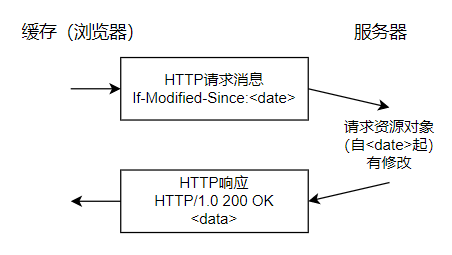
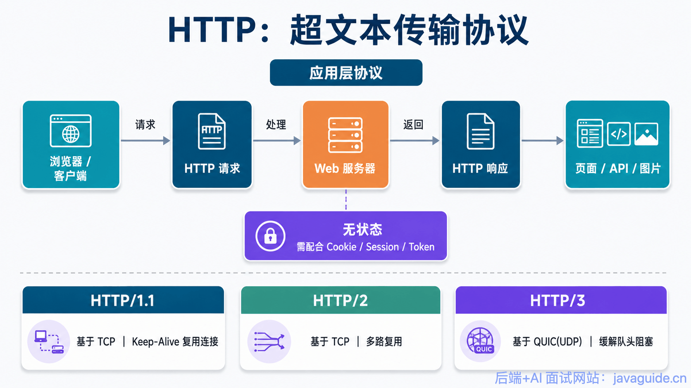

# HTTP 1.0 与 HTTP 1.1 的区别

HTTP/1.0 和 HTTP/1.1 之间的差异主要体现在连接方式、缓存机制、状态码数量、Host 头处理、带宽优化这几个方面。逐一来看。

## 连接方式：短连接 vs 长连接

这是两者最核心的差异之一。**HTTP/1.0 默认使用短连接**：每完成一次 HTTP 请求-响应，就要断开底层 TCP 连接，下一次请求再重新建立一次新的 TCP 连接。这意味着每次交互都要重复经历 TCP 三次握手和四次挥手的完整流程，在频繁请求的场景下会浪费大量带宽和时间在建连/断连上。

**HTTP/1.1 则把默认行为优化成了长连接**：一条 TCP 连接建立之后可以持续复用，承载多次请求-响应，直到连接超时或被显式关闭才断开。

需要注意的是，HTTP/1.0 也不是完全不能用长连接——可以通过显式带上 `Connection: Keep-Alive` 头来启用；反过来 HTTP/1.1 也可以通过 `Connection: close` 主动关闭长连接。另外要理解一点：**HTTP 协议本身没有"连接"的概念，长连接/短连接实质上是 TCP 层的特性**，HTTP 只是在应用层通过请求头去控制底层 TCP 连接是否复用，而且这需要客户端和服务端同时支持才能生效。

## 状态响应码：数量差异

**HTTP/1.0 只有 16 种状态码**，覆盖的场景比较有限。**HTTP/1.1 新增了大量状态码**，其中错误类响应码（4xx/5xx）就新增了 24 种，让服务器可以更精细地告知客户端具体是哪种类型的问题。

HTTP/1.1 新增的几个代表性状态码：

- **100 Continue**：客户端在发送大请求体之前，可以先只发请求头询问服务器"能不能继续发"，服务器确认后再发完整请求体。
- **206 Partial Content**：标识这是一次范围请求（Range Request）的响应，只返回资源的一部分内容。
- **409 Conflict**：请求与服务器当前状态存在冲突，无法处理。
- **410 Gone**：请求的资源已经永久不可用（区别于 404 的"未找到"，410 更强调"曾经存在但已经彻底删除"）。

## 缓存处理机制

**HTTP/1.0** 的缓存判断主要依赖两组机制：

- `Expires` 头，指定一个绝对过期时间。
- `Last-Modified` 搭配 `If-Modified-Since`：客户端带上上次拿到的最后修改时间去问服务器，服务器判断资源是否有更新，没更新则返回 304 Not Modified，客户端直接用本地缓存，不用重新下载。

**HTTP/1.1** 在这套机制基础上引入了更细粒度的缓存控制手段，核心是 `Cache-Control` 头，可以精确控制缓存的最大有效期、是否允许被代理缓存等策略。除此之外还补充了一组基于实体标签（Entity Tag，即 `ETag`）的校验方式：`If-Unmodified-Since`、`If-Match`、`If-None-Match`。相比 `Last-Modified` 只能精确到秒级时间，`ETag` 可以对内容做更精确的唯一性标识，两者可以配合使用来提升缓存判断的准确性。

## Host 头处理：支持虚拟主机

**HTTP/1.0 的请求里不包含主机名信息**，这意味着如果同一台服务器（同一个 IP）上部署了多个不同域名的网站，服务器没法从请求本身判断客户端到底想访问哪个域名对应的站点。

**HTTP/1.1 在请求头中加入了 `Host` 字段**，服务器可以据此识别出客户端真正想访问的域名，从而支持"一个 IP 承载多个域名"的虚拟主机（Virtual Host）场景——这也是现代云服务器能够在同一台机器上跑多个网站的基础能力之一。

## 带宽优化：范围请求、100 状态码、压缩

HTTP/1.1 在带宽利用效率上做了几处针对性优化：

**范围请求（Range Requests）**：客户端可以通过 `Range` 头指定只想要资源的某一段字节（例如 `bytes=0-1023`），服务器如果支持，会返回 206 状态码，并在响应头里带上 `Content-Range`（说明返回的是哪一段）和 `Content-Length`（这一段的长度）。这个能力是断点续传、视频拖动进度条加载的基础。HTTP/1.1 还支持"多重范围请求"，即一次请求同时声明多个字节区间，服务器会用 `multipart/byteranges` 格式把各段内容分隔后一起返回。HTTP/1.0 完全不支持这类断点续传机制。

**100 Continue 状态码**：如果客户端要发送一个体积很大的请求体（比如上传大文件），可以先只发请求头，带上 `Expect: 100-continue`，服务器看到后如果同意接收，就先回一个 100 Continue，客户端确认后再把请求体真正发出去——避免了"请求体发送到一半才发现服务器拒绝"造成的带宽浪费。HTTP/1.0 没有这个机制。

**内容压缩**：HTTP/1.0 只有 `Content-Encoding` 这一种压缩相关的头，表示端到端的内容编码方式（比如 gzip）。HTTP/1.1 进一步区分了两种不同层次的编码：**内容编码**（端到端，指资源本身被如何编码，比如压缩格式）和**传输编码**（逐跳，指这一次传输过程中数据被如何编码，比如分块传输）。对应新增了 `Transfer-Encoding` 头（描述传输编码）和 `Accept-Encoding` 头（客户端声明自己能接受哪些编码格式）。

## 差异总结表

| 对比维度 | HTTP/1.0 | HTTP/1.1 |
|---|---|---|
| 连接方式 | 默认短连接，可选 Keep-Alive | 默认长连接，可选 `Connection: close` 关闭 |
| 状态码数量 | 16 种 | 新增大量状态码（错误码新增 24 种），如 100、206、409、410 |
| 缓存机制 | `Expires`、`Last-Modified` + `If-Modified-Since` + 304 | 在此基础上新增 `Cache-Control`、`ETag`、`If-Match`、`If-None-Match` 等 |
| 带宽优化 | 不支持断点续传，无 100 状态码 | 支持 `Range` 范围请求（206）、`Expect: 100-continue`、区分内容编码与传输编码 |
| Host 头 | 请求不含主机名，不支持虚拟主机 | 请求头新增 `Host` 字段，支持虚拟主机 |

## 复习要点

1. 连接方式：HTTP/1.0 是短连接，HTTP/1.1 默认长连接——这本质上是 TCP 层特性，需要双端支持。
2. 状态响应码：HTTP/1.1 新增大量状态码，错误码新增 24 种。
3. 缓存处理：HTTP/1.0 依赖 `If-Modified-Since` / `Expires`，HTTP/1.1 补充了 `Cache-Control` 和基于 `ETag` 的更精细策略。
4. 带宽优化：HTTP/1.1 引入 `Range` 头支持部分内容请求（206 状态码），HTTP/1.0 不支持断点续传。
5. Host 头处理：HTTP/1.1 请求头新增 `Host` 字段，是虚拟主机能够运作的基础。

> 参考来源: https://javaguide.cn/cs-basics/network/http1.0-vs-http1.1.html
