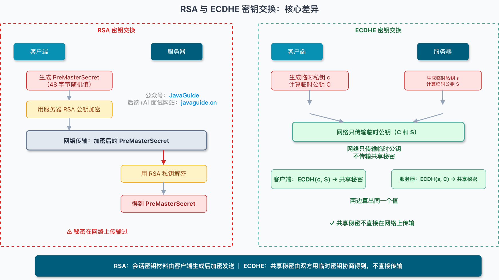
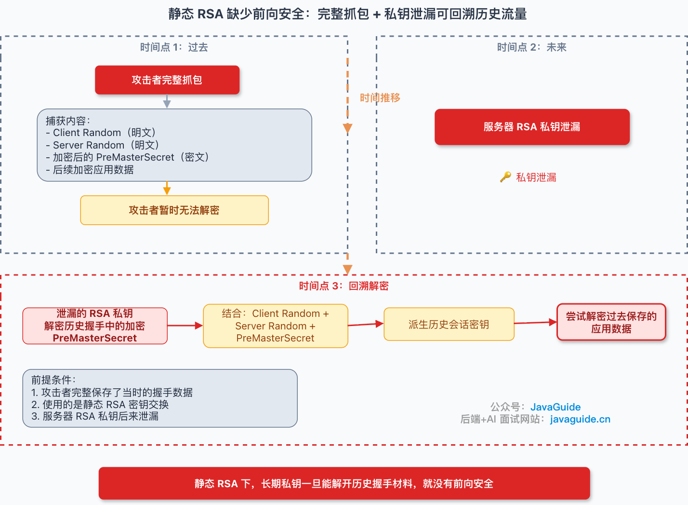
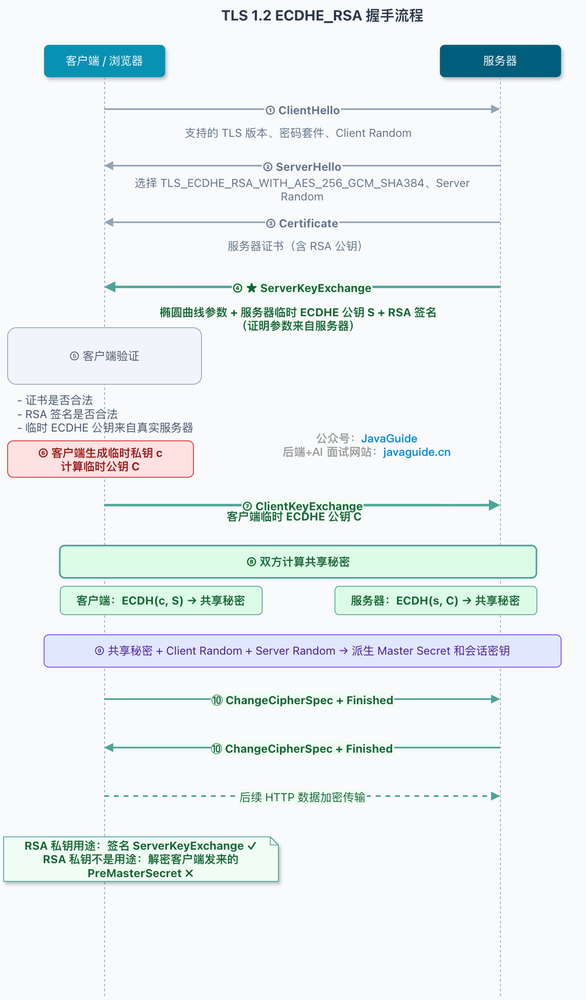
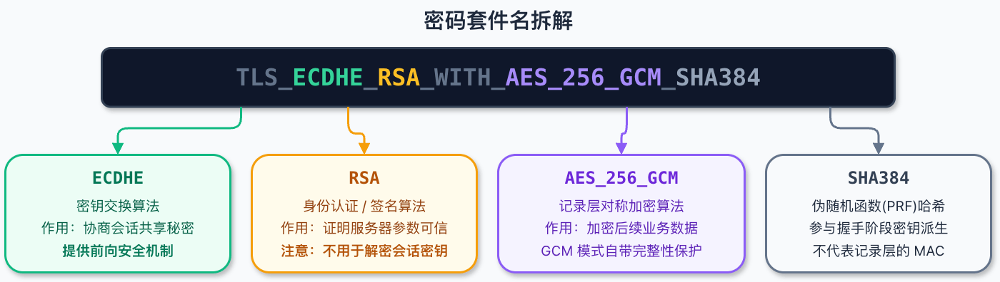
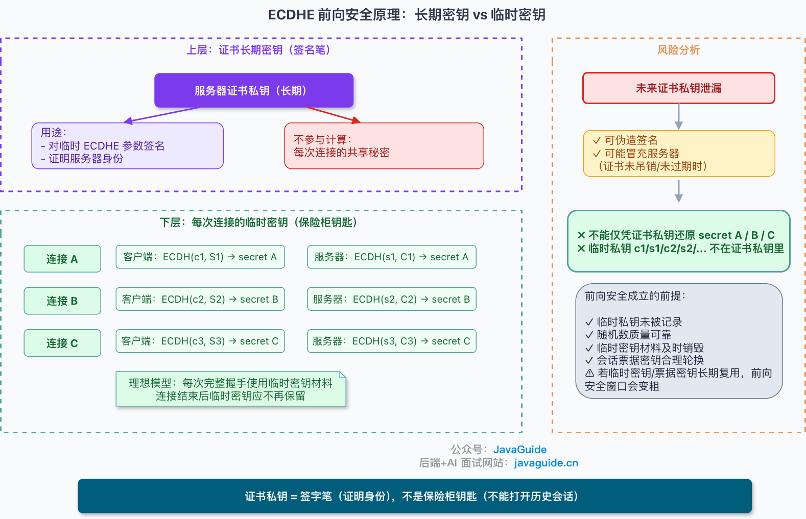
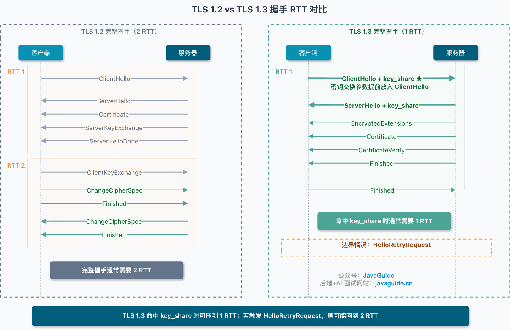
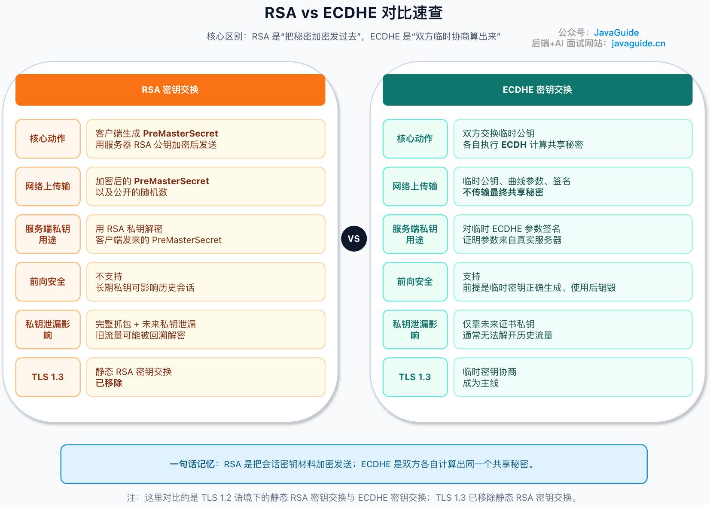

# HTTPS 中 RSA 与 ECDHE 的区别

## TLS 握手要解决的两个核心问题

无论用哪种密钥交换方式，TLS 握手本质上都要解决两个问题：**双方如何协商出一份只有彼此知道的会话密钥**，以及**如何确认对方就是它声称的那个身份，没有被中间人冒充**。RSA 和 ECDHE 是历史上两种主流的密钥交换方式，理解它们的差异，关键是搞清楚"密钥材料到底是被传输过去的，还是被双方各自计算出来的"。

## RSA 密钥交换：密钥材料被加密后传输

RSA 密钥交换的完整流程：

1. 客户端发送 ClientHello，带上支持的 TLS 版本、密码套件列表、一个随机数（Client Random）。
2. 服务器回应 ServerHello，确定本次用哪个版本和密码套件，带上自己的随机数（Server Random），并附上证书。
3. 客户端验证证书链、域名、有效期、签名，通过后从证书里取出服务器的 RSA 公钥。
4. 客户端在本地生成一个 48 字节的随机值，这就是 **PreMasterSecret**。
5. 客户端用刚才拿到的服务器 RSA 公钥，把 PreMasterSecret 加密，通过 Client Key Exchange 消息发给服务器。
6. 服务器用自己的 RSA 私钥解密这条消息，拿到和客户端一样的 PreMasterSecret。
7. 双方分别用 Client Random、Server Random、PreMasterSecret 三者一起派生出 Master Secret，再进一步派生出真正用于加密业务数据的对称会话密钥。

这套流程的核心特征是：**密钥材料由客户端单方面生成，用服务器公钥"包裹"后送过去，服务器用私钥拆开**。整个过程中，密钥材料实实在在地在网络上传输过一次，只是加密状态。

### RSA 没有前向安全：私钥太值钱

这套机制有个致命弱点——只要攻击者事先完整录下了所有加密流量，一旦未来某个时刻服务器的 RSA 私钥泄露，攻击者就可以用这个私钥把历史上录下的所有 PreMasterSecret 全部解密出来，进而还原出全部历史会话密钥，**倒查回溯所有历史通信内容**。这种"私钥一旦泄漏，代价就是全部历史流量都暴露"的性质，就是所谓"缺乏前向安全性"。

### 另一个历史包袱：填充预言机攻击

RSA 密钥交换还背负着一个历史安全问题：PKCS#1 v1.5 这种填充方式存在被称为"填充预言机攻击"的漏洞（典型代表是 Bleichenbacher 攻击，以及 2017 年被曝出的 ROBOT 攻击），攻击者可以通过观察服务器对错误填充的响应差异，逐步推导出被加密的内容。这也是业界推动放弃静态 RSA 密钥交换的另一个重要原因。

## ECDHE 密钥交换：密钥材料双方各自协商，从不传输

ECDHE 的核心思路来自 DH（Diffie-Hellman）密钥交换：双方各自拿出一个"私有的秘密"和一个"可以公开的信息"，通过数学运算，让双方最终各自独立算出**同一个共享秘密**，而这个共享秘密本身从来没有在网络上完整传输过。ECDHE 是 DH 思路在椭圆曲线上的实现（Elliptic Curve Diffie-Hellman Ephemeral，其中 Ephemeral 表示"临时"）。

以最常见的 ECDHE_RSA 套件为例，完整握手流程：

1. 客户端发送 ClientHello（版本、密码套件列表、Client Random）。
2. 服务器回应 ServerHello，选定套件（例如 `TLS_ECDHE_RSA_WITH_AES_256_GCM_SHA384`），并发送证书——注意这里证书里的 RSA 公钥只用来验证签名，**不用来加密密钥材料**。
3. 服务器发送 Server Key Exchange 消息，里面包含椭圆曲线参数和服务器这次临时生成的 ECDHE 公钥，并用证书对应的私钥对这些参数做签名。
4. 客户端用证书里的公钥验证这份签名，确认这个临时公钥确实来自持有证书私钥的服务器本人，防止中间人在半路替换掉临时公钥。
5. 客户端也生成自己的一对临时 ECDHE 私钥/公钥，通过 Client Key Exchange 把临时公钥发给服务器。
6. 双方各自用"自己的临时私钥 + 对方的临时公钥"做数学运算，独立计算出同一个共享秘密——这一步完全在本地完成，共享秘密本身没有在网络上出现过。
7. 结合 Client Random、Server Random，从这个共享秘密派生出最终的会话密钥。

这套流程的核心特征是：**密钥材料从未在网络上传输，而是双方各自本地计算得出**；证书对应的 RSA 私钥在这里的角色，更像是"签字笔"（用来签名认证），而不是"保险柜钥匙"（用来加密解密密钥材料）。

### 密码套件名怎么读

像 `TLS_ECDHE_RSA_WITH_AES_256_GCM_SHA384` 这样的命名，各段分别表示：密钥交换算法（ECDHE）+ 用于身份认证/签名的算法（RSA）+ 对称加密算法（AES_256_GCM）+ 用于握手完整性校验的哈希算法（SHA384）。

### 一个常见误读：ECDHE_RSA 不是"两种算法都参与加密"

很多人看到 `ECDHE_RSA` 会误以为 RSA 也参与了密钥的加密传输，实际上并不是——**RSA 在这个套件里的唯一职责是签名认证**，密钥交换的数学计算完全由 ECDHE 完成，RSA 从头到尾没有加密过任何密钥材料。

## 前向安全与性能代价

### ECDHE 为什么天然具备前向安全

因为每一次握手，双方都会重新生成一对**临时**的 ECDHE 密钥对，用完即可丢弃。就算未来某一天服务器的长期 RSA 私钥泄露了，攻击者能做的也只是伪造签名去做中间人攻击，但**没办法用长期私钥反推出过去每一次会话中生成的临时共享秘密**——因为共享秘密从来没有依赖长期私钥参与计算，也没有在网络上传输过。这正是"长期密钥"和"临时密钥"角色分离带来的安全收益。

不过前向安全并不是绝对保障，它的实际效果依赖实现质量：临时私钥有没有在用完后被正确销毁、随机数生成的质量好不好、会话票据（session ticket）的密钥有没有做定期轮换——这些环节任何一个做得不到位，都会拉长"前向安全窗口"被破坏的风险期。

### 会话恢复的影响

如果使用会话恢复机制（比如 Session Ticket）跳过完整握手，前向安全的保障效果也会受会话票据加密密钥的管理策略影响，票据密钥轮换不及时同样会削弱前向安全性。

### 性能不是免费的

RSA 密钥交换的主要计算成本集中在服务端的一次私钥解密操作；ECDHE 则需要额外完成一次临时密钥对生成、协商计算，以及对协商参数做签名，整体计算成本通常更高。但具体高多少，取决于密钥长度、选用的椭圆曲线、TLS 库实现、服务器 CPU 性能等多个变量，**文章没有给出一个绝对的性能倍数结论**，而是建议实际用工具（比如 `openssl speed`）测过才有意义，并且要区分"单次密码学运算耗时""完整握手耗时""端到端业务耗时"这三个不同层面分别衡量。

## TLS 1.3 的变化

TLS 1.3 相比 1.2 有两个关键变化：

1. **彻底移除了静态 RSA 密钥交换**，密钥建立方式统一转向 (EC)DHE、PSK（预共享密钥）或两者结合，不再支持"用公钥加密密钥材料"这种没有前向安全的方式。
2. **握手轮次被压缩**：TLS 1.2 完整握手通常需要 2 个 RTT；TLS 1.3 把密钥交换所需的参数（key_share）提前塞进了第一条 ClientHello 消息里，让完整握手理论上可以压缩到 1 个 RTT。但如果客户端猜的曲线和服务器不匹配，会触发 HelloRetryRequest 重新协商，这种情况下耗时会退回到接近 2 RTT。

## RSA vs ECDHE 核心差异速查

| 对比维度 | RSA 密钥交换 | ECDHE 密钥交换 |
|---|---|---|
| 密钥材料的产生方式 | 客户端单方面生成后加密传输 | 双方各自本地计算，从未在网络传输 |
| 前向安全性 | 不支持 | 支持（依赖临时密钥正确销毁等实现细节） |
| 证书私钥的角色 | 直接用于加密/解密密钥材料 | 仅用于对协商参数签名认证 |
| 主要性能开销 | 服务端一次私钥解密 | 临时密钥生成 + 协商计算 + 签名，通常更高 |
| 是否被 TLS 1.3 保留 | 已彻底移除 | 是当前主流方式 |
| 历史安全问题 | 填充预言机攻击（Bleichenbacher、ROBOT） | 临时私钥复用、随机数质量、无效曲线攻击等实现风险 |

## 面试怎么回答

如果被问到"RSA 和 ECDHE 密钥交换的区别"，抓住一句话作为主线："RSA 是把密钥材料加密后传过去，ECDHE 是双方各自算出同一份密钥，从不传输"，再补充前向安全这个由此直接引出的结论——因为密钥材料从未传输，长期私钥泄露也无法反推历史会话密钥，这就是 ECDHE 天然具备前向安全、而 RSA 不具备的根本原因。如果面试官继续追问 TLS 1.3，可以补充"TLS 1.3 已经彻底放弃了静态 RSA 密钥交换，统一使用 (EC)DHE，并把握手压缩到理论上的 1 RTT"。

> 参考来源: https://javaguide.cn/cs-basics/network/https-rsa-vs-ecdhe.html
