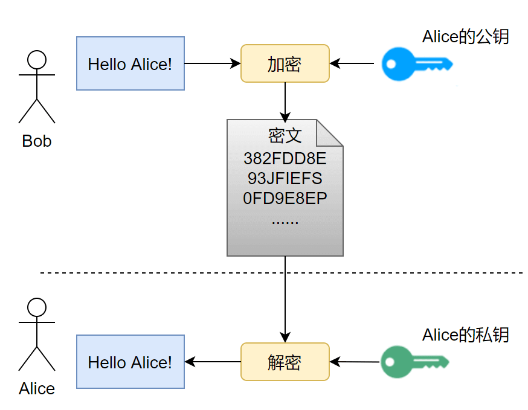
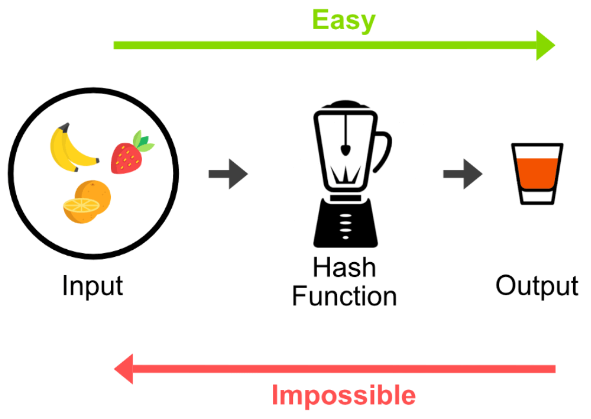
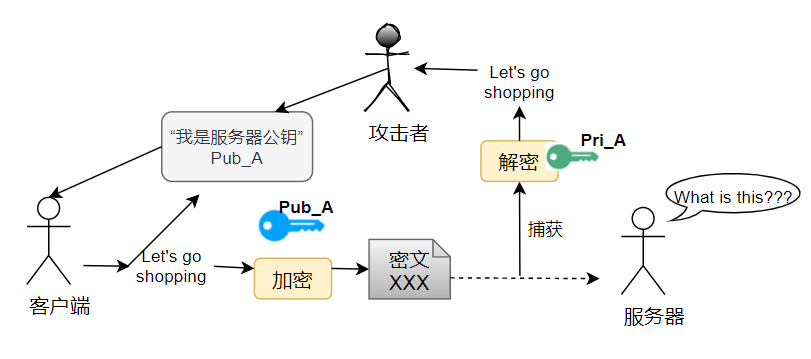

# HTTP 与 HTTPS 的区别

## HTTP 协议

HTTP（超文本传输协议）是一种应用层协议，用来规范浏览器和服务器之间该如何传输超文本数据。它默认使用 80 端口，采用经典的客户端-服务器通信模型：客户端发起请求，服务器返回响应。

HTTP 是**无状态协议**——服务器处理完一个请求后不会记住这次请求的任何信息，下一次请求到来时服务器完全不知道这是不是同一个客户端发的。这是协议设计上的简化选择，好处是服务器不需要为每个客户端维护状态，坏处是像登录状态这种"需要记住"的场景，必须依赖 Cookie、Session、Token 等机制在无状态协议之上"模拟"出有状态的效果。

HTTP 的优点很直接：语义清晰、实现简单、生态成熟，几乎所有网络设备和中间层都天然支持它。

## HTTPS 协议

HTTPS 的核心是"给 HTTP 加上一层 TLS"，用 TLS 为原本裸奔的 HTTP 提供三项保障：**机密性**（内容不被窃听）、**完整性**（内容不被篡改）、**身份认证**（确认对方就是它声称的那个服务器）。默认端口是 443。

不同 HTTP 版本搭配 TLS 的方式不完全一样：

- HTTP/1.1、HTTP/2：通常是"TCP 之上跑 TLS"，即先完成 TCP 三次握手，再在这条连接上做 TLS 握手。
- HTTP/3：底层换成了 QUIC（基于 UDP），而 QUIC 已经把 TLS 1.3 集成进了自己的握手流程里，不再是"先 TCP 再 TLS"的叠加模式。

## HTTPS 的核心：SSL/TLS 协议

### SSL 和 TLS 是什么关系

很多人把 SSL 和 TLS 当成两个不同的东西，但实际上**两者没有本质区别**：TLS 1.0 本质上就是 SSL 3.0 的下一个版本，只是换了名字继续演进。现在业界实际在用的是 TLS 1.2 和 TLS 1.3，而 SSL（包括 SSL 3.0）由于存在已知安全漏洞，早已被废弃，不应再使用。

### TLS 的工作原理

TLS 握手要解决的本质问题，是"如何在不安全的网络上，让双方安全地建立起一份只有彼此知道的密钥，并确认对方身份没有被冒充"。这个过程由几种技术配合完成。

**非对称加密**：用于身份认证和密钥协商阶段。需要特别澄清一个常见误区——像 ECDHE 这样的密钥交换方式，并不是"用公钥把一个提前生成好的对称密钥加密后传过去"，而是双方各自独立计算，最终协商出同一份共享密钥，这份密钥本身从未在网络上完整传输过。

**对称加密**：TLS 握手真正的目的是协商出一份对称密钥，握手完成之后，实际的 HTTP 业务数据全部改用对称加密算法（如 AES-GCM、ChaCha20-Poly1305 这类 AEAD 算法）来加解密，而不是用非对称算法直接加密全部数据——非对称算法计算成本高，只适合用在密钥协商这种小数据量、低频率的场景。

**公钥传输的信赖性问题**：如果服务器把公钥直接明文发给客户端，中间会存在一个致命漏洞——攻击者可以在中间拦截，把自己的公钥冒充成服务器的公钥发给客户端（中间人攻击）。举例来说：攻击者 A 可以在服务器 S 和客户端之间插入自己，向客户端发送 A 自己的公钥，客户端如果没有验证机制，就会误以为这是服务器 S 的公钥，之后所有"加密给服务器"的内容实际上都被 A 能够解密查看。

**数字签名**：为了解决上面的信任问题，业界引入了 CA（证书颁发机构）体系。CA 用**自己的私钥签名**服务器的证书信息，客户端用**CA 的公钥验证签名**，从而确认证书没有被篡改过。这里要纠正一个常见的表述错误：数字签名的正确说法是"私钥签名、公钥验证"，不是笼统地说成"私钥加密、公钥解密"——签名验证的目的是确认完整性和来源，不是为了保密。

客户端验证证书时要检查多个维度：签名链是否可信、证书上的域名是否匹配、证书是否在有效期内、证书用途是否合法，缺一不可。

## HTTP vs HTTPS 对比小结

| 对比维度 | HTTP | HTTPS |
|---|---|---|
| 默认端口 | 80 | 443 |
| URL 前缀 | `http://` | `https://` |
| 安全性 | 明文传输，无机密性、完整性、身份认证保障 | 基于 TLS 提供机密性、完整性、身份认证 |
| 传输方式 | 直接在 TCP（或对应传输层）上传输 | HTTP/1.1、HTTP/2 是 TCP 之上叠加 TLS；HTTP/3 的 QUIC 内建 TLS 1.3 |
| 依赖组件 | 无 | 依赖 CA 证书体系完成身份信任链 |

## 关键结论

没有 TLS 保护的 HTTP，默认情况下**不提供**机密性、完整性和对端身份认证这三项能力，数据在网络上以明文形式暴露。HTTPS 依靠 TLS 握手完成身份认证和密钥协商，握手完成后的实际数据传输则交给对称加密的 AEAD 算法处理。这里再次强调一个容易说错的点：不应该笼统地说"证书把对称密钥加密后传输"，证书真正的核心作用是**身份认证**，密钥本身是通过 ECDHE 之类的方式协商出来的，不是靠证书"运送"过去的。

> 参考来源: https://javaguide.cn/cs-basics/network/http-vs-https.html
