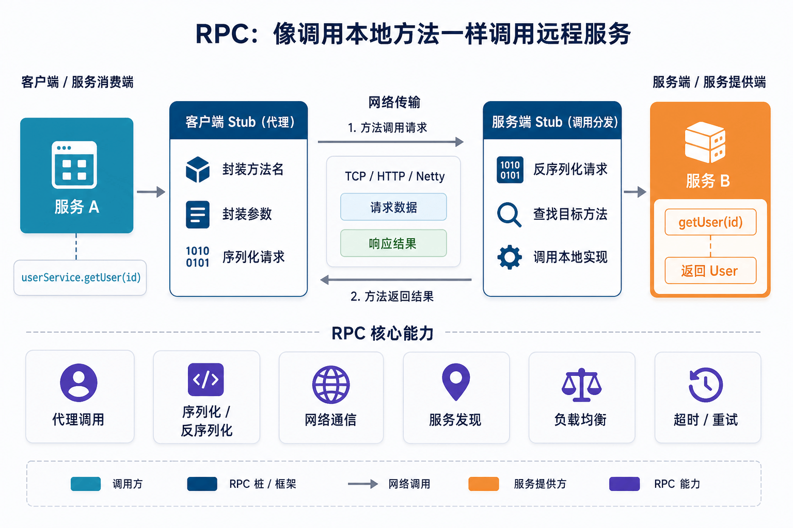
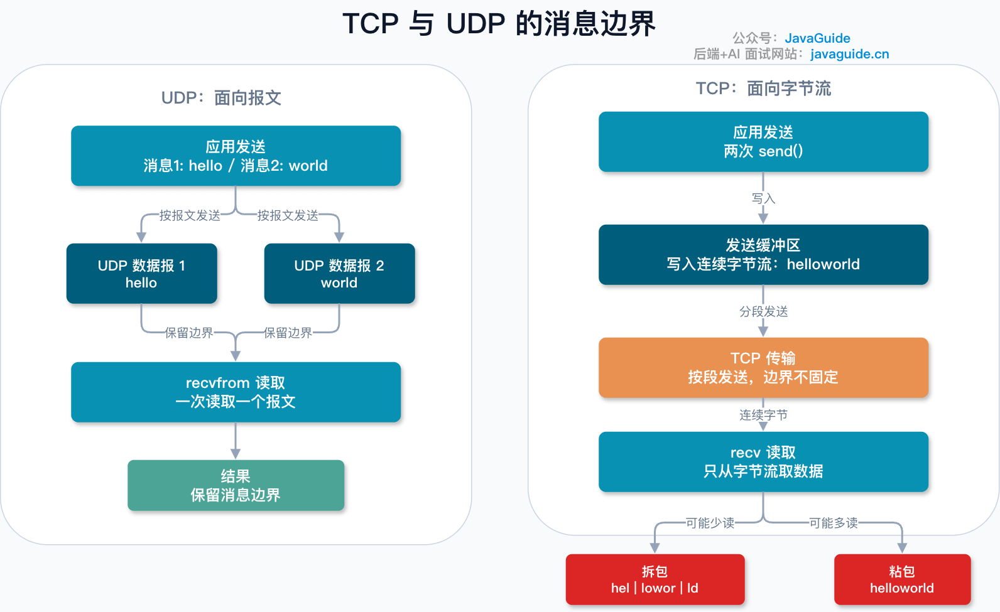
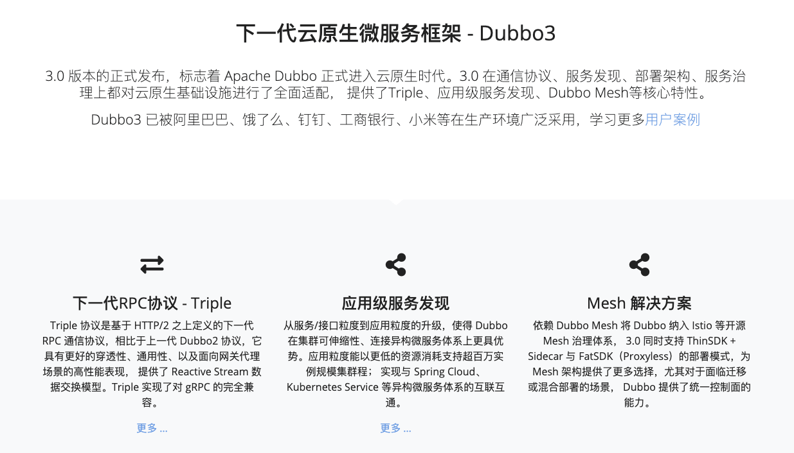
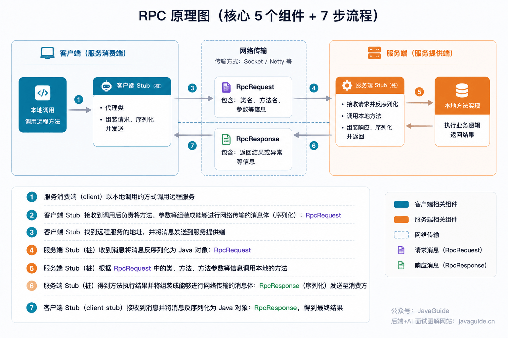
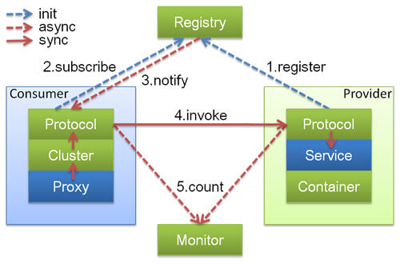

# HTTP 与 RPC 的区别

## RPC 不是一个具体协议，而是一种调用模型

理解 HTTP 和 RPC 的关系，首先要打破一个常见的对齐错误：**HTTP 是应用层协议，RPC 是一种远程调用模型**，两者不在同一个维度上，不能简单地拿来做"协议 vs 协议"的对比。

RPC（Remote Procedure Call）的核心目标，是让调用远程服务的体验尽量接近调用本地方法。比如本地代码里写 `userService.getUser(1001)`，感觉就是在调一个本地函数；RPC 框架要做的事，就是把这种"看起来像本地调用"的写法，在背后转换成真正的网络通信，屏蔽掉序列化、网络传输、服务定位这些细节。正因为 RPC 说的是"调用模型"而不是"具体协议"，所以 gRPC 底层跑在 HTTP/2 之上，同样可以被称为一种 RPC 框架——这恰恰说明 RPC 和 HTTP 并不互斥，可以叠加使用。



## 光有 TCP 还不够，为什么需要应用层协议

TCP 本身只是提供可靠的字节流传输，它不理解"消息"这个概念，也不会自动帮你划分消息边界。举个例子：如果连续通过同一条 TCP 连接发送 `getUser:1001` 和 `getOrder:8888` 两条请求，接收端在字节流层面看到的可能是连在一起的数据，无法直接判断第一条消息在哪里结束、第二条从哪里开始——这就是经典的粘包问题。正是因为 TCP 层不解决这个问题，才需要在它之上定义应用层协议，用来规定"消息从哪开始到哪结束、字段怎么排布"，HTTP 和各种 RPC 协议本质上都是在做这件事。



## 两种不同的建模方式：资源 vs 方法调用

HTTP（尤其是 REST 风格）习惯把交互对象建模成"资源"，动作靠 HTTP 方法表达：

```
GET /users/1001          # 查询用户
POST /orders              # 创建订单
PUT /orders/888/status    # 更新订单状态
DELETE /comments/9527      # 删除评论
```

RPC 风格则习惯直接把交互建模成"方法调用"：

```
userService.getUser(1001)
orderService.createOrder(request)
```

这两种写法背后是两种不同的思维方式：一个是"我要操作某个资源"，一个是"我要调用某个方法"。选哪种更多取决于团队习惯和场景，不存在绝对的谁比谁先进。

## 公司内部为什么更常用 RPC

内部微服务之间的调用如果全部走 HTTP+JSON，会暴露出几个痛点，而这些恰恰是 RPC 框架重点解决的方向：

1. **服务发现**：内部服务实例会不断上下线、扩缩容，调用方不应该硬编码目标机器的 IP。RPC 框架（比如 Dubbo）通常自带注册中心机制，调用方只需要知道服务名，注册中心负责维护"服务名到实际机器地址"的映射并动态更新。
2. **接口契约的强约束**：RPC 通常搭配 IDL（接口描述语言，比如 Protobuf 的 `.proto` 文件）来定义接口，字段类型、必填项等约束会在编译期就暴露出来；相比之下 HTTP + JSON 的字段约定通常是松散的文档约定，接口变更更容易在运行时才被发现问题。
3. **序列化效率**：RPC 框架常用二进制序列化格式（Protobuf、Thrift 等），数据体积和编解码速度上往往优于 JSON 文本格式。但这里有个必须澄清的误区——**"RPC 一定比 HTTP 快"这句话本身不严谨**，实际性能高低取决于具体实现、序列化格式选择、网络环境等多个因素，不能一概而论。







## HTTP 就完全不适合内部调用吗

不是。文章的态度很明确：已经有成熟 HTTP 基础设施、调用量不算特别大的团队，完全没必要"为了追求先进"强行把内部调用迁移到 RPC。HTTP 的通用性和调试成本优势（浏览器直接能测、抓包工具遍地都是、几乎所有语言都有现成客户端）在很多场景下比"理论上更快的序列化"更重要。

## gRPC 为什么容易让人搞混

gRPC 同时具备两个身份：它是一个 RPC 框架，同时它的底层传输走的是 HTTP/2。这也是很多人困惑"gRPC 到底算 HTTP 还是算 RPC"的根源——其实两者不冲突，gRPC 用 HTTP/2 做传输层载体，在这之上实现了 RPC 语义。

几个容易忽略的细节：

- gRPC 默认使用 Protobuf 做序列化，但协议本身并不排斥其他编码方式，比如 `application/grpc+json`。
- **业务调用是否真正成功，不能只看 HTTP 状态码**。gRPC 把真实的调用结果放在了 HTTP/2 的 Trailers 里的 `grpc-status` 字段中，HTTP 层面返回 200，并不代表这次 RPC 业务调用一定成功——这是排查 gRPC 问题时容易踩的坑。
- gRPC 支持四种调用模式：Unary（一元，最基础的请求-响应）、Server streaming（服务端流式）、Client streaming（客户端流式）、Bidirectional streaming（双向流式）。

## 常见误解答疑

**性能谁更好？** 不能一概而论，需要结合具体实现和真实场景做压测，脱离场景谈"RPC 天生比 HTTP 快"是不严谨的。

**RPC 是不是只能走 TCP？** 不是。RPC 说的是调用模型，不是具体协议，gRPC 基于 HTTP/2 就是最直接的反例。

**REST 和 RPC 是否互斥？** 不完全互斥，实践中经常混用——对外暴露走 REST 风格的 HTTP 接口，内部服务间调用走 RPC，两者各自服务不同的边界。

**有了 HTTP/2 是不是就不需要 RPC 了？** 仍然需要。HTTP/2 只是解决了传输层面的一些效率问题（多路复用、头部压缩），但不解决服务发现、接口契约管理、调用治理（限流、熔断、负载均衡策略等）这些 RPC 框架天然要处理的问题。

## 核心结论

RPC 的价值不只是"调用速度快一点"，更重要的是它把服务发现、接口契约、调用治理这些分布式系统里绕不开的问题统一管理起来。选型时不应该问"HTTP 和 RPC 哪个更高级"，而应该问"用哪个能以更低成本解决当前场景的问题"：

- 对外接口（Web、App、第三方开放平台）通常优先选 HTTP，图的是通用性强、调试成本低。
- 内部高频微服务调用可以考虑 RPC，图的是能集中处理服务治理相关的问题。
- 已经有成熟 HTTP 基础设施的团队，不必为了"看起来更先进"而强行迁移到 RPC。

> 参考来源: https://javaguide.cn/cs-basics/network/http-vs-rpc.html
