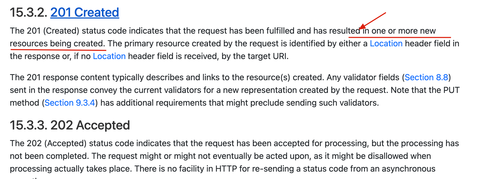

# HTTP 常见状态码总结

HTTP 状态码用三位数字表示，第一位数字决定了它属于哪个大类：1xx 表示"信息性提示"，2xx 表示"成功"，3xx 表示"重定向"，4xx 表示"客户端错误"，5xx 表示"服务端错误"。下面按类别梳理常见状态码及其含义。

## 1xx：信息性状态码

1xx 类状态码在日常开发中很少直接接触到，属于协议层面的中间提示信息，通常不需要特别关注。

## 2xx：成功状态码

- **200 OK**：请求已成功处理。最常见的例子就是查询用户数据，服务器正常返回结果。
- **201 Created**：请求成功，并且因此创建了新的资源，典型场景是用 POST 方法创建一个新用户。这里有个值得注意的细节：更准确地说，**201 Created 表示"创建了一个或多个新资源"**，不局限于单个资源——这个说法参考了 RFC 9110 中对该状态码的定义。
- **202 Accepted**：服务器已经接收了请求，但还没有处理完成。典型场景是报表生成、Excel 导出这类耗时的异步任务——服务器先告诉你"我收到了，正在处理"，具体结果需要之后再查询。
- **204 No Content**：服务器成功处理了请求，但没有内容需要返回。典型场景是删除一个用户之后，不需要返回任何数据体，只需要告诉客户端"删除成功"这个事实。可以用一个简单的类比理解：就像问别人一个只需要是非回答的问题，对方只需要回一个"好"，不需要长篇大论。

## 3xx：重定向状态码

- **301 Moved Permanently**：资源被**永久**重定向了。典型场景是网站 URL 发生了永久性变更，旧地址不再使用。
- **302 Found**：资源被**临时**重定向。典型场景是某些资源暂时挪到了另一个 URL，但未来可能还会挪回来或再变化。

301 和 302 的关键区分在"永久"还是"临时"——这决定了浏览器、爬虫等客户端是否应该更新自己缓存的地址记录：301 通常会被缓存并直接替换为新地址，302 则每次都应该重新请求原地址确认。

## 4xx：客户端错误状态码

- **400 Bad Request**：请求本身存在问题，比如参数不合法，或者用错了请求方法。
- **401 Unauthorized**：访问一个需要身份验证的资源，但客户端没有提供有效的身份凭证（未登录、Token 失效等）。
- **403 Forbidden**：服务器**明确拒绝**处理这个请求，通常用于表示这是一次不被允许的非法请求——即便身份认证是有效的，也可能因为权限不足被拒绝。
- **404 Not Found**：请求的资源在服务器上找不到。典型场景是查询一个不存在的用户 ID。
- **409 Conflict**：请求与服务器当前的资源状态存在冲突，无法处理。

401 和 403 的核心区分点：**401 通常意味着"你还没有证明自己是谁"（未认证），403 通常意味着"我知道你是谁，但你没有权限做这件事"（已认证但无权限）**——虽然原文没有用表格明确对比，但两者的语义边界值得单独记住，是面试中常被追问的细节。

## 5xx：服务端错误状态码

- **500 Internal Server Error**：服务器内部出现了未处理的异常或代码缺陷，是一个笼统的"服务端出错了"信号，具体原因需要看服务端日志。
- **502 Bad Gateway**：网关或代理服务器已经把请求转发出去了，但从上游服务器拿到了一个错误的响应。

需要提醒的是，虽然 503（服务不可用，通常表示服务器过载或正在维护）和 504（网关超时，通常表示上游服务响应时间过长）在实际工程中也很常见，但这两个状态码在这篇笔记依据的原文中只是被提及但未展开详细定义，实际含义可以按惯例理解为：503 是服务端暂时无法处理请求（比如限流、停机维护），504 是网关等待上游响应超时。

## 状态码速查表

| 类别 | 代表状态码 | 核心含义 |
|---|---|---|
| 1xx | （较少涉及） | 协议层面的信息性提示 |
| 2xx | 200 / 201 / 202 / 204 | 200 处理成功；201 创建了新资源；202 已接收但未处理完；204 成功但无返回内容 |
| 3xx | 301 / 302 | 301 永久重定向；302 临时重定向 |
| 4xx | 400 / 401 / 403 / 404 / 409 | 400 请求本身有问题；401 未认证；403 拒绝处理（权限不足）；404 资源不存在；409 状态冲突 |
| 5xx | 500 / 502 | 500 服务端内部错误；502 网关收到上游的错误响应 |

## 面试常见追问点

- **201 vs 204**：201 是"创建了资源并可能需要返回资源信息"，204 是"处理成功但没有内容需要返回"，两者都表示成功，区别在于是否创建了新资源、是否有响应体。
- **401 vs 403**：401 是身份未认证，403 是认证通过但权限不足或请求被明确拒绝。
- **301 vs 302**：本质区别是重定向的"永久性"，直接影响客户端是否应该缓存新地址。
- **500 vs 502**：500 是服务器自身代码/逻辑出错，502 是网关/代理转发后从上游拿到了异常响应，问题更可能出在上游服务而非网关本身。

> 参考来源: https://javaguide.cn/cs-basics/network/http-status-codes.html
