# 应用层常见协议总结

应用层协议解决的核心问题是：应用程序之间"该用什么格式交换数据、按什么规则通信"。理解每个协议时可以抓三个点：解决什么问题、跑在 TCP 还是 UDP 之上、默认端口是多少。下面按协议逐一梳理。

## HTTP：超文本传输协议

HTTP 是浏览器与服务器之间最常用的通信协议，采用经典的客户端-服务器模型。不同版本在传输层的实现差异很大：

- HTTP/1.1：基于 TCP，默认开启 `Keep-Alive`，即长连接。
- HTTP/2：同样基于 TCP，但引入了多路复用（一条连接并发多个请求）和头部压缩，缓解了 HTTP/1.1 队头阻塞的问题。
- HTTP/3：不再基于 TCP，而是基于 QUIC（QUIC 本身跑在 UDP 之上），进一步解决了 TCP 层面的队头阻塞。

HTTP 本身是**无状态协议**，服务器不会记住上一次请求的任何信息，因此实际业务中要靠 Cookie、Session、Token 等机制在无状态协议之上维护"会话"概念。

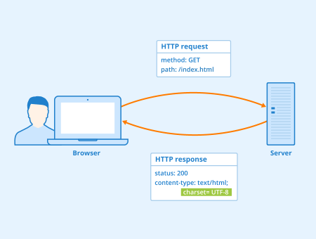

## WebSocket：全双工通信协议

WebSocket 用于解决 HTTP 单向请求-响应模型无法满足的场景：服务器需要主动、持续地向客户端推送数据。它诞生于 2008 年，2011 年成为国际标准，本质上是基于 TCP 的全双工协议——一旦连接建立，双方都可以随时主动发送数据，不需要一方发起请求。

建立过程分为几步：

1. 客户端先发一个 HTTP 请求，请求头里带 `Upgrade: websocket` 等字段，表示"想升级协议"。
2. 服务器同意后返回 101 状态码，表示协议切换成功。
3. 之后双方在这条连接上通过"帧"（Frame）传输数据，不再走 HTTP 语义。
4. 关闭连接时，双方通过关闭帧完成告知与确认。

为了确认连接是否还活着，WebSocket 通常会配合心跳机制，即定期发送 Ping 帧、对方回 Pong 帧。

典型应用场景：视频弹幕、实时消息推送、在线游戏对战、多人协同编辑、在线客服、股票行情推送——这些场景的共同点是服务器需要主动、低延迟地把数据"推"给客户端，而不是等客户端来问。

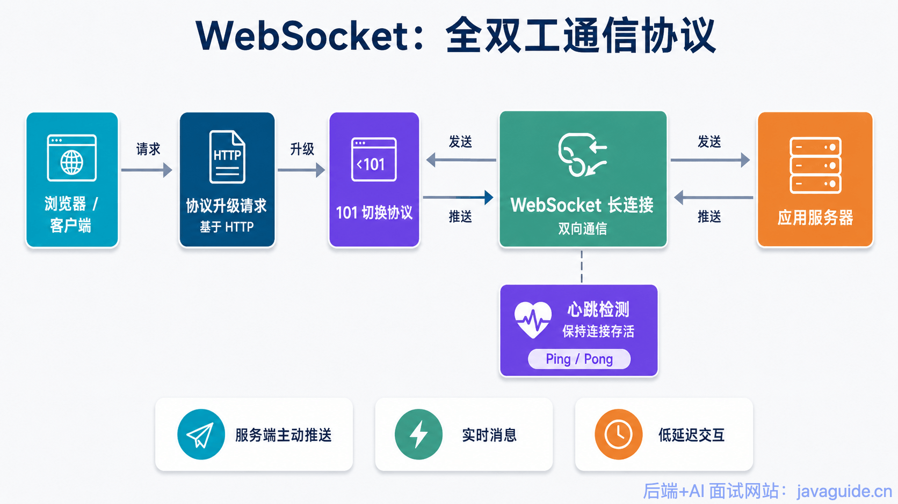

## SMTP：简单邮件传输协议

SMTP 基于 TCP，专门负责**邮件的发送**和**邮件服务器之间的转发投递**。这里有一个常见的混淆点：SMTP 只管"发"，用户从邮箱里"收"邮件靠的是 POP3 或 IMAP，两者职责是分开的。

SMTP 相关的端口有三个，用途不同：

| 端口 | 常见用途 | 说明 |
|---|---|---|
| 25 | 邮件服务器之间转发邮件 | MTA 到 MTA 之间的投递通道，很多云厂商会限制这个端口的出站流量以防垂钓/垂类滥用 |
| 587 | 客户端向服务器提交邮件 | 标准的 Message Submission 端口，通常配合 STARTTLS 升级加密并要求认证 |
| 465 | 隐式 TLS 的邮件提交 | 连接建立时就直接走 TLS 加密通道，不需要额外的升级步骤 |

一封邮件从写好到被收件人看到，大致经过六步：客户端写信 → 通过 SMTP 提交给发信服务器 → 发信服务器查询收件域名的 MX 记录 → 通过 SMTP 把邮件投递到收件服务器 → 收件服务器把邮件保存到用户邮箱 → 用户用 POP3/IMAP 把邮件取下来查看。

值得一提的是，想验证一个邮箱地址是否真实存在，通常做法是查询该域名的 MX 记录，再对目标服务器发起 SMTP 探测，但这种方式并不总是可靠——很多邮件服务器出于反滥用考虑，会对不存在的地址也返回"看起来成功"的响应。

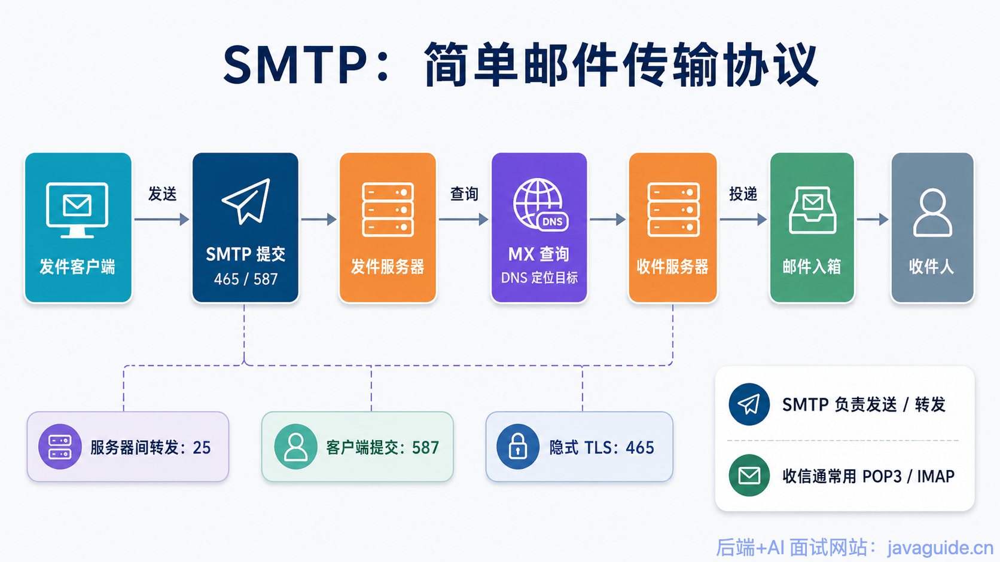

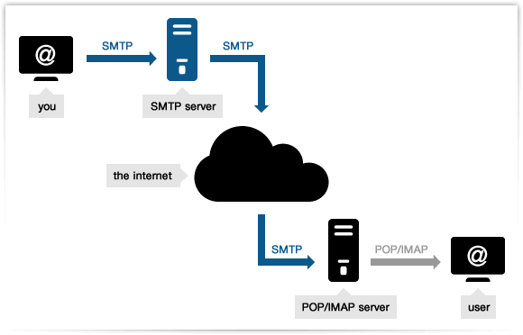

## POP3 / IMAP：邮件接收协议

POP3 和 IMAP 都基于 TCP，职责是**接收和管理邮件**，和负责发送/转发的 SMTP 形成互补：

| 协议 | 主要用途 | 特点 |
|---|---|---|
| POP3 | 接收邮件 | 偏向把邮件下载到本地，多设备之间的同步能力较弱 |
| IMAP | 接收和管理邮件 | 支持多设备同步、服务器端搜索、标记已读/未读、文件夹归档 |
| SMTP | 发送和转发邮件 | 负责邮件从发件人到收件服务器的投递链路 |

简单记忆：SMTP 管"寄"，POP3/IMAP 管"收"；POP3 更像"下载后就断开"，IMAP 更像"和服务器保持同步的邮箱视图"。

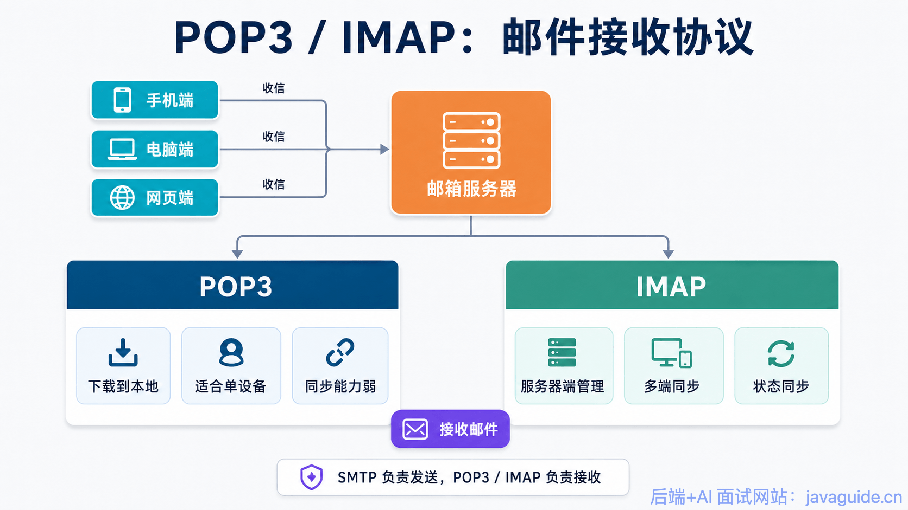

## FTP：文件传输协议

FTP 基于 TCP，采用客户端-服务器模型，与大多数协议不同的是它**同时使用两条连接**：一条控制连接负责传输命令和响应，一条数据连接专门负责传输文件内容本身。

根据数据连接的建立方向，FTP 分两种工作模式：

- **主动模式（PORT）**：服务器主动向客户端发起数据连接。这种方式在客户端处于 NAT 或防火墙之后时很容易被挡住，因为服务器发起的连接会被客户端侧的防火墙拦截。
- **被动模式（PASV）**：反过来，由客户端主动向服务器发起数据连接。因为发起方是客户端，能绕开大部分 NAT/防火墙限制问题，所以实际生产环境中更常用被动模式。

FTP 本身是明文传输，用户名、密码、文件内容都不加密，安全性较差。因此有两种常见的安全替代方案：

- **SFTP**：基于 SSH 协议实现的文件传输，走的是 SSH 的加密隧道。
- **FTPS**：在 FTP 基础上叠加 TLS 加密（FTP over TLS）。

这两个名字长得很像，但完全不是同一个协议——SFTP 依赖 SSH，FTPS 依赖 TLS，选型时不能混用概念。

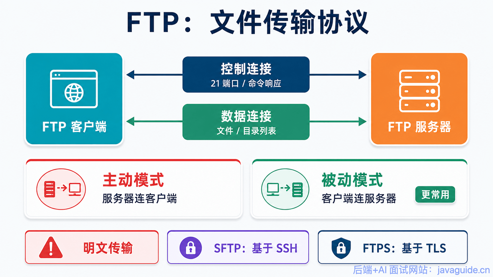

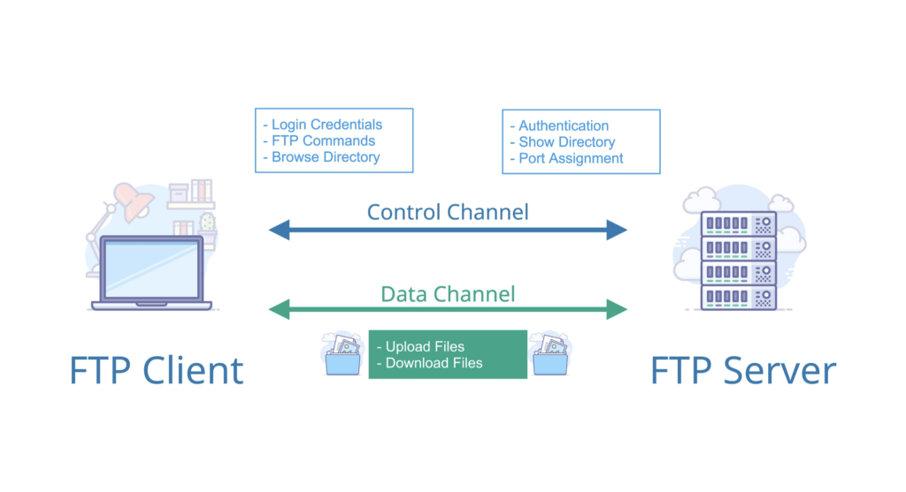

## Telnet：远程登录协议

Telnet 基于 TCP，默认端口 23，用于远程登录到另一台机器上执行命令。它的问题很致命：**全程明文传输**，用户名、密码、执行的每一条命令都能被中间人直接窃听到。

正因为这个安全缺陷，Telnet 现在已经很少用于真正的远程管理场景，早已被 SSH 取代，一般只在某些遗留系统调试或非敏感的内部测试环境里还能看到。

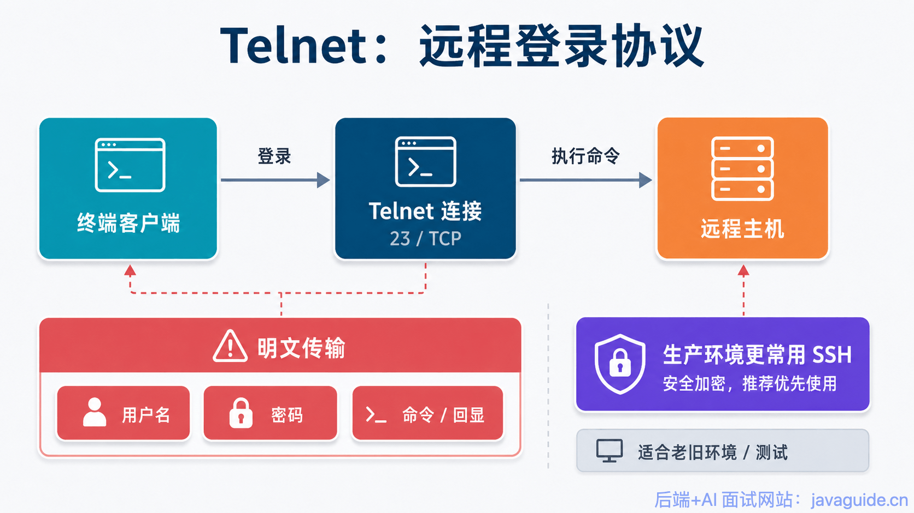

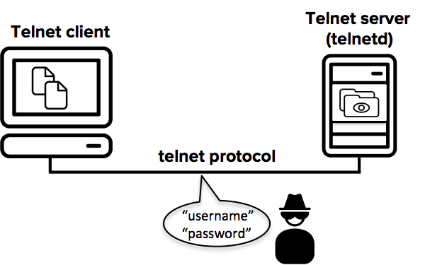

## SSH：安全的网络传输协议

SSH 基于 TCP，默认端口 22，是 Telnet 的现代安全替代品，核心特点是内建了加密和身份认证机制。除了最常见的远程登录（`ssh user@server_ip`），SSH 的用途其实更广：

- 远程执行单条命令，不进入交互式会话
- 端口转发 / 隧道代理，把本地或远程端口的流量通过 SSH 隧道转发
- X11 转发，让远程图形界面程序显示到本地
- SFTP / SCP，基于 SSH 隧道的文件传输能力

认证方式上有密码认证、公钥认证、多因素认证几种，实践中更推荐使用公钥认证——不需要在网络上传输密码本身，安全性更高，也更方便做自动化脚本免密登录。

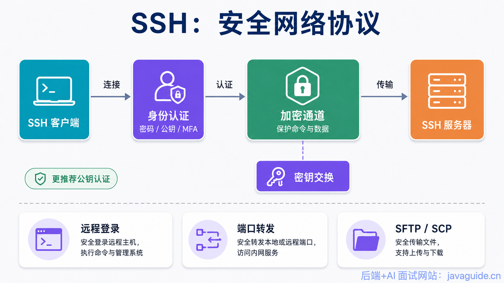

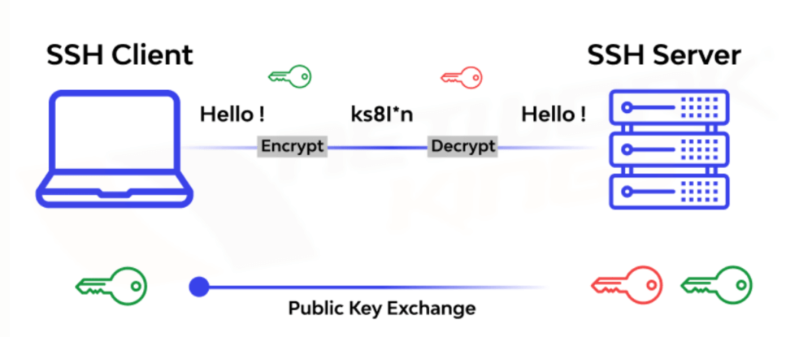

## RTP：实时传输协议

RTP 严格来说按分层规则被归到应用层，但它承担的职责其实更接近传输层——专门为实时音视频数据设计传输格式。它通常运行在 UDP 之上，因为实时音视频场景**宁可丢包也不要延迟**，UDP 不重传、不保证顺序的特性正好匹配这个需求。

RTP 本身不保证可靠传输，也不保证数据按时到达，靠序列号和时间戳来让接收端做排序和同步播放。为了补充监控能力，RTP 通常搭配 **RTCP**（RTP 控制协议）一起用，RTCP 负责反馈丢包率、延迟、抖动等网络质量信息，供发送端调整策略。

在 WebRTC 这类现代实时音视频应用中，还会在 RTP 基础上叠加 SRTP 做加密，并结合拥塞控制、NACK（丢包重传请求）、FEC（前向纠错）等机制进一步提升可靠性和抗弱网能力。

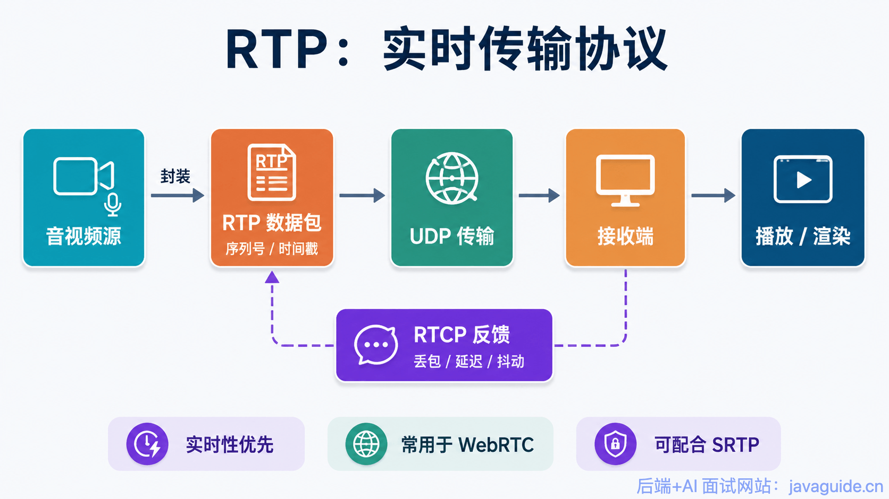

## DNS：域名系统

DNS 默认端口 53，负责把人类可读的域名解析成机器可用的 IP 地址。之所以通常选择 UDP 而不是 TCP，是因为域名查询响应通常很小、追求快速返回，不需要 TCP 三次握手带来的额外开销。

不过 DNS 并非只用 UDP：早期协议限制 UDP 报文最大 512 字节，超出这个限制的响应会被截断并设置标志位，客户端识别到截断后会改用 TCP 重新发起查询；另外区域传送（Zone Transfer，主从 DNS 服务器之间同步整个区域的记录）这种大数据量场景也固定使用 TCP。EDNS0 扩展进一步放宽了 UDP 报文的大小上限，缓解了截断重试的频率。

出于隐私和防篡改的考虑，业界也发展出了更安全的 DNS 方案：**DoH**（DNS over HTTPS）和 **DoT**（DNS over TLS），把明文的 DNS 查询包裹进加密通道。

## 全部协议端口与传输层协议汇总

| 协议 | 默认端口 | 传输层协议 | 主要用途 |
|---|---|---|---|
| HTTP | 80 | TCP | Web 页面访问 |
| HTTPS | 443 | TCP / QUIC | 加密的 Web 访问 |
| WebSocket | 80 / 443 | TCP | 双向实时通信 |
| SMTP | 25 / 465 / 587 | TCP | 邮件发送和转发 |
| POP3 | 110 / 995 | TCP | 邮件接收 |
| IMAP | 143 / 993 | TCP | 邮件接收和多端同步 |
| FTP | 20 / 21 | TCP | 文件传输 |
| SSH | 22 | TCP | 安全远程登录和文件传输 |
| Telnet | 23 | TCP | 明文远程登录（已过时） |
| DNS | 53 | UDP（默认）/ TCP（截断重试、区域传送） | 域名解析 |
| RTP | 动态端口（通常为偶数，RTCP 用相邻奇数端口） | UDP 为主 | 实时音视频传输 |

## 复习要点小结

1. HTTP 各版本的传输层实现不同：1.1/2 基于 TCP，3 基于 QUIC（UDP）。
2. WebSocket 通过 HTTP 升级握手（101 状态码）建立，之后是全双工、基于帧的通信。
3. SMTP 只管"发"和"转发"，POP3/IMAP 管"收"，三者职责不能混淆。
4. FTP 用两条连接分离控制和数据；生产环境更常用被动模式；SFTP（基于 SSH）和 FTPS（基于 TLS）不是同一回事。
5. Telnet 明文不安全，已被 SSH 取代；SSH 更推荐用公钥认证。
6. RTP 依赖 UDP 换取低延迟，靠 RTCP 反馈网络质量，自身不保证可靠传输。
7. DNS 默认走 UDP 追求速度，但截断重试和区域传送场景会切换到 TCP。

> 参考来源: https://javaguide.cn/cs-basics/network/application-layer-protocol.html
