# 计算机网络常见面试题总结

> 整理自 javaguide.cn 面试题总结(上/下)，用自己的话组织，配图见 `img/` 目录。

## 一、网络基础

### 分层模型

- **OSI 七层**：物理/数据链路/网络/传输/会话/表示/应用。理论完整但太复杂，部分功能在多层间重复，实际很少严格照搬。
- **TCP/IP 四层**：应用层、传输层、网络层、网络接口层。是 OSI 的实用精简版，二者不能一一对应（比如会话层、表示层的职责被并入应用层）。

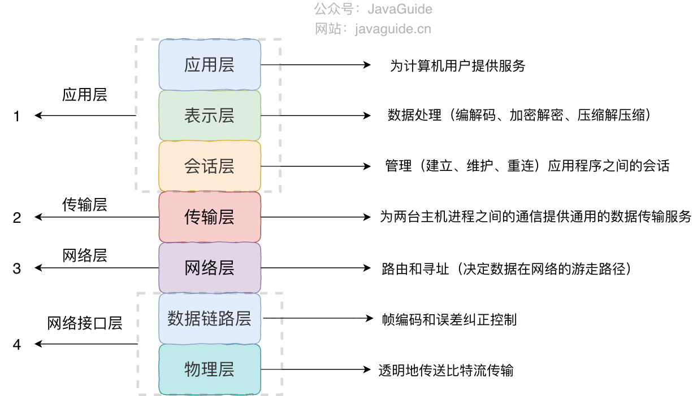

- **为什么要分层**：类似后端 Controller/Service/Repository 分层——
  1. 层间解耦，上层不用管下层怎么实现（面向接口）
  2. 每层可独立替换实现（高内聚低耦合）
  3. 把一个大问题拆成边界清晰的小问题，便于标准化

### 常见协议一览

- **应用层**：HTTP(网页)、SMTP(发邮件)、POP3/IMAP(收邮件，IMAP功能更强)、FTP(文件传输，明文不安全)、Telnet(明文已淘汰)、SSH(加密远程登录)、RTP(实时音视频)、DNS(域名解析)
- **传输层**：TCP(面向连接可靠)、UDP(无连接不可靠但快)
- **网络层**：IP(寻址路由)、ARP(IP转MAC)、ICMP(错误/状态通知，ping基于此)、NAT(内外网地址转换)、OSPF/RIP/BGP(路由协议)

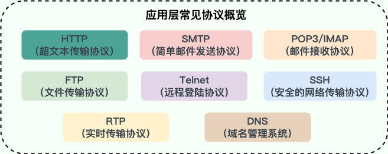
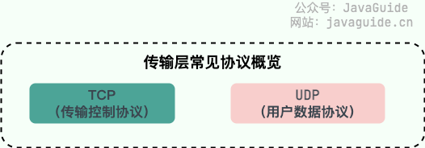

---

## 二、HTTP

### URL 到页面展示的全过程

DNS 解析域名 → 建立 TCP 连接(三次握手) → 发送 HTTP 请求 → 服务器处理返回响应 → 浏览器解析渲染 HTML，并行请求 CSS/JS/图片等资源 → 页面完成加载 → 断开或复用连接。

### 状态码

2xx 成功，3xx 重定向，4xx 客户端错误，5xx 服务端错误。

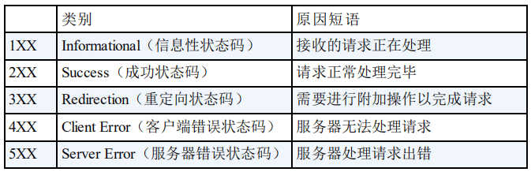

### 常见 Header

- `Accept`：能接受的内容类型
- `Cache-Control`：缓存策略
- `Authorization`：认证信息
- `Content-Type`：请求体格式(如 application/json)
- `Cookie` / `Set-Cookie`：会话标识传递

### HTTP vs HTTPS

| | HTTP | HTTPS |
|---|---|---|
| 端口 | 80 | 443 |
| 安全性 | 明文 | TLS 加密 |
| SEO | 一般 | 更友好 |

**RSA vs ECDHE 握手**（面试高频）：
- RSA：客户端用服务器公钥加密一个随机数发过去，服务器私钥解密。一旦私钥泄露，历史流量全部可回溯破解 —— **无前向安全性**。
- ECDHE：双方各自生成临时密钥对，交换公钥后各自算出同一个共享密钥，证书私钥只用来签名防篡改，不参与密钥本身。私钥泄露也不影响历史会话 —— **有前向安全性**，是现代 HTTPS 主流方案。

### HTTP vs RPC

不是替代关系，是场景选择：
- 对外接口（Web/App/开放平台）→ HTTP，通用、好调试、接入成本低
- 内部高频服务间调用，要做服务发现/超时重试/负载均衡 → RPC 更合适

### HTTP 版本演进

**1.0 → 1.1**
- 短连接 → 支持长连接(Keep-Alive)
- 新增 Host 头，支持虚拟主机
- 新增 Range，支持断点续传/范围请求(206)
- 缓存机制更丰富(ETag/If-None-Match)

**1.1 → 2.0**
- 二进制分帧，取代文本协议
- **多路复用**：一条 TCP 连接并行跑多个请求，突破浏览器 6-8 个连接的限制
- **HPACK** 压缩 Header
- 服务器推送(Server Push)

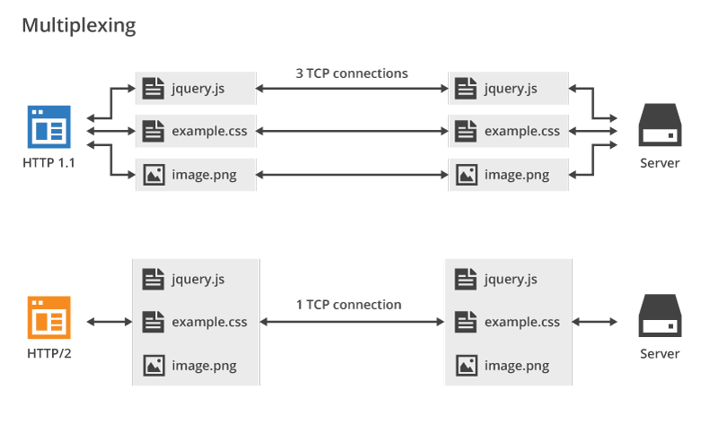

**2.0 → 3.0**
- 基于 UDP 的 **QUIC** 协议，自己实现可靠传输+拥塞控制+TLS1.3
- 连接建立更快：新连接 1-RTT，恢复连接可 0-RTT（但 0-RTT 有重放风险）
- **QPACK** 压缩 Header
- 连接迁移：用 Connection ID 标识连接，换网络(如WiFi切4G)不断连

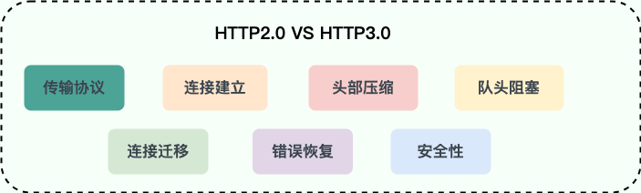
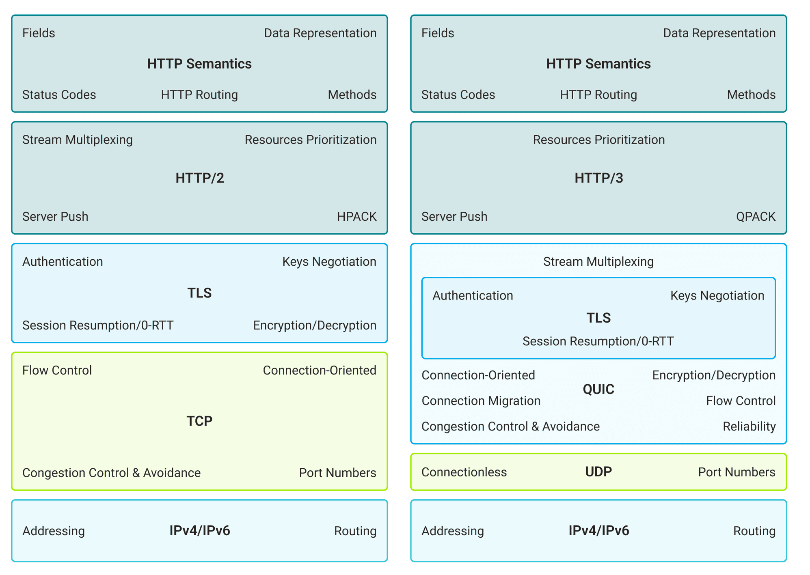
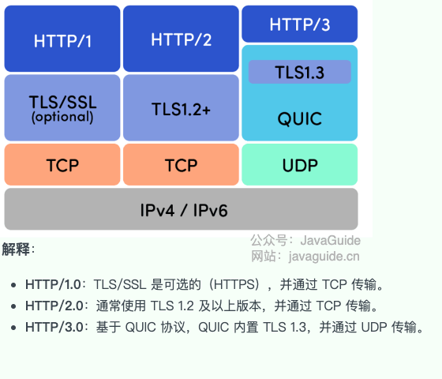

### 队头阻塞（Head-of-Line Blocking）

- **HTTP/1.1**：应用层阻塞，一个连接上必须排队处理，前一个卡住后面全等——靠开多个 TCP 连接缓解
- **HTTP/2.0**：应用层多路复用解决了，但底层 TCP 要求字节严格按序到达，一个包丢了会卡住这条连接上所有的流——传输层阻塞，只能靠减少丢包或换 QUIC 解决

### HTTP 无状态怎么保存状态

1. **Session + Cookie**（最经典）：服务器生成 SessionID 通过 `Set-Cookie` 给浏览器，之后请求自动带上 Cookie。要设 `HttpOnly`+`Secure` 防窃取，Session 数据存内存/DB/Redis。
2. **URL 重写**：SessionID 塞进 URL 参数，缺点是丑、不安全、不利于 SEO，基本不用了。
3. **Token/JWT**：登录后发一个 JWT，客户端存 localStorage，每次请求带在 Header 里。适合前后端分离/微服务。

### URI vs URL

URI 是资源的"身份证号"（唯一标识），URL 是"家庭住址"（具体定位方式），URL 是 URI 的一种。

### GET vs POST

| | GET | POST |
|---|---|---|
| 语义 | 查询 | 创建/修改 |
| 幂等性 | 幂等 | 不幂等 |
| 参数位置 | URL query string | 请求体 |
| 缓存 | 可缓存 | 一般不缓存 |
| 安全性 | 参数暴露在URL，更易泄露 | 相对安全，但仍需HTTPS |

---

## 三、WebSocket

### 定义

基于 TCP 的全双工协议，一次 HTTP Upgrade 握手后建立持久连接，双方随时可主动推数据。典型场景：弹幕、实时消息、多人协同、聊天。

### WebSocket vs HTTP

- WebSocket 双向，服务器可主动推；HTTP 只能客户端发起
- 协议前缀 `ws://`/`wss://` vs `http://`/`https://`
- WebSocket 头部轻量，HTTP 每次请求都带完整 Header（HTTP/2 靠 HPACK 有所改善）

### 工作过程

客户端发带 `Upgrade: websocket` + `Sec-WebSocket-Key` 的 HTTP 请求 → 服务器返回 `101` 状态码 + `Sec-WebSocket-Accept` → 协议升级完成，之后用帧传数据（消息可拆多帧再重组）→ 任一方发关闭帧结束会话。期间靠心跳保活。

### 三种方案对比

| | 短轮询 | 长轮询 | WebSocket |
|---|---|---|---|
| 实时性 | 差 | 中 | 强 |
| 资源占用 | 高(频繁请求) | 高(连接挂起) | 相对低 |
| 实现复杂度 | 简单 | 简单 | 较复杂(需心跳+重连) |

### SSE vs WebSocket

- SSE：**单向**（只能服务器推客户端），基于标准 HTTP，浏览器原生 `EventSource` 自动重连，只能传文本（二进制要 base64），实现简单
- WebSocket：**双向**全双工，独立协议需手动处理重连，原生支持二进制

> SSE 是当前大模型流式回复（DeepSeek/OpenAI 等）常用方案，响应头带 `text/event-stream`。

---

## 四、PING 与 DNS

### PING 原理

基于网络层 **ICMP** 协议：发 Echo Request(类型8) → 等 Echo Reply(类型0)。输出含序号、TTL、RTT、丢包率。

### Ping 通 ≠ TCP 能连通

ICMP 和 TCP 是不同协议，中间设备/防火墙可能分别处理：
- 防火墙只放行特定端口，ICMP能过TCP端口不通
- 目标服务没监听对应端口
- NAT/负载均衡代answer了ICMP，但后端服务其实没起
- HTTPS场景SNI被拦截

排查顺序：查DNS → 测ICMP连通 → 测端口连通 → 验证TLS握手。

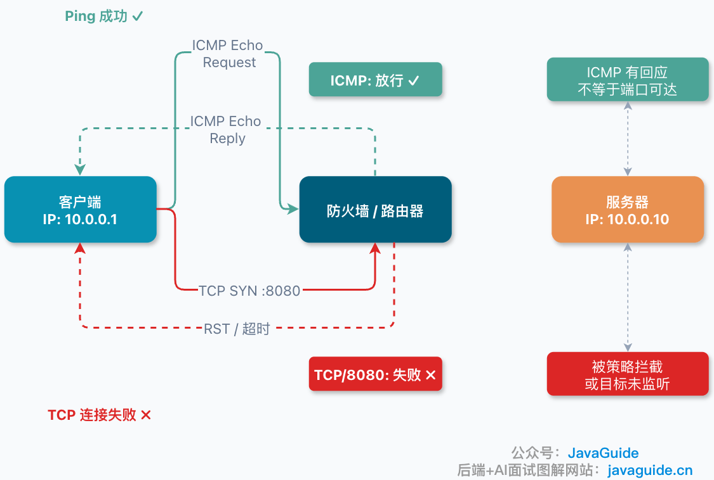

### DNS

- 域名 ↔ IP 映射，应用层协议，可跑 UDP/TCP，端口 53，分布式层次数据库
- 查询顺序：浏览器缓存 → OS缓存 → 路由器缓存 → 都没有再走DNS系统
- 根服务器逻辑上 13 个标识（a~m.root-servers.net），由多个组织通过 Anycast 部署，不是物理上只有13台机器

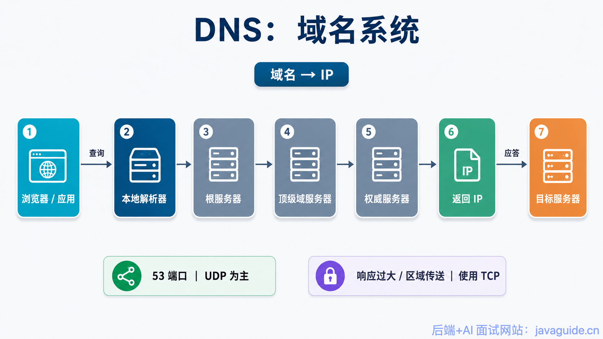

### DNS 劫持

篡改 DNS 解析结果让域名指向错误/恶意 IP，也叫 DNS 重定向/欺骗/污染。

---

## 五、TCP 与 UDP

### 核心区别

| | TCP | UDP |
|---|---|---|
| 连接 | 面向连接(三次握手/四次挥手) | 无连接 |
| 可靠性 | 可靠(序列号+确认+重传+流量/拥塞控制) | 不保证 |
| 状态 | 有状态 | 无状态 |
| 传输单位 | 字节流 | 报文(保留消息边界) |
| 头部开销 | 20-60字节 | 固定8字节 |
| 通信方式 | 仅单播 | 单播/多播/广播 |

### 选型

- 要完整性 → TCP：网页、文件传输、邮件、远程登录
- 要实时性能容忍丢包 → UDP：音视频通话、游戏、DHCP、IoT上报

### HTTP 基于 TCP 还是 UDP

HTTP/1.x、2.0 基于 TCP；HTTP/3 改用基于 UDP 的 QUIC，主要为解决队头阻塞+降低连接延迟。

### 字节流 vs 报文（粘包拆包问题）

TCP 只保证字节按序可靠到达，**不保留消息边界**，多条消息可能粘在一起或被拆开（粘包/拆包）；UDP 按数据报收发天然保留边界。

解决粘包拆包（应用层自定义边界）：
1. 固定长度
2. 分隔符
3. **长度头**（最常用，适合二进制/变长消息）

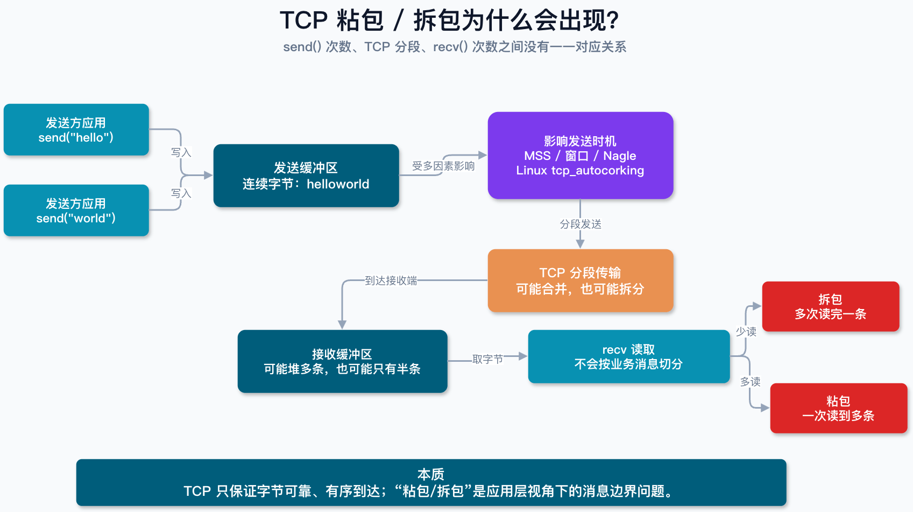
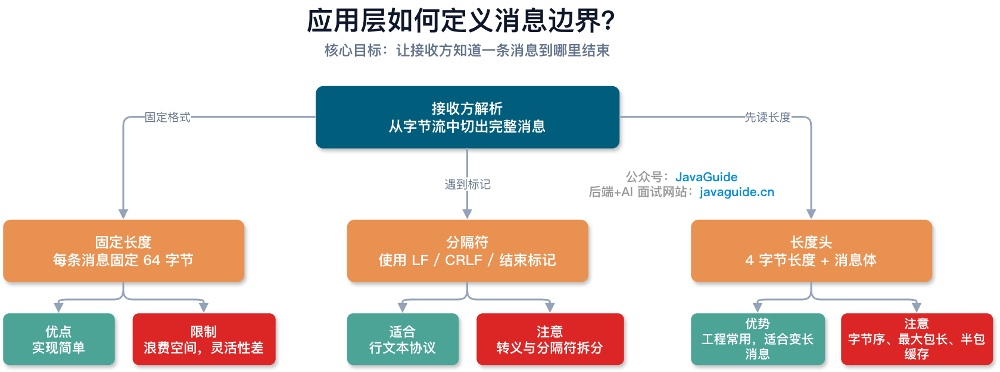

### 基于 TCP/UDP 的常见协议

- TCP：HTTP/HTTPS、FTP(明文，建议SFTP/FTPS)、SMTP/POP3/IMAP、Telnet(明文已淘汰)、SSH
- UDP：HTTP/3(QUIC)、DHCP、DNS(常规查询走UDP，响应过大/区域传送切TCP)、RTP/RTCP、TFTP、SNMP、NTP

### TCP Keepalive vs HTTP Keep-Alive（易混淆点）

两个不同层的机制，互不替代：
- **HTTP Keep-Alive**：应用层，复用 TCP 连接减少重复建连开销，服务器可"主动"回收空闲连接
- **TCP Keepalive**：传输层，默认关闭需显式开启，定期探测对端是否还活着，是"被动"回收（先探测确认失联才回收）

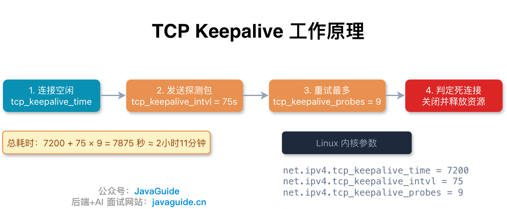

### TCP 和 UDP 能共用端口吗

**能**。内核按 IP 层的协议号区分（TCP=6，UDP=17），报文先按协议号分流到各自协议栈，再各自按端口分发。真正冲突只发生在**同协议**下重复绑定同一地址端口（此时才涉及 SO_REUSEADDR/SO_REUSEPORT）。

例：DNS 同时用 UDP/53 和 TCP/53；HTTP/3 的 UDP/443 和传统 HTTPS 的 TCP/443 可以并存。

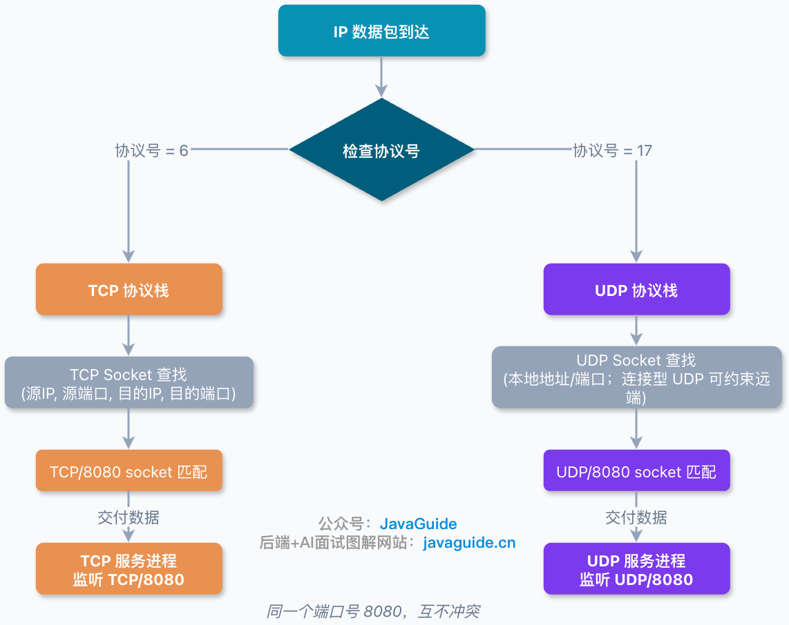

### 单机 TCP 连接数上限是 65535 吗

**不是**。65535 只是端口号范围上限，TCP 连接由**四元组**（源IP、源端口、目的IP、目的端口）区分，不是端口数决定连接数。

真正瓶颈：
- 服务端：文件描述符数量、内存、CPU、网卡带宽
- 客户端：访问同一目标时，源端口容易成为瓶颈（Linux 默认约 2.8 万临时端口可用）
- NAT 网关场景下，公网侧的源端口也可能成为瓶颈

> 生产常见坑：连接池配置不当，短连接频繁创建销毁，把临时端口耗尽。

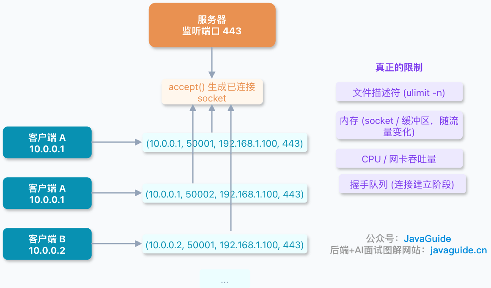

---

## 六、IP

### IP 协议作用

网络层协议，定义数据包格式并负责路由寻址。IPv4/IPv6 目前并存，IPv6 是未来趋势。

### IP 地址与寻址

IP 地址分配给**网络接口**（不是设备本身）用于标识通信端点。一个接口可以有多个 IP，IP 也可能变化（不是永久身份）。私有地址可以在不同局域网重复使用。

### IPv4 vs IPv6

| | IPv4 | IPv6 |
|---|---|---|
| 位数 | 32位 | 128位 |
| 格式 | 点分十进制 | 十六进制冒号分隔 |
| 可用地址 | 约42亿 | 极大扩展 |
| 特色 | — | 支持SLAAC无状态自动配置，NAT变可选，ICMPv6增强 |

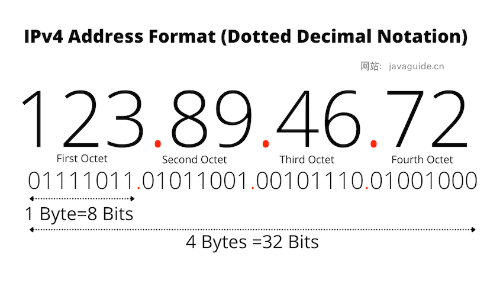
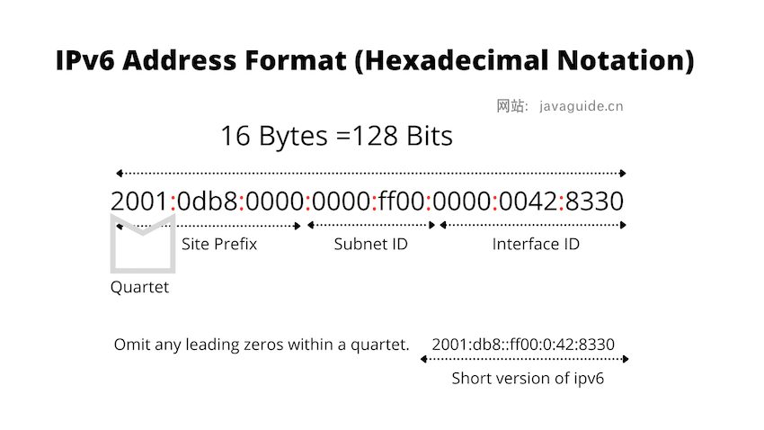

### 获取客户端真实 IP

- **应用层**：`X-Forwarded-For`（业界常用但非标准）/ `Forwarded`（IETF标准）—— 不能无条件信任客户端直传的头，得由可信代理规范化处理
- **传输层**：TCP Options 携带真实源IP（需双端改造）/ Proxy Protocol
- **网络层**：隧道 + DSR 模式（复杂，少用）

### NAT 的作用

内外网地址转换，让局域网多设备共享一个公网IP，缓解IPv4地址短缺、隐藏内部拓扑。**注意**：NAT 本身不是安全机制，决定哪些报文能进来的是防火墙的过滤策略，不能靠 NAT 替代防火墙。

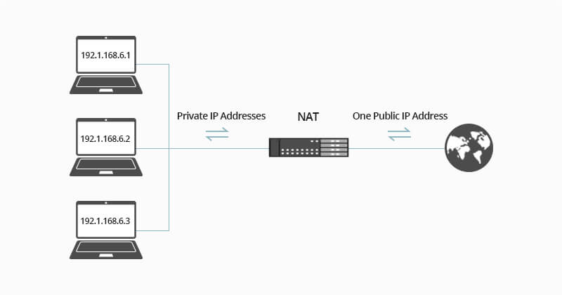

---

## 七、ARP

### MAC 地址

链路层接口标识，通常 6 字节(48位)，格式 EUI-48。可被操作系统修改/随机化，**不是永久不变**的。全1地址 `FF-FF-FF-FF-FF-FF` 表示广播。

### ARP 协议

解决**网络层 IP 地址 → 链路层 MAC 地址**的转换问题，让 IP 包在物理网络上能确定下一跳该发给谁（哪个MAC）。

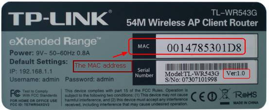

---

## 附：延伸阅读方向（未在此展开，面试前建议单独补）

- Cookie vs Session 详细对比（属于认证授权专题）
- TCP 三次握手/四次挥手细节 + 为什么需要 2MSL
- TCP TIME_WAIT 状态含义、堆积影响、`tcp_tw_reuse` 使用注意
- TCP 可靠传输机制细节（序列号/确认应答/超时重传/滑动窗口/拥塞控制）
- ARP 协议详细工作流程（ARP请求/应答/缓存表）
- DNS 完整解析流程（递归查询 vs 迭代查询）

> 复习资料推荐：《图解 HTTP》
