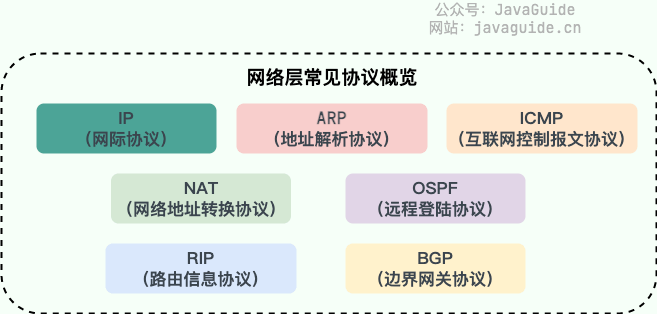
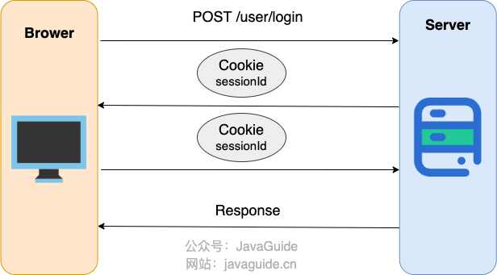
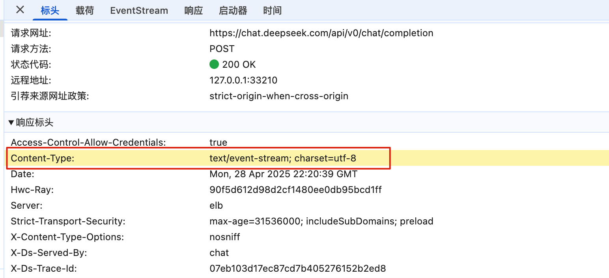
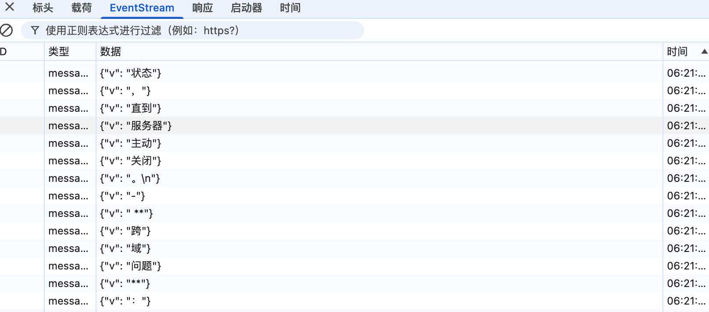
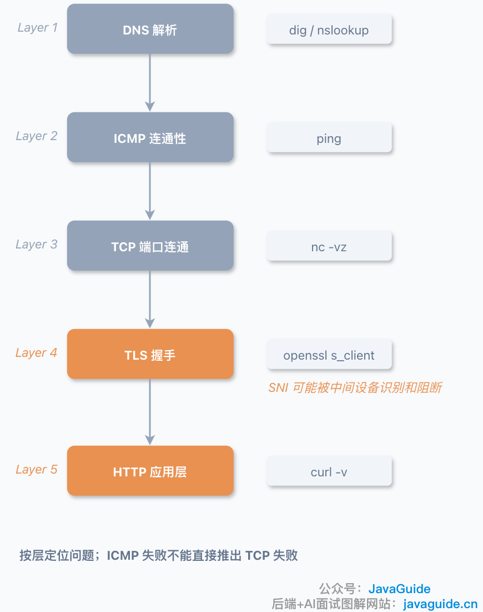

# 计算机网络常见面试题总结（上）

## 一、网络分层

### 为什么网络要分层？
分层的本质是"分而治之"：把一个庞大、复杂的通信问题拆解成若干个相对独立的小问题，每一层只关心自己的职责，不需要了解其他层的实现细节。好处主要有三点：

- **层间独立**：某一层的实现变化，不会影响到其他层（比如换了物理传输介质，应用层协议不需要改动）。
- **灵活性好**：只要接口不变，各层可以灵活替换实现方案。
- **化繁为简**：把大问题拆成小问题，每个模块的复杂度可控，方便设计、实现和调试。

这跟做后端开发时把系统分成 Controller / Service / Repository 是同一个思路——上层依赖下层提供的服务，不用管下层具体怎么实现。

### OSI 七层模型 vs TCP/IP 四层模型
OSI 模型定义了七层：物理层、数据链路层、网络层、传输层、会话层、表示层、应用层。它的优点是概念清晰、职责划分严谨，但在实际工程中过于复杂，很多功能（如会话层、表示层）在真实网络栈里并没有独立实现。

TCP/IP 模型是实际落地使用的模型，一般简化为四层（应用层、传输层、网络层、网络接口层），把 OSI 的会话层、表示层、应用层合并成应用层，物理层和数据链路层合并成网络接口层。

面试中常见的说法是"五层模型"（应用层、传输层、网络层、数据链路层、物理层），是对 TCP/IP 四层模型的进一步细化，同样是主流表述方式。

## 二、常见协议

### 应用层协议
应用层协议解决的是"具体业务怎么通信"的问题，常见的有：

- **HTTP**：网页浏览，基于 TCP
- **SMTP / POP3 / IMAP**：邮件发送与接收，基于 TCP
- **FTP**：文件传输，基于 TCP
- **Telnet / SSH**：远程登录，基于 TCP（SSH 是加密版）
- **DNS**：域名解析，通常基于 UDP（大响应或区域传输时用 TCP）
- **RTP**：实时音视频传输，基于 UDP

### 传输层协议
传输层核心是 TCP 和 UDP 两大协议，二者的取舍问题会在下篇详细展开。

### 网络层协议
网络层负责寻址和路由，常见协议包括：

- **IP**：定义地址格式和路由转发规则
- **ARP**：完成 IP 地址到 MAC 地址的映射
- **ICMP**：网络诊断与错误报告（ping 命令的基础）
- **NAT**：私有地址与公有地址转换
- **OSPF / RIP / BGP**：路由协议，负责在网络设备之间同步路由信息

## 三、HTTP 相关

### 从输入 URL 到页面显示，发生了什么？
大致可以拆成以下几步：

1. **DNS 解析**：把域名解析成服务器 IP 地址
2. **建立 TCP 连接**：与目标服务器完成三次握手
3. **（如果是 HTTPS）TLS 握手**：协商加密算法，交换密钥
4. **发送 HTTP 请求**：浏览器构造请求报文并发出
5. **服务器处理并返回响应**：服务器处理请求，返回 HTTP 响应报文
6. **浏览器渲染页面**：解析 HTML/CSS/JS，构建 DOM 树和渲染树，绘制页面
7. **连接维护或关闭**：根据 Keep-Alive 策略决定是否复用连接

### 常见 HTTP 状态码
状态码按首位数字分类：

- **1xx**：信息性，表示请求已接收，正在处理
- **2xx**：成功，如 200 OK
- **3xx**：重定向，如 301 永久重定向、302 临时重定向
- **4xx**：客户端错误，如 404 Not Found、403 Forbidden
- **5xx**：服务端错误，如 500 Internal Server Error、502 Bad Gateway

### HTTP 和 HTTPS 的区别
| 对比项 | HTTP | HTTPS |
|---|---|---|
| 安全性 | 明文传输，无加密 | TLS/SSL 加密传输 |
| 端口 | 80 | 443 |
| URL 前缀 | http:// | https:// |
| 证书 | 不需要 | 需要 CA 证书 |
| 性能 | 相对更快（无加解密开销） | 有一定的加解密性能损耗 |
| SEO/信任度 | 浏览器可能标记"不安全" | 浏览器显示安全锁标识，搜索引擎更友好 |

### HTTPS 握手中 RSA 和 ECDHE 的区别
这是 HTTPS 密钥交换阶段两种不同的算法思路：

- **RSA 方式**：客户端生成一个随机密钥，用服务器的 RSA 公钥加密后传给服务器。一旦服务器的私钥泄露，历史所有会话密钥都能被反推出来，**不具备前向安全性**。
- **ECDHE 方式**：基于椭圆曲线 Diffie-Hellman 密钥交换，双方各自生成临时（短暂）密钥对，交换公开参数后各自独立计算出相同的会话密钥，私钥本身不参与密钥的直接传输。即使私钥泄露，过去的会话密钥也无法被还原，**具备前向安全性**。这也是目前主流网站优先采用 ECDHE 的原因。

### 为什么有了 HTTP 还需要 RPC？
两者不是替代关系，而是分别适配不同场景：HTTP 更适合对外暴露的公共接口（浏览器/第三方调用，通用性和兼容性优先），RPC 框架（如 gRPC、Dubbo）更适合内部服务间调用（性能、序列化效率、服务治理能力优先）。选型本质是"通用性"与"性能/治理能力"之间的权衡，而不是谁淘汰谁。

### HTTP/1.0 vs HTTP/1.1
| 特性 | HTTP/1.0 | HTTP/1.1 |
|---|---|---|
| 连接方式 | 默认非持久连接，每次请求新建 TCP 连接 | 默认持久连接（Keep-Alive），可复用 TCP 连接 |
| Host 头 | 不强制要求 | 强制要求，支持虚拟主机 |
| 缓存机制 | 较简单（If-Modified-Since 等） | 更完善（增加 Cache-Control、ETag 等） |
| 状态码 | 较少 | 新增多个状态码 |
| 带宽利用 | 较低效 | 支持范围请求（Range），带宽利用更优 |

### HTTP/1.1 vs HTTP/2.0
| 特性 | HTTP/1.1 | HTTP/2.0 |
|---|---|---|
| 传输格式 | 文本格式 | 二进制分帧 |
| 多路复用 | 不支持（队头阻塞明显） | 支持，一个连接可并发多个请求/响应 |
| 头部压缩 | 无 | HPACK 压缩，减少冗余头部开销 |
| 服务器推送 | 不支持 | 支持 Server Push |

多路复用让多个请求可以在同一条 TCP 连接上并发传输，不再需要排队等待：

### HTTP/2.0 vs HTTP/3.0
| 特性 | HTTP/2.0 | HTTP/3.0 |
|---|---|---|
| 传输层协议 | TCP | QUIC（基于 UDP） |
| 队头阻塞 | 应用层已解决，但 TCP 层仍可能阻塞 | 从传输层彻底解决 |
| 头部压缩 | HPACK | QPACK |
| 连接迁移 | 依赖 IP+端口四元组，网络切换会断连 | 使用 Connection ID，网络切换（如 WiFi 切换到 4G）连接不中断 |
| 加密 | TLS 可选（HTTPS 场景强制） | 默认强制加密，加密与传输层协议深度集成 |

三代协议的协议栈对比可以直观看出演进关系：

### HTTP/1.1 和 HTTP/2.0 的队头阻塞有什么本质区别？
虽然都叫"队头阻塞"，但阻塞发生的层面不同：

- **HTTP/1.1**：阻塞发生在**应用层**。同一条连接上的请求必须严格按顺序处理，前一个请求没处理完，后面的请求即使已经到达也要排队等待。
- **HTTP/2.0**：应用层通过多路复用解决了请求级别的排队问题，但底层依然是 TCP，一旦某个 TCP 报文丢失，**TCP 层**会阻塞该连接上所有流的数据，直到丢失的报文重传成功——阻塞被"下移"到了传输层，而不是彻底消失。这也是 HTTP/3 改用 QUIC/UDP 的核心动机之一。

### HTTP 是无状态协议，是如何保持状态的？
HTTP 协议本身不记录任何请求之间的关联信息，但实际业务中常用以下三种方式维持"状态"：

1. **Session + Cookie（主流方案）**：服务器为每个用户生成唯一 Session，用 Cookie 把 Session ID 返回给客户端，后续请求带上该 Cookie，服务器据此找到对应的会话数据。

2. **URL 重写（较少使用）**：把状态信息附加在 URL 参数里传递，缺点明显——URL 会变得冗长、不安全（信息暴露在地址栏和日志里），现在基本被淘汰。
3. **Token 认证（如 JWT）**：服务器生成一个自包含用户信息的令牌，客户端每次请求携带该令牌，服务器通过验证签名来确认身份，天然支持无状态的分布式部署，是目前微服务场景下常见方案。

### URI 和 URL 的区别
URI（Uniform Resource Identifier）是"统一资源标识符"，作用是唯一标识一个资源，它是一个更大的概念范畴，包含 URL 和 URN 两个子集。URL（Uniform Resource Locator）是"统一资源定位符"，除了标识资源，还额外说明了资源的具体位置（协议、主机、路径等），因此可以理解为：**URL 是 URI 的一种，所有 URL 都是 URI，但不是所有 URI 都是 URL。**

### GET 和 POST 的区别
| 维度 | GET | POST |
|---|---|---|
| 语义 | 获取资源 | 提交/创建资源 |
| 幂等性 | 幂等（多次请求结果一致） | 非幂等（多次提交可能产生多条记录） |
| 参数位置 | 拼接在 URL 上 | 放在请求体中 |
| 长度限制 | 受浏览器/服务器 URL 长度限制 | 理论上没有限制 |
| 缓存 | 可被缓存 | 默认不缓存 |
| 安全性 | 参数暴露在 URL 中，相对不安全 | 参数在请求体，相对更安全（仍需配合 HTTPS） |

## 四、WebSocket

### WebSocket 是什么？
WebSocket 是一种基于 TCP 的全双工通信协议，客户端和服务器只需要完成一次握手，就能建立持久连接，此后双方都可以随时主动向对方发送数据，非常适合聊天、实时游戏、消息推送等需要双向实时交互的场景。

### WebSocket 和 HTTP 的区别
- **通信方向**：HTTP 是单向的请求-响应模式（客户端发起，服务器响应）；WebSocket 是全双工的，双方都能主动发消息。
- **连接方式**：HTTP 通常是短连接（即使开启 Keep-Alive 也是请求驱动的）；WebSocket 是长连接，一次握手后持续保持。
- **协议标识**：HTTP 用 `http://`/`https://`；WebSocket 用 `ws://`/`wss://`。
- **开销**：WebSocket 建立连接后每次通信的头部开销远小于 HTTP，更适合高频率的小数据量实时通信。

### WebSocket 的工作过程
1. **握手升级**：客户端先发一个 HTTP 请求，带上 `Upgrade: websocket` 头，请求协议升级；服务器同意后返回 101 状态码，完成协议切换。
2. **帧数据传输**：升级完成后，双方以"帧"（frame）为单位收发数据，不再走 HTTP 请求-响应模型。
3. **心跳保活**：定期发送 Ping/Pong 帧，检测连接是否仍然存活，避免中间设备（如 NAT、负载均衡）因空闲超时而断开连接。
4. **关闭握手**：任意一方发送 Close 帧，另一方确认后连接正式关闭。

### WebSocket 与短轮询/长轮询的区别
- **短轮询**：客户端固定间隔发起 HTTP 请求询问是否有更新，实现简单但存在延迟，且大量无效请求浪费资源。
- **长轮询**：客户端发起请求后，服务器"hold住"连接直到有数据或超时才返回，相比短轮询减少了无效请求，但本质仍是基于请求-响应的模拟。
- **WebSocket**：真正的双向实时通信，没有轮询的延迟和资源浪费，是三者中实时性最好、服务器资源利用率最高的方案，但实现和维护成本相对更高。

### SSE 和 WebSocket 的区别
SSE（Server-Sent Events）是基于普通 HTTP 协议的单向推送技术，服务器可以持续向客户端推送数据，但客户端不能通过同一条连接向服务器发消息。

| 维度 | SSE | WebSocket |
|---|---|---|
| 通信方向 | 单向（服务器→客户端） | 双向 |
| 底层协议 | 标准 HTTP（`text/event-stream`） | 需要协议升级 |
| 实现复杂度 | 简单，浏览器原生支持自动重连 | 相对复杂，断线需自行处理重连 |
| 典型场景 | 消息通知、实时日志、大模型流式输出 | 聊天室、协同编辑、实时游戏 |

目前主流大模型的流式回复接口（如 DeepSeek 的 API）普遍采用 SSE 方案，因为场景是"服务器单向持续吐字"，不需要客户端反向实时发消息，SSE 实现简单且天然契合。

## 五、PING

### PING 是做什么的？
PING 是最基础的网络连通性诊断工具，用于测试本机与目标主机之间是否可达，以及往返时延（RTT）大小。执行 `ping www.example.com` 之类的命令后，会看到每次探测的响应时间、丢包率等信息，用来快速判断网络是否通畅。

### PING 的工作原理
PING 基于 **ICMP（Internet Control Message Protocol）** 协议中的 Echo Request / Echo Reply 报文实现：本机发送 ICMP Echo Request 报文给目标主机，目标主机收到后返回 ICMP Echo Reply 报文，通过往返时间差计算延迟，通过是否收到回复判断是否可达。ICMP 属于查询类报文，专门用于网络诊断，不涉及具体应用层业务。

### 能 Ping 通，但 TCP 连接却建立不了，正常吗？
**是正常的，两者并不等价。** 原因在于 ICMP 和 TCP 是完全不同的协议，走的检测路径也不同：

- 很多防火墙、安全组、云服务商会专门禁止或限制 ICMP 报文，但同时放行特定端口的 TCP 流量，所以可能 Ping 不通但 TCP 却能连上。
- 反过来，有些设备允许 ICMP 探测通过，但对应端口的服务并未监听，或被防火墙按端口单独拦截，此时表现为能 Ping 通但 TCP 连接失败（比如常见的端口未开放、服务未启动）。
- NAT、负载均衡等中间设备对 ICMP 和 TCP 的处理策略也可能不同。

所以 Ping 通只能说明网络层（IP 层）基本可达，不能作为传输层（TCP）连接一定成功的依据，两者需要分别排查。

## 六、DNS

### DNS 是做什么的？
DNS（Domain Name System）负责把人类容易记忆的域名（如 `www.example.com`）解析成机器可识别的 IP 地址，是互联网访问的基础设施之一。DNS 查询通常基于 UDP 的 53 端口（响应数据量较大或涉及区域传输时会切换到 TCP）。

### DNS 服务器的类型和"根服务器"
DNS 体系里的角色可以从两个维度理解：

- **按数据权威性划分**：根服务器（负责指引到顶级域）、顶级域服务器（负责 .com、.cn 等）、权威服务器（负责具体域名的最终解析记录）。
- **按查询代理角色划分**：递归解析器（代替客户端逐级查询，通常是我们配置的 DNS，如 8.8.8.8）、转发服务器（简单转发查询请求）。

需要注意的一个常见误解：所谓的"13 个根服务器"，指的是 **13 个逻辑标识（A 到 M）**，而不是 13 台物理机器。每个逻辑根服务器背后通过 Anycast 技术，实际由分布在全球的大量物理服务器节点组成，用于提升可用性和访问速度。

### 什么是 DNS 劫持？
DNS 劫持（也称 DNS 重定向/欺骗/污染）是指攻击者通过篡改 DNS 解析结果，让用户在访问正常域名时被错误地指向恶意或错误的 IP 地址，从而实现流量劫持、广告注入、钓鱼攻击等目的。常见的防范手段包括使用 DNSSEC、HTTPS（可以在应用层校验证书识别中间人）、可信的公共 DNS 服务等。

> 参考来源: https://javaguide.cn/cs-basics/network/other-network-questions.html
