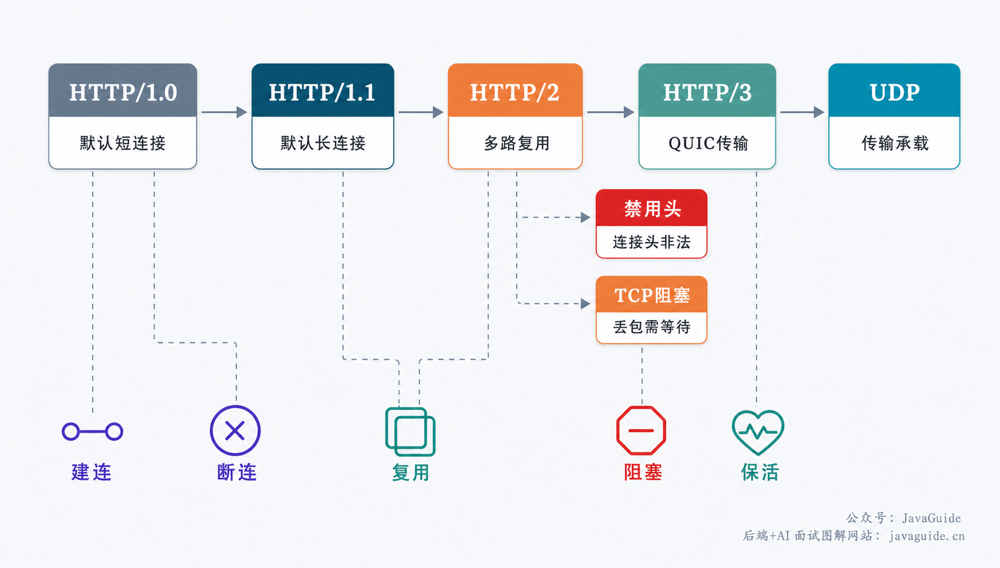
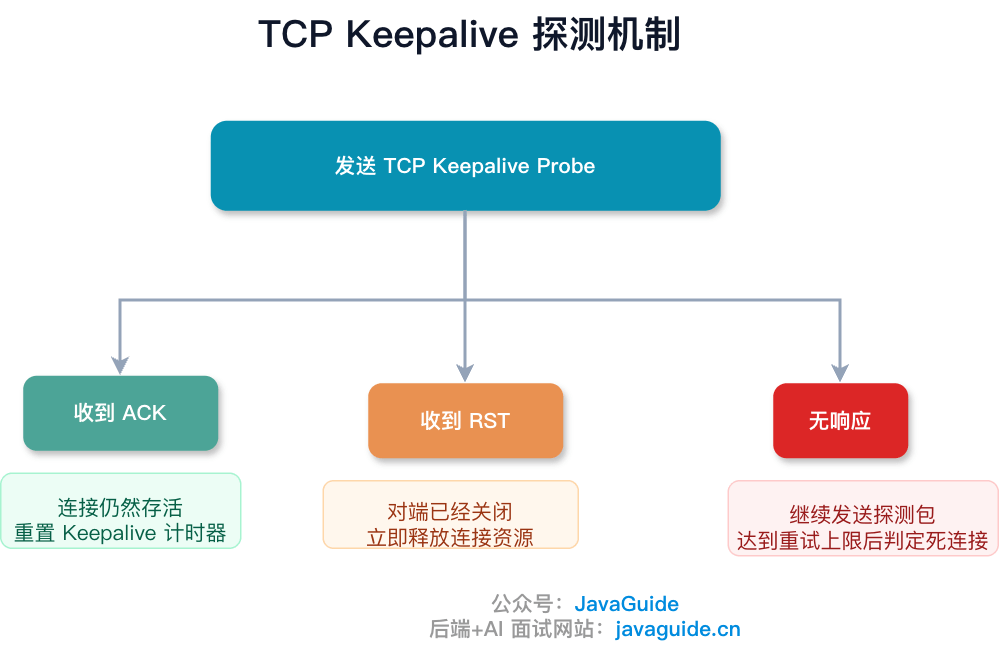
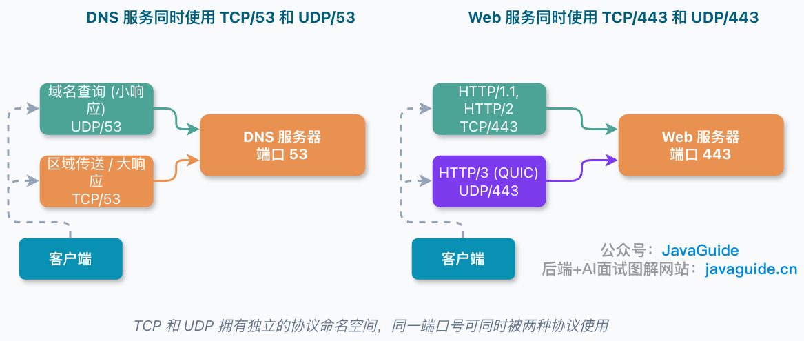
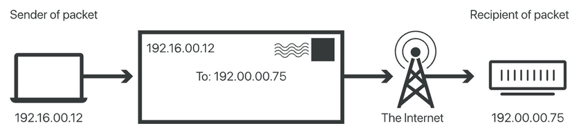

# 计算机网络常见面试题总结（下）

## 一、TCP 与 UDP

### TCP 和 UDP 的区别
这是网络面试里最基础也最核心的问题，可以从几个维度对比：

| 维度 | TCP | UDP |
|---|---|---|
| 连接性 | 面向连接，需三次握手建立连接 | 无连接，直接发数据 |
| 可靠性 | 可靠传输（确认、重传、排序） | 不保证送达，尽力而为 |
| 状态维护 | 有状态，双方维护连接状态 | 无状态 |
| 效率 | 相对较低（握手、确认、拥塞控制带来开销） | 更高效，没有额外控制开销 |
| 传输形式 | 面向字节流，无消息边界 | 面向消息/数据报，一次发送对应一个完整数据报 |
| 头部开销 | 20~60 字节（含可选项） | 固定 8 字节，非常轻量 |
| 通信模式 | 只支持一对一（单播） | 支持单播、多播、广播 |

### 什么场景选 TCP，什么场景选 UDP？
选型的核心是"要不要保证可靠性"和"能否容忍一定的丢包"：

- **优先选 TCP** 的场景：网页浏览（HTTP/HTTPS）、文件传输（FTP）、邮件收发、远程登录——这些场景要求数据完整、准确，哪怕慢一点也不能丢数据或乱序。
- **优先选 UDP** 的场景：语音/视频通话（VoIP）、在线游戏、DHCP 地址分配、物联网设备高频上报数据——这些场景更看重实时性和效率，少量丢包/丢帧可以容忍或有业务层自己的补偿机制，用不着 TCP 那一整套确认重传机制拖慢速度。

### HTTP 是基于 TCP 还是 UDP？
HTTP/1.x 和 HTTP/2 都是构建在 TCP 之上的；到了 HTTP/3，则彻底转向了基于 UDP 的 QUIC 协议。这次转变的主要动机是解决 TCP 层面的队头阻塞问题，同时降低连接建立的延迟：

- TCP 在丢包时会阻塞该连接上的所有数据流，QUIC 在协议层面把多路复用做得更彻底，一个流的丢包不会影响其他流。
- TCP 每次新建连接至少需要一次完整往返（RTT）完成三次握手，加上 TLS 握手又要额外的 RTT；QUIC 可以把连接建立和加密握手合并，甚至在连接恢复（Resumption）场景下支持 0-RTT——但需要注意，0-RTT 只适用于此前已经建立过连接、缓存了会话参数的场景，且存在重放攻击（Replay Attack）的安全风险，需要业务层配合去重等手段防范。

### 为什么说 TCP 是面向字节流的，UDP 是面向消息的？
这是理解"粘包/拆包"问题的关键：

- **TCP（字节流）**：TCP 只负责保证字节按顺序、完整地到达，它不知道、也不关心应用层一次“发送”对应的是一条完整的消息还是半条消息。发送方多次写入的数据，在接收方读取时可能被合并成一次读到，也可能一条消息被拆成多次才读完——这就是所谓的"粘包"和"拆包"。

- **UDP（消息/数据报）**：UDP 每次发送对应一个独立的数据报，接收方每次读取正好对应发送方的一次完整发送，天然保留了消息边界，但代价是不保证这个数据报一定能到达，也不保证多个数据报之间的顺序。

正因为 TCP 不保留消息边界，应用层协议（比如自定义 RPC 协议、HTTP 协议本身）需要自己定义消息的边界，常见做法有三种：**固定长度**（每条消息定长，简单但浪费空间）、**特殊分隔符**（如换行符，简单但要处理消息内容本身包含分隔符的转义问题）、**长度前缀**（消息头里写明消息体长度，接收方先读长度再按长度读取内容，是最通用可靠的方式，HTTP 的 Content-Length 就是典型应用）。

### 基于 TCP/UDP 的常见协议
**基于 TCP 的协议**：HTTP/HTTPS（网页访问）、FTP（文件传输）、SMTP（邮件发送）、POP3/IMAP（邮件接收）、Telnet（远程登录，明文）、SSH（远程登录，加密）。

**基于 UDP 的协议**：HTTP/3（借助 QUIC）、DHCP（动态获取 IP 地址配置）、DNS（域名解析，正常查询走 UDP，响应过大或区域传输时会切换到 TCP）、RTP/RTCP（实时音视频流传输及其控制）、TFTP（简单文件传输，常用于设备初始化引导）、SNMP（网络设备监控管理）、NTP（网络时间同步）。

### TCP Keepalive 和 HTTP Keep-Alive 的区别
这是两个名字相似但完全不同层面的机制，很容易混淆：

| 维度 | HTTP Keep-Alive | TCP Keepalive |
|---|---|---|
| 所在层 | 应用层 | 传输层 |
| 作用 | 让一条 TCP 连接可以被多个 HTTP 请求复用，避免每次请求都重新建连 | 检测一条已建立但长时间空闲的 TCP 连接对端是否还存活 |
| 触发方 | 应用（浏览器/服务器）可以主动决定关闭连接 | 内核根据配置的空闲时间自动发送探测包，被动等待对方确认 |
| 关闭连接 | 可以主动关闭 | 只探测，探测失败后才由内核判定连接已失效并清理 |

需要强调的是，这两者是**独立运行、互不替代**的机制：即使开启了 TCP Keepalive，应用层依然需要自己的 HTTP Keep-Alive 策略来决定连接复用；反之开启了 HTTP Keep-Alive，也不代表底层 TCP 连接不需要保活探测。

### TCP 三次握手与四次挥手（简要）
这部分是经典高频考点，包括几个常见追问：为什么建立连接需要三次而不是两次？为什么服务端可以把 SYN 和 ACK 合并到一个包里发送，而挥手时 FIN 和 ACK 通常不能合并？为什么断开连接需要四次挥手？为什么最后需要等待 2MSL 才能真正关闭？由于这部分内容体系庄大，建议结合专门讲解三次握手/四次挥手的文章系统学习，此处不再展开重复。

### TCP 的 TIME_WAIT 状态到底在等什么？
与 TIME_WAIT 相关的常见追问包括：TIME_WAIT 状态具体在等待什么、大量 TIME_WAIT 堆积会不会引发问题、`tcp_tw_reuse` 参数是否安全、TIME_WAIT 和 CLOSE_WAIT 两种状态有什么本质区别。这几个问题同样建议参考专门的 TCP 状态机文章做系统性学习。

### TCP 如何保证可靠传输？
TCP 的可靠性是通过序号确认、超时重传、滑动窗口、流量控制、拥塞控制等多种机制共同实现的，内容较多，建议查阅专门讲解 TCP 可靠传输机制的文章系统学习。

### TCP 和 UDP 可以使用同一个端口吗？
**可以。** 很多人误以为端口号是全局唯一的，其实端口的命名空间是按协议分开的：TCP 和 UDP 在 IP 层被视为不同的上层协议（协议号分别是 6 和 17），操作系统内核会先根据 IP 头里的协议号把报文分发给对应的协议栈处理，再各自根据端口号找到对应的应用。也就是说 TCP 的端口空间和 UDP 的端口空间是相互独立的，只有**同一协议**内的端口才会真正冲突。

典型例子：DNS 同时使用 UDP 53 端口和 TCP 53 端口；HTTP/3（基于 QUIC/UDP）使用 UDP 443 端口，与传统 HTTPS（TCP 443 端口）可以在同一台机器上并存，互不影响。

### 一台主机最多只能支持 65535 个 TCP 连接吗？
**这是一个常见误解，答案是否定的。** 65535 其实是端口号的最大数量（16 位无符号整数的上限），但一条 TCP 连接实际上是由**四元组**（源 IP、源端口、目的 IP、目的端口）唯一标识的，并不是只看端口号。

对于服务器来说，只要客户端的 IP 或端口不同，即使服务器只监听同一个端口，也可以同时维持远超 65535 条连接——真正的限制来自服务器的**文件描述符数量上限、内存、CPU 处理能力、网卡带宽**等物理资源，而不是端口数量。

对于客户端来说，情况有所不同：客户端向同一个服务器地址+端口发起连接时，受限于本机可用的临时端口（ephemeral port）范围，Linux 默认大约只有 28000 多个可用临时端口，这才是客户端侧真正的限制来源；此外如果客户端经过 NAT 网关出网，还会受到 NAT 设备端口转换表容量的限制。

## 二、IP 与地址

### IP 协议做了什么？
IP（Internet Protocol）是网络层的核心协议，负责定义数据包（分组）的格式、寻址方式以及路由转发规则，是互联网上所有设备互联互通的基础。目前 IPv4 和 IPv6 两个版本共存于现实网络中。

### 什么是 IP 地址？IP 是如何寻址的？
IP 地址本质上标识的是"一次通信的接口"，而不是某台设备本身固定不变的身份证。同一台设备可能有多个网络接口（有线、无线），也可能因为 DHCP 动态分配而在不同时间获得不同的 IP；在私有网络（如公司内网、家庭网络）中，同一个私有 IP 段也会在不同的局域网中被重复使用，因为它们互相之间本身就是隔离的。因此理解 IP 地址的关键是：它标识的是"某次通信中，某个接口在某个网络里的位置"，而非设备的永久身份。

### 什么是 IP 地址过滤？
IP 地址过滤是指通过配置规则，只允许或禁止特定 IP 地址/IP 段访问某个资源，是最基础的一种访问控制手段。但它通常只能作为安全防护的一个环节，一般需要结合身份认证、权限校验、传输加密等手段一起使用，单独依赖 IP 过滤并不能提供足够的安全保障（IP 可以被伪造或经由代理绕过）。

### IPv4 和 IPv6 的区别
最核心的差异是地址长度和数量：IPv4 使用 32 位地址，理论上限约 42.9 亿个地址，早已面临枯竭；IPv6 使用 128 位地址，地址空间近乎无限，从根本上解决了地址枯竭问题。

除了地址数量，IPv6 相比 IPv4 还带来了几个重要改进：

- **SLAAC（无状态地址自动配置）**：设备可以根据路由器广播的网络前缀自行生成 IP 地址，不再强依赖 DHCP 服务器分配地址；配合**重复地址检测（DAD）**机制来确认生成的地址没有冲突，不过 DAD 本身只在链路本地范围内检测，并不能做到百分之百可靠。
- **NAT 变为可选**：由于地址空间极大，理论上每个设备都能拥有一个全球唯一的公有地址，不再需要靠 NAT 来节省地址（虽然出于安全或过渡兼容的考虑，仍有场景会继续使用 NAT）。
- **头部结构简化**：IPv6 基本头部格式更加精简、字段更少，路由器处理效率更高。
- **可选扩展头**：把一些不常用的功能（如分片、认证）抽取成可选的扩展头，按需附加，基本头部保持轻量。
- **ICMPv6 增强**：整合了地址解析、路由通告等更多功能，比 IPv4 时代的 ICMP 承担了更多职责（比如替代了 ARP 的部分作用）。

### 如何获取客户端的真实 IP？
由于请求经常要经过代理、负载均衡、CDN 等中间节点，直接在服务器上拿到的往往是最近一个中间节点的 IP，而不是用户的真实 IP，常见的解决方式按层次可以分为：

- **应用层（最常用）**：通过 HTTP 头字段传递，如非标准但广泛使用的 `X-Forwarded-For`（记录请求经过的每一级代理 IP 列表），以及更规范化的标准头 `Forwarded`。需要特别注意的是：**这些头字段的值都是客户端或中间代理自己声明的，如果不加校验直接信任，很容易被伪造**，因此生产环境通常只信任由可控的第一层反向代理写入/覆盖后的值，而不是简单地读取用户请求中自带的头。
- **传输层**：可以利用 TCP Options 自定义字段携带原始信息，或使用 Proxy Protocol（在 TCP 连接建立之初，由代理主动附加一段包含原始 IP 信息的协议头，常见于 HAProxy、Nginx 等场景）。
- **网络层**：通过隧道技术结合 DSR（Direct Server Return，直接服务器返回）模式，让响应包不经过负载均衡直接返回给客户端，从而保留原始 IP 信息，但这种方案配置复杂，实际生产环境中使用得比较少。

### NAT 的作用是什么？
NAT（网络地址转换）的核心作用是把内网的私有 IP 地址转换成公网可路由的公有 IP 地址，主要带来两个好处：**节省宝贵的公有 IPv4 地址资源**（多台内网设备可以共用少量公有地址对外通信），以及**在一定程度上隐藏内网拓扑结构**，外部无法直接看到内网设备的真实地址分布。

需要澄清一个常见误解：NAT 本身只是做地址和端口的转换，**它是否放行某类流量、拦截哪些连接，取决于具体的过滤/防火墙策略配置，而不是 NAT 转换这个动作本身决定的**。也就是说，NAT 不能替代一个真正的状态化防火墙，它们是两个独立的机制，只是常常被部署在一起。

## 三、链路层与地址解析

### 什么是 MAC 地址？
MAC 地址（也叫 EUI-48）是长度为 48 位的链路层地址，用来标识**网络接口**，而不是标识整台设备——如果一台设备有多个网卡（有线+无线），它就会拥有多个不同的 MAC 地址。MAC 地址可以是厂商在生产时全局分配的，也可以是本地手动配置的；出于隐私保护考虑，现代操作系统（如手机、笔记本）在 WiFi 扫描等场景下往往会启用**MAC 地址随机化**，即临时生成一个随机 MAC 而不暴露真实硬件地址。广播地址统一为全 `FF-FF-FF-FF-FF-FF`。

### ARP 协议解决了什么问题？
ARP（Address Resolution Protocol，地址解析协议）解决的是"**网络层地址（IP）到链路层地址（MAC）的映射**"问题：设备在局域网内实际发送数据帧时，必须知道对方的 MAC 地址才能完成链路层的寻址和转发，而应用通常只知道对方的 IP 地址，ARP 就是用来把 IP 地址"翻译"成对应的 MAC 地址的协议。

### ARP 协议的工作原理是怎样的？
ARP 具体的请求-响应交互流程（广播 ARP 请求、目标主机单播 ARP 响应、ARP 缓存表的维护和过期机制等）内容较为独立完整，建议查阅专门讲解 ARP 工作原理的文章做详细了解。

> 参考来源: https://javaguide.cn/cs-basics/network/other-network-questions2.html
